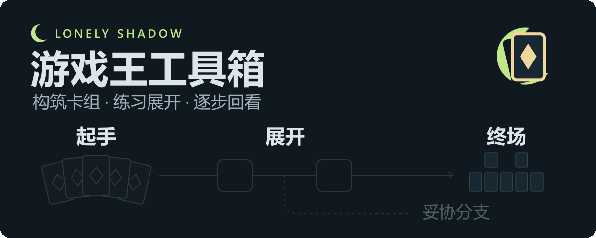

<p align="center">
  
</p>

<p align="center"><strong>Lonely Shadow</strong> · 把一次展开，整理成可回看的本地方案。</p>

<p align="center">Windows 桌面应用 · YDK 卡组 · 原生规则引擎 · 本地数据</p>

<p align="center">
  <a href="#features">核心能力</a> ·
  <a href="#start">开始使用</a> ·
  <a href="docs/usage-guide.md">完整手册</a> ·
  <a href="#scope">支持范围</a>
</p>

<a id="features"></a>

## 当前版本 · 1.49.0（标注直接驱动用途库与起手分析）

终场、手坑、解场资料现在由统一标注自动生成，直接替换同一卡牌原先单独维护的用途、条件和效果备注；旧个人内容写入前完整备份。起手的角色与统计也改为读取统一效果，手坑／解场 TAG 自动同步成员。界面以规范效果为主体，通过“编辑统一标注”集中维护，不再并排维护两套说明。当前资料生成 91 张终场、35 张手坑、174 张解场用途记录，其中“标注推导”明确显示为静态分类依据，具体费用、时点及可用次数仍须核对。使用与恢复见[跨模块能力说明](docs/card-capability-integration.md)，升级与实测见[1.49.0 验收](docs/verification-1.49.0.md)。

### 跨模块共用卡片能力 · 1.48.0

卡片详情、终场／手坑／解场标记、卡组与 TAG 筛选、起手分析、断点与实战参考共同引用逐效果标注。修改一次标注，相关入口读取同一份能力、条件、费用与次数资料；三类标记可查看带依据的用途候选并手动采纳，原有用途、目录和备注保留。新保存的本地方案冻结能力版本，旧方案不补造历史；模块化终场显示所选效果的能力构成，静态标签不替代引擎检查或可用阻抗次数。使用与数据边界见[跨模块能力引用](docs/card-capability-integration.md)，实际检查见[验收记录](docs/verification-1.48.0.md)。

### 四个完整系列新增效果标注 · 1.47.7

补齐闪刀、半龙女仆、斩机与军贯四个完整系列，按本地整数卡号新增 96 张已核对标注。逐卡对照 KONAMI 官方 OCG 卡页与 FAQ，保存完整卡文、全分段和来源引用；14 个异画本地编号经同名、同类型、同全文指纹核对后分别保留。闪刀卡片发动与魔法效果发动、半龙女仆战斗阶段回手、斩机素材手续与费用、军贯超量素材分支各自独立记录。[逐卡清单](docs/card-annotation-batch-2026-09-25-phase4.csv)列出卡号、卡名、系列、官方来源和核对结果；[验收记录](docs/verification-1.47.7.md)列出检查范围。当前 14,716 张非衍生物中完成 498 张，尚余 14,218 张，继续按完整系列推进，见[全库进度](docs/card-annotation-progress.md)。自动草稿不计入已核对。

### 上一版 · 1.47.6

补齐影灵衣、召唤兽、珠泪哀歌族、神碑、白森林与星杯六个系列，新增 100 张；阶段覆盖为 402／14,716。来源与检查见[逐卡清单](docs/card-annotation-batch-2026-09-25-phase3.csv)和[1.47.6 验证记录](docs/verification-1.47.6.md)。

### 历史版 · 1.47.5

补齐烙印、死狱乡、自奏圣乐与青眼四个系列，新增 94 张，原有 6 张复核后保留；阶段覆盖为 302／14,716。来源与检查见[逐卡清单](docs/card-annotation-batch-2026-09-25-phase2.csv)和[1.47.5 验证记录](docs/verification-1.47.5.md)。

### 历史版 · 1.47.4（按完整系列补充卡片效果标注）

按本地整数卡号补充 100 张已核对完整分段的卡牌：杀手旋律／杀手级调整曲 8、原清单辅助卡 4、相剑 14、驱魔姐妹 18、转生炎兽 39、天威 17。各系列旧条目 19 张对照当时卡文与官方 OCG 卡页／FAQ 后保留，五个系列在当时卡库中的成员均已覆盖。实际新增卡号、卡名、系列和来源见[1.47.4 清单](docs/card-annotation-batch-2026-09-25.csv)；官方原始页面快照及检查证据只保留在本机 `.local/anno-batch4-research/`。该版完成时内置已核对 208 张；未标注不代表没有相应能力。

本轮把效果复制、互斥分支、融合／仪式素材处理、对方效果改写、效果结算时丢弃与超量素材取除等差异单独登记，保留原有 TAG ID 与个人资料。静态标注和效果 TAG 不判断某个当前局面能否发动；历史脚本映射也不代表完整规则验证。个人修正仍按卡文指纹隔离，旧标签、备注和确认状态不会套用到新卡文；机制修复见[1.47.3 验证记录](docs/verification-1.47.3.md)，本轮检查见[1.47.4 验证记录](docs/verification-1.47.4.md)。

主导航归为「首页／构筑训练／决斗／资料库」：卡组编辑、展开与模块化在构筑训练顶部切换；卡片标注、情报站与 TAG 管理在资料库顶部切换。全局设置独立保留在侧栏底部。已有卡组编辑缓冲、训练进度与个人资料继续保留。

卡片标注默认显示紧凑的系列卡牌夹：小封面与名称、数量、首发日期并排，单夹高度 92px，每页 48 个。默认按系列成员最早已知的 OCG／TCG 实体卡发售日期由新到旧排列，也可切换由旧到新或中文名称；未知日期置后并标记「日期待补」，「无系列归属」单独收纳。日期资料离线随包提供，来源与更新方法见[制作流程](docs/card-series-production-guide.md)。

进入系列后，左侧每张卡的文字旁显示小卡图；详情右上角「查看卡图」按钮在点击处附近打开原图浮层，点击外部、再次点击按钮或按 Esc 关闭，浮层自动避开窗口边缘。筛选整体默认收起，搜索支持中文系列名、旧译名、卡名与卡号。彩色效果 TAG 和额外怪兽类型标识继续保留。

现有 20 套系列徽记与 35 张联网核对的代表卡：首批青眼、转生炎兽、相剑、驱魔姐妹、杀手旋律，本批新增黑羽、真红眼、光子、银河、冰结界、娱乐伙伴、异色眼、我我我、废品、疾行机人、电子、混沌、DDD、超重武者、急袭猛禽。系列名采用已核对的官方简体中文（如官方「废品同步士」「电子终极龙」，本地仍显示原卡名），仍可搜索「救祓少女」「杀手级调整曲」「BF」「スピードロイド」等旧译名与日英别名；卡库原卡名、卡文、个人 TAG 与备注保留。徽记为项目设计的识别图形，不是官方标志；来源核对不等于全系列逐卡效果审核。其他系列仍从本地卡库生成普通卡牌夹，尚未逐系列联网核对。可直接交给其他智能体继续扩充的[系列标识制作流程](docs/card-series-production-guide.md)包含来源、命名、封面、样例和校验步骤；本轮验收见[1.47.2 验证记录](docs/verification-1.47.2.md)。

联网对照 KONAMI 官方卡文与补充说明，复核首批 11 张参考样本后补全引擎审计清单 35 张、手坑／解场常用卡 62 张；随后按完整系列和实战辅助缺口分阶段新增 100、94、100、96 张。卡文变化后显示保存的旧卡文，停止用旧标注匹配当前能力；自动草稿不能一键确认为完整标注。覆盖统计排除衍生物：当前基础库 14,981 张，可标注 14,716 张，已标注 498 张，未标注 14,218 张。未标注不代表没有能力，脚本映射也不等于完整规则验证。

效果词表仍包含 19 个当前标签与 1 个兼容旧标签；本轮只扩充确需使用的受控区域与处理，定义及正反例见[卡片标注体系](docs/card-annotation-system.md)。规则段、处理说明和来源按需展开，点击「个人修正」才显示编辑。逐批效果标注请使用[标注交接指南](docs/card-annotation-agent-guide.md)、实际 runtime 校验器与[本阶段语义检查](scripts/check_annotation_batch7.py)。

MDPRO3 的「智能化识别 → 选择展开方案 → 展开教程」新增只读实时跟随：按完整操作证据更新教程，区分实际进度与浏览位置，保留暂停、重新同步、回看和手动确认。正式方案使用原始事件及逐步快照；从起手采用的临时候选同步写入原有确认记录。首版只支持已适配构建的 BO1 先攻第一回合；无效、偏离、随机结果或实例歧义时暂停，不默认重规划。范围见[实时跟随说明](docs/mdpro3-live-follow.md)，测试与真人验收状态见[1.44.0 验证记录](docs/verification-1.44.0.md)。

### 后攻实战辅助首版 · 1.43.0

后攻起手页新增「进入实战辅助 · OCG」：保存当前资源与实际操作，结合本地资料查看对方路线候选、威胁和交／留选择，并在我方回合提供短段及限定的两素材同调续接。起手快照保留，费用、次数和处理结果独立记录；当前局面改变后撤销旧建议。

YGOPro 自动模式可观察我方手牌与双方公开区域、LP、回合和已知卡片的等级／调整身份；隐藏对手牌号与双方牌序不读。完整连锁、响应时点及次数历史仍需人工核对，不宣称全自动交坑或任意场面引擎求解。使用见[实战辅助说明](docs/going-second-live.md)，实际检查范围见[1.43.0 验收](docs/verification-1.43.0.md)。

### 后攻分析阅读布局与卡组要点 · 1.42.2

后攻分析先展示上手卡片的分工、关键配合和路线前提；构筑统计、完整卡文、效果参与记录与来源版本改为按需展开。分析完成后收起主卡组选牌区，保留起手预览与调整入口；情报站继续维护原有通用选择和备注。

补充杀手级调整曲及配套共 14 张关键卡的官方卡文依据与条件化用途，说明提示员的召唤入口、自然蔷薇鞭的留场／素材取舍、调整手坑的素材用途及特召限制。卡文参考不计为新增录制方案，也不把含随机结果的路线改成已验证。分析中的「同调／融合」通用支援标签不再被当成独立主系列，原 TAG 成员与个人分类保留。使用见[后攻起手分析](docs/going-second-opening.md)，范围与验证见[1.42.2 记录](docs/verification-1.42.2.md)。

### 后攻起手分析 · 1.42.1

手动后攻与自动识别的冻结起手现可进入本地资源分析：按实际副本统计主系列／小轴、手坑、护航和解场，结合正式方案核对启动费用、卡组组件与分支前提，并展示基本展开、效果参与和终场效果差异。情报站新增「起手分析」工作区，允许受控维护通用用途、备注和本地候选；人工修改独立保存，版本变化时提示核对。

这次仅交付起手资源评估，不恢复旧后攻实现，不启用对手路线识别、交坑时点指挥、通用解场搜索或自动操作。未验证的斩杀、共享次数与对手场面保持待核对。使用和保存位置见[后攻起手分析](docs/going-second-opening.md)，检查证据见[1.42.1 验证记录](docs/verification-1.42.1.md)。

第 2—5 点的讨论、默认规则与后续扩展范围保留在[实战辅助完善计划](docs/going-second-live-plan.md)。1.43.0 的实际交付范围以本页及使用说明为准，未覆盖内容继续明确标注。

## 从构筑卡组，到记住每一步展开

**Lonely-Shadow-Yu-Gi-Oh-Toolbox** 是本地游戏王工具箱，将卡组编辑、展开练习、逐步回看和方案管理放在同一个桌面界面中。操作与结算由现有 YGOPro 规则引擎处理，练习记录保存在自己的电脑上。

### 01 · 整理构筑

新建或导入 YDK，编辑主／额外／副卡组，搜索、筛选与收藏卡牌。用代表卡和 TAG 组织卡组，再将已保存的构筑带入练习。

### 02 · 练习展开

指定具体卡或“任意等级 3 调整”等条件牌、设置禁止上手集合，按主卡组实际副本随机组成起手。条件支持且／或／排除，并实时校验候选与槽位冲突。起手及同一实例的后续素材、移动、详情和教程显示条件牌，原始卡号保留供规则校验与复现。在嵌入的原生场地手动召唤、发动效果、选择素材与对象；当前练习可退回已记录的可恢复节点。

### 03 · 回看与保存

逐步查看真实场面、费用、对象与处理结果，补充步骤说明并标记终场。核对资源、起手条件和隐性条件后保存独立方案，也可以导出分享文件或 PNG／SVG 一图流。

“展开方案调整与保存”只展示当前打开的记录；历史未保存草稿的数量显示在“展开管理 → 历史记录与未保存草稿”。

### 04 · 准备另一条路线

从可恢复的主线节点创建妥协分支，设置对手场景并继续练习。BO1 先攻辅助会根据已保存卡组、TAG、资源和实际起手筛选已有方案，随后由用户手动跟随教程。

决斗依次经过「模式选择 → 功能选择 → 卡组选择 → 决定先/后攻 → 卡组展开」。功能选择下提供「手动或自动 / 平台选择」：手动进入现有卡组流程；自动可选择 YGOPro、YGOPRO2、MDPRO3 或 Yu-Gi-Oh! Master Duel，弹窗显示进程名称、PID、路径及重试入口。四个平台均可启动智能化识别；YGOPro 还可读取正在编辑的主／额外／副卡组，进入卡牌预览、设置 TAG 并保存到本地卡组库，同名覆盖需确认并保留旧版本备份。YGOPRO2、MDPRO3 与 Master Duel 暂不开放编辑器卡组识别。

> **BO1 先攻可根据手动录入或自动捕捉的起手筛选方案、生成本局临时路线，并按步骤图确认操作。** 自动模式在起手确认后进入独立的方案选择与展开教程；方案仍由玩家选择，教程仍由玩家推进。后攻可独立分析起手资源；BO3、完整对局状态跟踪及后攻逐步展开尚未实现。详见 [BO1 决斗说明](docs/duel.md)。

## 一次练习的完整流程

1. **选择卡组**：只读预览已保存的构筑，确认后进入前置设计。
2. **设计起手**：填写方案名称和条件，设置指定卡、禁止卡与对手配置。
3. **手动展开**：在规则引擎中完成操作，点击「展开结束」检查记录。
4. **确认保存**：补充步骤与终场说明，核对资源、起手条件和隐性条件后存入展开管理。

正式方案保留独立快照，源卡组后续的修改不会追溯覆盖已保存路线。首图展示的是功能流程示意，具体展开以引擎与实际记录为准。

## 对手卡组只读资料与两级主题导航 · 1.41.0

断点管理按「OCG」「Master Duel」两个大主题浏览：先点击大主题，再从「卡组主题」选择该环境的卡组，子项省去重复环境前缀。「全部」按环境分组展示，「个人主题」保留手写与空主题的入口。切换大主题会清空旧的子主题选择，搜索与 TAG 可继续叠加；未保存编辑保持在右侧。此调整直接适配已有资料，无需重新导入或修改个人数据。

情报站第四个分类新增「对手卡组」只读预览，收录 2026 年 7—9 月六个来源统计期中的 18 份高频代表构筑。展示主卡、额外及已披露副卡的卡图和张数，关联现有系列 TAG；按统计期从新到旧、期内按该牌型的来源样本占比从高到低排列。占比保留原分子、分母与来源口径，不把所收录的18份当作统计分母，也不把MD的Power分值当成占有率。不同统计期和不同环境保持独立。

每份构筑有两条基于实际收录卡片整理的基础展开路线，共36条、204个配图步骤，列出起手、费用、前后资源变化与关键终场资源。构筑、路线和步骤保留稳定引用及来源，供后续功能读取；尚未经逐局规则引擎验证，不是玩家比赛录像或最大终场承诺。新页没有新增、编辑、保存或导入个人卡组入口，写入请求也会拒绝。资料随应用提供，个人卡组和TAG文件不迁移。范围及数据结构见[对手卡组资料](docs/opponent-catalog.md)，验收见[1.41.0 验证记录](docs/verification-1.41.0.md)。

### 主流卡组图解与阻抗资料 · 1.40.0

情报站 → 断点管理增加「导入主流对策」：分别收录 8 份 OCG、12 份 Master Duel 资料，共 58 个条件化断点、97 个带卡图的路线节点。参考 2026 年 7—9 月赛事及 9 月 20 日社区榜，逐份标明实际采样期。包括耀圣、卡通、杀手级调整曲、闪刀、烙印、星辰、道化一座、青眼、VS K9、共鸣者等；较低份额和外挂条目明确说明，不把所有收录都称为当月顶级卡组。

导入后默认阅读图解：从起手前提沿卡图查看每步动作与得到的资源，点击关联按钮定位具体断点，再对照「放行／此处阻抗／仍有补点」。每个断点列应对卡、时点、费用／条件、作用和例外，附可打开的官方卡文与策略来源；环境证据、原作者建议、手工条件推演分开表达。内容基于卡文与公开路线整理，**尚未逐局通过规则引擎验证**，不读取实时对局、不预测隐藏手牌、不保证一张手坑停牌。

可按 OCG、Master Duel、个人资料及主题、卡名／卡号、TAG 筛选，保留原编辑、卡牌预览、版本冲突及备份流程。同版再次导入不覆盖个人修改；手动改动步骤后，原始图解保留并明确标示，不再把旧引用绑定到新步骤。来源及覆盖范围见[主流对策资料](docs/matchup-catalog.md)，验收见[1.40.0 验证记录](docs/verification-1.40.0.md)。

### 常用手坑与解场分类 · 1.39.0

情报站新增独立的「解场标记」，并提供按效果整理的常用资料：64 张不同卡牌，形成 28 份手坑资料、39 份解场资料，其中三张兼具两种用途。手坑分为 10 类，解场分为 8 类；效果 TAG 支持跨文件夹筛选，并且不参与卡组／方案的系列自动识别。每张卡包含用途、使用条件、具体效果备注及资料来源。效果和卡号核对于 2026-09-20；收录包含跨环境常见及针对性选择，不代表某一环境的即时使用率或合法投入数量。

在手坑或解场分类点击「导入常用分类」可合并整套资料：保留已有用途、条件、文件夹及独立终场标注，补充效果备注；相同版本重复导入不会重复写入或恢复手动移除的备注。缺卡会列出卡号并跳过，文本不匹配的效果保留为待核对。联网来源与分类表见[常用卡资料](docs/staple-catalog.md)，验收结果见[1.39.0 验证记录](docs/verification-1.39.0.md)。

手坑资料支持逐条勾选卡牌效果，并为每个已选效果添加、编辑或移除多条备注。效果选择与备注保存后可重新载入，列表显示效果和备注数量；用途说明、使用条件与文件夹仍独立保留。卡库文本变化时可保留旧效果与备注待核对，再手动归入当前效果。

情报站沿用卡组编辑和展开管理的工作区布局：顶部切换终场、手坑、解场与断点分类，左侧集中搜索、筛选和资料列表，右侧编辑当前资料。进入分类时打开首条资料，当前选择在列表中高亮；备注可独立滚动，保存操作保留在编辑区底部。选卡和来源汇总使用完整工作区，窄窗口改为上下排列。

「资料库 → 情报站」集中管理通用终场标注、手坑资料和手动断点。已有方案标注可以按卡牌合并，也可以一键全部合并：同一卡牌只保留一份通用资料，效果取并集，相同备注去重，不同的卡牌用途与效果备注并列展示、独立编辑，并保留来源。效果文本不一致时保留为待核对，不按效果序号强行对应。

终场卡牌浮层可查看这些并列备注，一键应用到当前实例，或把本方案的新说明合并到通用库。已保存方案及分支的实例、区域、效果和局部备注保持独立；多条备注不会变成额外的效果或阻抗次数。

手坑与专用用途 TAG 共用成员资料，支持单层文件夹、用途／条件备注和卡牌组合筛选；仅允许主卡组类型，包含用户自行确认用途的魔法或陷阱，排除额外卡组与衍生物。用途 TAG 不参与原有系列主／副 TAG 的自动识别。断点按主题组织，逐步关联对手操作与可选应对，组合配合需显式标注；未补全资料显示「待补充」，完整资料仍显示「待核对」，不代表规则或策略有效性已经验证。

全部资料沿用本地 TAG 文件的原子保存、版本冲突检查和备份，卡库缺卡时保留编号和用户资料。使用方式、兼容与恢复见[情报站说明](docs/intelligence.md)，手坑效果验证见[1.38.3 验证记录](docs/verification-1.38.3.md)，布局验证见[1.38.2 验证记录](docs/verification-1.38.2.md)，标注合并见[1.38.1 验证记录](docs/verification-1.38.1.md)，首版范围见[1.38.0 验证记录](docs/verification-1.38.0.md)。

### TAG 关联卡片 · 1.37.0

TAG 管理新增关联候选与单卡「关联卡片」入口：从当前卡库的系列编号、效果中精确点名的卡片／系列和 Lua 数字引用发现直接关联，逐张显示依据，可筛选并加入 TAG。成员区区分卡库系列与手动加入，支持查看和恢复手动排除的卡片。确认保存的范围由卡组、方案和智能识别共用；浏览候选不会修改已有标签，关联关系本身也不代表当前局面可发动或一定能配合。MDPro3 实现分析、使用方式与边界见 [TAG 关联卡片](docs/tag-relations.md)。

### 保留的功能边界 · 1.36.1

按用户要求，暂时撤回 1.29.0–1.36.0 的 BO1 后攻计划实现：后攻工作区、条件化交康、内置后攻续算与战斗验证、外部公开资源／阶段／素材／连锁读取均退出当前产品。决斗流程恢复到 1.28.5 的功能基线；仍保留开局构筑、先后攻和初始起手识别、既有先攻方案与教程，以及独立的 AI 实验。共用的 YGOPro 模块名定位修正单独保留。

原后攻记录、个人数据、研究资料和旧版本在本地保留，当前版本不显示已暂停的后攻记录入口。完整研究和实施补丁已归档；重新启用需另行验证。此版本号用于发布回退后的程序，不覆盖已有旧版本包。范围和检查见[回退记录](docs/verification-1.36.1.md)。

### 功能基线 · 1.28.5

本次范围与实际检查见 [1.28.5 验证记录](docs/verification-1.28.5.md)。

本次精简随机牌数量和步骤悬停预览：仅表示张数的展示／翻牌／抽牌合并为一张卡背加数量，独立效果与后续去向继续分开；手动与自动教程的悬停窗口显示关键卡牌及操作摘要，完整内容通过点击步骤查看。同时将历史未保存草稿数量移到历史列表入口，为零时隐藏，避免空白方案调整页仍显示数字。已有草稿、正式方案和原始记录继续保留。上一版的教程自适应展示见 [1.28.4 验证记录](docs/verification-1.28.4.md)；此前的随机手牌展示、一图流排版与持续规则状态见 [1.28.3 验证记录](docs/verification-1.28.3.md)及[规则状态说明](docs/continuous-rules.md)。

- **Master Duel 智能化识别**：新增「Yu-Gi-Oh! Master Duel · 史上最强的数位卡牌遊戏！」入口，捕捉 `masterduel.exe`，使用独立的只读 IL2CPP 适配器。以正式开局结果确认先后攻，区分投硬币与最终选择；核对本局构筑、冻结 5 张起手，并复用 TAG、方案选择和跨局监听。暂不开放编辑器卡组识别。真人 Solo 联调与普通 PvP 的验证边界见 [Master Duel 适配说明](docs/masterduel-recognition.md)。

- **MDPRO3 智能化识别**：新增「MDPRO3 · 仿官方作品 Master Duel」入口，以同风格的客户端图标展示。针对已核实的 IL2CPP 构建，只读识别正式先攻、已提交构筑和初始起手，并复用 TAG、方案选择与持续跨局监听；不提供编辑器卡组识别。三套不同卡组的真实先攻识别及逐轮人工起手核对均已通过。支持范围与验证详情见 [MDPRO3 适配说明](docs/mdpro3-recognition.md)。

- **YGOPRO2 智能化识别**：新增同风格的「YGOPRO2 · 新一代原版游戏」入口，两个平台均使用各自客户端图标并统一配色。对已核实构建只读捕获正式开局、已提交完整构筑和我方初始发牌，复用 TAG、先攻校验、方案选择和跨局监听。三套不同卡组的真实先攻识别已完成，第三轮起手经用户明确核对一致；构建范围和详细验证见 [YGOPRO2 适配说明](docs/ygopro2-recognition.md)。

- **智能化识别**：YGOPro 捕捉弹窗新增一键等待开局，自动读取本局完整构筑、应用现有本地系列 TAG、冻结初始起手并校验正式先攻，直接进入方案选择，同时开始匹配和模块化计算。可取消、重试；本局结束自动清理工作区并等待下一场，同一客户端无需再次点击识别。后攻冻结起手现接入独立的资源分析页。原逐步流程继续保留。TAG 使用现有本地系列统计规则。三轮真实联调与自动连续下一局补测已完成；修正了实测发现的异画卡脚本校验。实现边界与验证范围见[智能识别说明](docs/smart-recognition.md)。

- **随机牌与效果说明修复**：卡组顶部翻牌及同一实例的后续除外、回卡组在回看和一图流中使用随机牌卡背，标明双方；效果明确允许选择顶部或底部时显示“选择放回卡组最上面或最下面”，记录依据保留当时实际去向。日志直接展示对应效果原文。定向选卡后继续选择表示与位置的特殊召唤可正确计入主卡组资源，缺少来源依据单列待核对；旧方案只读重算，不覆盖原始记录。见[回看说明](docs/usage-guide.md#记录展示)。

- **条件牌起手**：玩家和对手均可使用可编辑的条件集合。预览区分原始匹配、禁止排除和其他槽位占用；按实体副本整体分配。方案分别保存条件定义与实际起手，一图流显示集合及实例，分享文件保留完整规则。手动／自动决斗筛选与模块化继续核对具体路线，属性相同不代表替换已验证。见[条件牌使用与影响清单](docs/condition-cards.md)。

- **隐性条件与后台准备**：保存前确认与展开管理显示按步骤识别的指定区域资源、用途和选择依据；普通匹配扣除真实起手，按卡牌实例跟踪送墓、检索和回收。资源不足、随机依赖与条件待核对分别显示。确认本局输入后，后台共同准备四种偏好；点击复用已有任务和结果，改变输入后拒绝旧版本，保留已确认教程。见[隐性条件与预计算](docs/implicit-precompute.md)。

- **自动模式方案与教程**：确认先攻起手后，根据本局卡组、TAG 与冻结起手筛选方案；支持排序、收藏、详细预览、单步自适应展示、分支导航、场面查看、快捷键及临时方案生成和续算。手动与自动教程一次展示完整的当前 Step，按窗口宽高排布并等比缩放，步骤导航自动换行；展示卡牌有卡图与名称，旧方案按冻结事件补显示。自动模式拥有独立页面、状态、接口和推演会话，与手动模式共用规则和数据服务，筛选与教程进度互不覆盖。见 [BO1 决斗说明](docs/duel.md)。

- **生成与续接修复**：方案选择页生成临时方案时重新从本局起手计算，教程内重算保留已确认步骤；返回列表不会把旧续接面板显示为起手生成。兼容标准连接召唤脚本回调的整体行号移动，卡牌效果分支仍严格识别，每步由当前引擎校验。详见 [1.23.1 修复记录](docs/verification-1.23.1.md)。

- **自动准备起手**：从先后攻监测开始观察初始发牌，将我方发牌消息与手牌区交叉核对，完整后冻结为本局起手。先攻可查看逐张卡牌预览并确认进入下一阶段；后攻保存独立起手并可分析资源。重复卡保留各自位置，之后抽牌或使用卡牌不会替换初始快照；卡图按比例填满预览框。

- **自动识别先后攻**：卡牌预览点击「开始决斗」后持续监测 YGOPro 的等待开局、猜拳与选择阶段；游戏正式开局后给出我方先攻／后攻，支持手动更正和确认下一步。重新开局清空旧的界面结果，每局自动判断和确认记录单独保存在本地。后攻结果可记录并进入起手资源分析，逐步展开仍保留先攻流程。

- **YGOPro 实时卡组捕捉**：以只读权限读取当前编辑器，包括尚未保存的修改；每次「获取卡组」重新读取，失败时禁止将上次快照作为新结果保存。支持本地 TAG 推荐、手动调整、持久化保存及有版本校验的同名覆盖。当前仅适配经指纹核实的 YGOPro 1.036.2 x64 构建，其他构建明确提示未适配。适配范围见 [BO1 决斗说明](docs/duel.md)。

- **超先行补丁管理**：左侧「全局设置」位于「TAG 管理」正上方，提供官方更新时间、下载位置、安装、检查更新、更新和卸载；卡库、效果脚本、卡图与系列名称同步生效，失败回滚并保留个人数据。详见[超先行补丁](docs/superpre.md)。
- **偏好与搜索范围**：临时路线提供花费最少、终场最大、步骤最少、平均，默认终场最大。花费先比较投入的手牌，再比较主卡组与额外卡组合计；平均取资源、终场、步骤三个标准化评分的等权平均。四种偏好共享候选搜索及引擎校验，切换复用当前状态的准备结果；部分搜索保持未完成标记，终场以用户标记为目标。
- **方案排序与收藏**：步骤最少、终场最大、平均值（均衡）；展开管理与决斗共用本地收藏，支持只看收藏和边框高亮。决斗终场只展示来源明确标记的卡牌与效果。
- **从普通步骤续算**：在普通教程选中已完成的 Step，生成该步之后的可能路线；先按本局起手复核前缀，失败时保留原教程。
- **临时方案图示与缓存**：恢复素材、召唤、效果与区域流向图示，生成面板可折叠；重复候选和相同步骤校验复用有容量限制的本局缓存。
- **临时方案与步骤确认**：决斗页后台生成路线，采用后直接进入步骤图；下一步表示用户确认已照做，返回查看不会撤销已确认进度。
- **实际情况与后续重算**：在当前步骤填写抽牌、随机堆墓或手牌阻抗及费用。可复核时保留已确认前缀并替换后续；不完整或不适用的填报保留原路线并说明原因。
- **场地刷新修复**：合并滚动期间过期的原生窗口位置更新；后台推演窗口始终隐藏，不出现在决斗页或展开历史中。

- **模块化数据核心**：卡组与展开提供原始数据，决斗直接请求并使用调度输出。决斗临时方案仅使用与本局卡组主、副 Tag 至少命中一项的可用来源；无匹配时明确提示，后台计算与缓存同样校验。手动与自动模式的候选使用并排卡片，直接显示步数和终场卡图，点击卡片采用路线，详细步骤按需展开。
- **模块化续展**：从多个正式方案提取决策快照，以当前真实局面重新组合后续；支持花费最少、终场最大、步骤最少、平均及目标调整。
- **内置 YGO AI**：候选通过隔离引擎校验；可执行下一决策或启用自动模式。误操作、对手干扰、来源修订和偏好切换后，从实际状态重算。
- **IF 与精确开关**：妥协场记录打断事件和补点条件；默认自适应站位，精确模式核对完整已知局面，规则前提始终由引擎检查。
- **Step 使用模块图**：名称与批注标识保留，局面、前后关系、教程、回看及妥协分叉共用决策边界。旧方案不会补造缺失状态。
- **准确效果识别**：使用引擎效果对象、触发上下文、次数标识和 Lua 处理位置；菜单序号不等于卡面效果编号。未核对的编号明确标注。

完整流程、搜索与评价边界、转生炎兽、相剑、烙印、白骨、灵摆与仪式的验收说明见[模块化展开](docs/modular.md)。

对局数据读取的已验证路径与边界见 [YGOPro 对局读取记录](docs/ygopro-live-state-research.md)；当前实现覆盖开局构筑核对、先后攻与初始起手，完整局面跟踪仍待后续接入。

临时方案的使用与边界见[临时方案](docs/duel-temporary-plans.md)，历史模块化检查见[1.16 验收记录](docs/modular-verification-1.16.md)。完整操作说明保留在[使用与开发手册](docs/usage-guide.md)。

<a id="start"></a>

## 开始使用

1.24.0 接通自动模式的方案选择与展开教程，独立保留本局输入和教程进度，检查范围见 [1.24.0 验收记录](docs/verification-1.24.0.md)。操作边界见 [BO1 决斗说明](docs/duel.md)；此前检查见 [1.23.1](docs/verification-1.23.1.md)、[1.23.0](docs/verification-1.23.0.md)、[1.22.0](docs/verification-1.22.0.md) 和 [1.21.0](docs/verification-1.21.0.md)。

**仓库提供源码、适配补丁、依赖锁、测试与文档。Windows 成品包、完整卡牌数据库、卡图和效果脚本需要在本地准备。**

### 已有本地 Windows 应用包

完整解压应用包，运行 `Lonely-Shadow-Yu-Gi-Oh-Toolbox.exe`。保留同目录的 DLL、`resources` 等全部文件；成品包无需另装 Node.js 或 Python。

第一次使用：进入「卡组编辑」→ 新建或导入 YDK → 保存构筑 → 在「展开」中选择并确认卡组。

### 从源码启动

需要 **Windows 10/11 x64、Node.js 22.12+、npm、Python 3.12+**，以及已构建的 `.local/YGOPro-Lite` 工作副本。以下命令均在仓库根目录执行：

```powershell
npm ci
npm run desktop:prepare
npm start
```

尚未准备工作副本时，先按[运行资源准备与构建](docs/usage-guide.md#构建与检查)完成资源复制、依赖下载、补丁应用和原生构建。这一步需要已有的 YGO 安装及 Visual Studio C++ x64 工具链。

`desktop:prepare` 首次可能下载固定版本的 Python／Electron，并从本地工作副本生成资源包。完整准备后，应用使用本地服务和本地卡牌资源。

<details>
<summary>检查、打包与旧网页入口</summary>

```powershell
# 单元测试与后台桌面验收
npm test
npm run test:desktop
npm run test:modular

# 构建本地目录并验收
npm run build:dir
npm run test:packaged

# 生成本地 Windows ZIP 包
npm run build
```

构建输出位于 `release/`。检查方法与实际历史结果见[验收记录](docs/verification.md)。

旧网页入口继续保留：准备工作副本后运行 `./Start-Trainer.ps1`，使用脚本打开的本地页面。

</details>

## 数据留在自己的电脑上

桌面版默认使用 `%LOCALAPPDATA%\YGOTrainer`，开发版使用 `.local/desktop-dev/`。卡组、训练记录与正式方案各自保存；迁移前创建备份，源目录保留原处。

- **构筑与方案分开保存**：修改源卡组不会改写正式方案的冻结内容。
- **记录可追溯**：简略日志的过滤只影响展示，原始事件保留。
- **修改留有恢复副本**：覆盖、删除和修订的恢复步骤见[数据与迁移说明](docs/usage-guide.md#用户数据与旧数据迁移)及[本地保存与恢复](docs/usage-guide.md#本地保存与恢复)。

<a id="scope"></a>

## 支持范围

- **自由练习**：训练检查主卡组 40–60 张、额外与副卡组各不超过 15 张；当前不执行禁限卡表及同名三张限制，副卡组不参加训练。
- **已有方案匹配**：BO1 辅助使用你已保存的正式方案。随机依赖与不完整条件仍需核对，到达终场不自动判定真实对局胜负。
- **模块化搜索**：只组合所选来源中已记录的决策；搜索有预算，随机结果及未知对手响应按条件展示。终场评价和灰流丽场景测试不是胜率预测。
- **基础对手 AI**：用于规则内互动，复杂选择可能需要手动处理，不保证任意卡组的策略质量。
- **有条件的恢复**：引擎、脚本或重放记录不满足要求时拒绝恢复，旧方案仍可回看。
- **资源更新**：更新机制处于设计阶段，尚未实现；当前不提供自动卡牌资源更新。

## 继续阅读

| 你想了解 | 文档 |
| --- | --- |
| 卡片效果标注规范、效果 TAG 与覆盖口径 | [卡片标注体系](docs/card-annotation-system.md) |
| 把卡片标注交给其他 AI：资料包、候选、审核及可复制提示词 | [外部 AI 标注教程](docs/card-annotation-external-ai-tutorial.md) |
| 标注体系建立前的现状与缺口盘点 | [标注缺口分析](docs/card-annotation-gap-analysis.md) |
| 详细操作、更新、构建与恢复 | [使用与开发手册](docs/usage-guide.md) |
| BO1 方案筛选与教程导航 | [决斗辅助](docs/duel.md) |
| 后攻实战辅助的五点讨论（初稿，新增能力尚未实现） | [后攻讨论记录](docs/going-second-discussion.md) |
| 分支、对手接管与恢复条件 | [妥协场构建](docs/compromise-design.md) |
| 日志、快照与资源统计依据 | [记录说明](docs/recording.md) |
| 已执行检查及尚未验证事项 | [验收记录](docs/verification.md) |
| 现成模型在真实引擎中的逐步指导试验（未接入正式界面） | [ygo-agent 本机试验](experiments/ygo_agent/README.md) |
| AI 推演与本地模型学习研究（已停止并封存，未接入正式界面） | [封存内容与提交、推送回溯](docs/ai-learning-archive.md) |
| 上游组件与许可证 | [第三方来源](docs/third-party.md) |

---

项目复用 YGOPro 客户端、规则核心及本地卡牌资源。上游客户端许可证副本见 [GNU GPL v2](licenses/YGOPro-GPL-2.0.txt)，各组件适用范围见[第三方来源](docs/third-party.md)。仓库的 `package.json` 当前标记为 `UNLICENSED`。
