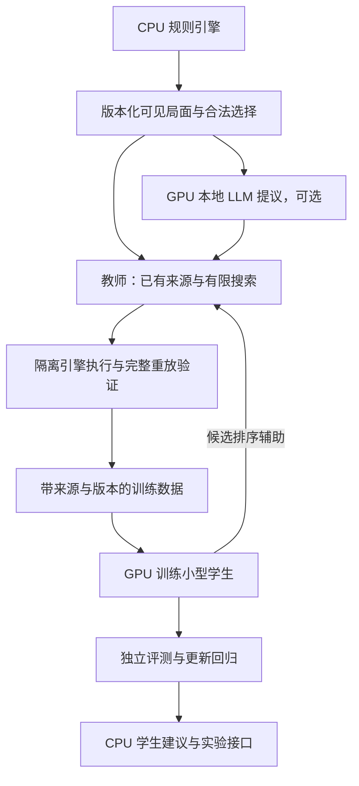

# AI 推演生成数据与本地模型学习：可行性验证计划

版本：v3，2026-09-19。依据 [P0B/P1 实测记录](ai-learning-p0b-p1-results.md)修订。**P0A 与限定范围的 P0B/P1 执行包已完成：60 个机制案例通过，50 个新起手完成记录和重放，其中 44 个真实结束回合、6 个策略循环停止。** 正式教师质量、未见起手的策略收益、能力更新及产品接入仍未验证，整体结论为部分可行。

用户已选择：**本机优先，先验证不产生付费调用的流程**。已执行独立 GPU 学生训练与真实引擎连续执行；本轮未调用 LLM，正式批量训练、后台定时任务、付费 API 和云端 GPU 均未启动。后续按阶段执行，保存实际成本与失败证据。

本次修订确定以下执行顺序和默认选择：

1. 固定并复用已通过的原生 Windows、PyTorch/ROCm 环境，正常开发不再重复安装或进行完整 CPU 训练对照。
2. CPU 运行规则引擎，GPU 运行本地 LLM 教师与学生批量训练，学生在软件中的单条建议默认使用 CPU。GPU 批量评分另测，不强求所有操作都上显卡。
3. 保留原约 101 万参数、78 样本探针；P1 已建立约 147 万参数的契约 v2 学生，用 423 个开发决策训练。两者都不作为已证明策略能力的模型；原三场、机制/示范与新 50 回合均排除在正式验证/测试之外。
4. 已测出主要时间在引擎推进、渲染和重放；GPU 训练 400 次更新约 6.76 秒，但不能据此估算整体加速。下一重点转为教师质量、数据划分及证据存储成本。
5. 进入 200 家族小试的协议与教师标定准备，先用训练部分的 20 个家族测教师成本。当前 2,000 家族的保守时间和未压缩证据超过既定上限，优化并重测前不启动正式采样。
6. 教师与学生分别评测；学生自己的结果、老师回退后的混合系统结果分别报告。是否接入本地 LLM，以相同预算下的额外收益决定。

## 1. 要回答的问题

目标是验证：能否用真实规则引擎、已有展开来源、搜索及可选的本地大模型生成可靠示范，把这些示范训练成能在工具箱内快速决策的小模型，并在新增数据或卡牌后完成可回退的更新。

分别报告以下结论，不把其中一项通过写成整体通过：

| 编号 | 假设 | 当前状态 | 仍需取得的证据 |
| --- | --- | --- | --- |
| H1 | 自动生成轨迹真实、可复现 | P1 的 115 个机制/示范/开发会话核对窗口、状态及动态值通过 | 正式教师批量数据仍须逐条重放与来源审计 |
| H2 | 教师数据比现有基线有价值 | 未验证 | 在独立局面上的目标达成率或覆盖改善 |
| H3 | 学生能学到教师能力 | 423 决策开发拟合通过；50 新回合存在策略循环，正式收益未验证 | 未见起手和干扰下的预注册目标及独立对照 |
| H4 | 本地部署足够轻量 | 30 共同窗口及 990 次真实执行已分项计时；正式性能门槛未验收 | 至少 1,000 个真实多选窗口及更广范围的时延、质量联合评测 |
| H5 | 新数据可以带来受控更新 | 检查点恢复通过，能力更新未验证 | 新场景改善、旧场景回归、特征/模型包成套回退 |
| H6 | 本地 LLM 有额外收益 | GPU 文本生成可用，策略增益未验证 | T1/T0 和 S2/S1 的同预算对照 |

H1、H3、H4、H5 是工程闭环；H2 是是否值得投入；H6 专门检验“接入文字 AI 是否有帮助”。未执行本地 LLM 对照时，H6 必须写“未验证”。若未做同预算强化学习对照，不宣称比从零强化学习更省资源。

## 2. 已有基础与缺口

当前基础包括[学生训练与执行试验](../experiments/ygo_learning/README.md)、[P0B/P1 结果](ai-learning-p0b-p1-results.md)、[原模型试验](../experiments/ygo_agent/README.md)及[模块化文档](modular.md)。P0A 的历史证据来自 `2234928`，P1 保留单独的源码与资源清单。正式运行仍须冻结实际代码、特征、引擎与资产版本。

| 项目 | 已有证据 | 本计划需要补齐 |
| --- | --- | --- |
| 本地推理 | 新学生完成 990 次实际响应，928 次多选推理、62 次单选旁路 | 策略目标、独立对照与更广泛局面 |
| 模型适配 | 独立契约 v2、真实动态属性、效果/素材/次数、连锁及历史恢复 | 扩展首轮未支持的消息、计数器等机制时另行验证 |
| 引擎隔离 | 完整前缀重放通过；两隔离实例的简单工作负载短测通过 | 教师搜索吞吐、状态引用去重和无渲染批处理成本 |
| 数据来源 | 正式方案与分支可提供经过引擎记录的选择 | 仅选用公开或专为实验制作的来源，建立独立训练集与测试集 |
| 训练 | 原 78 样本探针及新 423 决策 GPU 训练/恢复/CPU 导出通过；旧 TFLite 权重未微调 | 正式数据、独立质量评测、更新及产品接入仍待验证 |
| 硬件路径 | RX 9070 XT 学生训练可用，CPU 引擎与部署成本已有短测 | 教师、大规模训练和完整对局尚未验证；不直接沿用上游 CUDA/JAX 环境 |
| 本地 LLM | 已有 `qwen2.5:3b` 和 `gemma2:2b`；前者完成 CPU/GPU 文本生成对照 | 尚未验证对局理解、结构化动作输出或教师路线质量 |

已有报告中的 `3.156 ms` 是特征适配及推理的历史中位数，包含只有一个合法选项时不调用网络的窗口，也不含模型加载、动画和引擎结算。不能用这个数字估算训练吞吐或完整决策延迟。

P0A 学生的 CPU `1.08 ms` / GPU `2.08 ms` 来自预先编码的输入张量，不能直接与旧模型的 `3.156 ms` 比较。P1 采用新的模型和特征：30 个共同窗口中，状态构造至策略返回的中位数为学生四线程 `4.69 ms`、两线程 `5.67 ms`、旧模型两线程 `4.23 ms`，包含 IPC；990 次实际响应的后继引擎等待中位数为 `146.27 ms`。完整口径及尾延迟见本轮结果，不混用两个探针的倍数。

外部项目仅作为技术参考：

- `jjj-n/ygo-ai-agent` 固定参考提交 `348fece889ecd5eaa1d8678becdbaeef2ece46b4`。借鉴局面、动作、模拟、解释的接口分工；不直接信任其评分或搜索结果。当前静态审查发现多层搜索重复克隆原始实例、固定权重评分、部分选择由默认策略处理等问题，需要独立验证。
- `sbl1996/ygo-agent` 借鉴状态编码、合法动作表示、历史状态、训练与部署分离。当前试验资产固定在 `7888000e081519ea8258ed027e6d97ae8f3f0d0a`，不能随意替换词表。上游发布页存在 `.flax_model` 和 `.tflite` 文件，但当前 `0546_26550M.tflite` 不能直接视为可继续训练的检查点；同号训练权重与转换对应关系尚未核实。
- 默认训练独立的小型学生，保留旧 TFLite 模型作为固定基线。只有确认训练权重、网络定义、映射和导出一致后，才考虑旧模型微调；不把检查点移植变成首轮前置条件。

## 3. 首轮范围

首轮使用现有公开相剑构筑及其冻结版本。已有适配和三例记录可以作为工程回归，不能充当正式统计结论。

纳入范围：

- 我方先攻首回合展开；无额外响应、明确的一次干扰、资源不足、实际抽牌后的续展及主动停止。
- 真实费用、对象、素材、效果确认、站位和连锁顺序。只有一个合法选项可机械处理，但必须记录。
- 已知资源下的终场及有限响应能力测试；可执行多个可接受终场，不强迫所有起手复制一条路线。
- 对局日志、结构化训练样本、小模型 CPU 推理、一次增量更新与回退演练。

完整双方对局胜率、任意卡组、BO3、全自动外部客户端操控暂不属于首轮结论。首轮成功后，完整对局是另一个明确阶段，不由首回合终场测试推断。

冻结构筑不等于当前赛事合法构筑。P0B 必须标明自由练习或具体平台及禁限表版本；不满足当前禁限表的历史构筑只能用于同条件工程实验。涉及新环境适用性时另建符合目标规则的构筑集。

## 4. 技术分工与兼容边界



规则引擎是状态和结算的依据。教师只能在合法选择中提出候选；训练流程从真实结果学习；学生输出候选分数或动作；界面解释从已发生事件与已验证分支生成。

沿用工具箱当前的引擎和语义决策接口作为第一选择。上游两项目可能使用不同核心、脚本和消息格式，不因都叫 YGOPro 就直接交换响应字节。若另外接入 `ygoenv`，必须对同一批完整轨迹做跨环境一致性验证，未通过前不得混合数据。

现有模块系统继续保留来源边界、四种偏好和执行历史。实验模型使用独立 provider/适配层；模型分数不替代合法性、来源证据或真实胜率。未知卡、未覆盖窗口、容量溢出、过期状态、进程失败时，明确返回不支持并保留人工或既有方案入口。

## 5. 阶段、产物与停止条件

保留阶段编号。P0A 与 P0B/P1 开发执行包已完成；表中后续工作量仍为初步估计，计算时间另计。P1 的工程通过不等于正式策略、教师或更新验证通过。

| 阶段 | 工作与交付物 | 进入下一阶段的门槛 | 初步工作量 |
| --- | --- | --- | --- |
| P0A 环境与训练工具链 | 已完成：GPU/CPU 训练、检查点恢复、CPU 导出与依赖锁定 | 复用证据；只有相关变更才回归 | 已完成，不重做 |
| P0B 实际瓶颈 | 已测引擎/特征/IPC/重放及双实例短测；输出时间/存储预算 | 教师成本仍须 P3 标定；正式 2,000 家族暂不满足预算 | 开发测量已完成 |
| P1 可靠数据与连续执行 | 动态状态、契约 v2、CPU 学生运行器和原始日志审计 | 60 个机制案例、50 个新回合均完成证据；44 结束、6 循环停止，无未解释的响应偏差 | 限定范围通过 |
| P2 冻结实验协议 | 200 家族小试与独立的 2,000 家族正式划分、目标、对照组 | 不同阶段和训练/验证/测试无泄露，失败分母固定 | 1–2 天 |
| P3 教师质量 | 无 LLM 搜索教师；可运行时增加本地 LLM 对照；输出可执行分支 | 先在验证集找到有价值且可负担的教师；否则修正或止步 | 2–4 天 |
| P4 采样与数据审计 | 先完成 200 家族小试；通过后按批扩展正式数据 | 全量重放、来源与划分审计通过；采样成本可承担 | 1–2 天，加限额内采样 |
| P5 学生学习与导出 | 复用 GPU 训练器；同结构对照；闭环偏离；三个种子 | 未见局面连续执行可靠，导出一致，训练收益独立检验 | 1–2 天，加限额内训练 |
| P6 独立评测 | 封存测试集一次正式评测；完整展开、性能、解释核对 | 按第 8 节分别给出工程、收益和 LLM 结论 | 1–2 天 |
| P7 更新与回退 | 新场景更新；条件允许时增加新卡；旧场景回归；成套回退 | 新数据有收益，旧能力符合回归门槛，错误版本被拒绝 | 1–2 天 |
| P8 实验接入 | 工具箱建议模式、状态失效、日志回看、隔离桌面验收 | 不改变正常训练随机性；失败可回退；开发版与打包版通过 | 1–2 天 |

剩余 P2–P6 暂估约 6–12 个有效工作日，P7/P8 另约 2–4 天；这是后续实现工作量估计，不是计算耗时承诺。P1 的 50 回合工作进程约 14.42 分钟，不能替代教师实验预算。先走 200 家族小试准备，教师质量、时间或存储成本不合格时停止扩展。

P2–P6 按“小试、正式”两轮执行：小试 P6 只打开其 40 个开发留出家族；通过后再进行正式数据的 P3–P6，并最终打开 400 个封存测试家族。P0A 不重复，P1 仅在相关实现变化时回归。两轮计算和结论分别记录。

### P0A：冻结已通过环境

复用 CPython 3.13.13、PyTorch `2.12.0+rocm7.14.1`、RX 9070 XT 和现有依赖锁；保留原 78 样本、失败记录、通过报告和 CPU 导出。当前不安排 WSL/JAX 迁移，不以扩大模型规模为目标；补齐输入字段所需的结构调整仍须验证。已有原始报告已验证梯度、实际参数更新、优化器恢复及新 CPU 进程加载，不再把这些检查列成下一轮从零任务。

驱动、依赖、特征、模型结构、优化器或序列化方式改变时，针对受影响部分重跑验收；纯文档修改不启动训练。每个输入版本变更均创建新数据/模型包，不覆盖当前探针。

### P0B：测量尚未验证的成本

本节规定的开发测量已执行。按全部 50 回合的批次平均成本，200/2,000 家族约 0.96/9.61 小时；若按每家族两次尝试、实测 p95 规划，则约 3.60/36.04 小时，均未计入教师。未压缩证据的平均外推为 3.10/30.99 GiB。因此保留 200 家族小试准备，正式扩展必须先解决教师标定和证据存储，不能套用简单双实例短测的 1.87 倍抵消所有成本。

1. 固定正式实验的代码提交、引擎、Lua、卡库、构筑、特征和动作版本，生成本地清单。
2. 使用 30 个全新的开发起手测量状态读取、特征准备、模型冷加载/稳态推理、IPC、引擎结算、完整重放和日志时间。这 30 个可包含在 P1 的 50 个开发回合中，不重复计数。
3. CPU 学生分别测量 2/4 线程，主路径先沿用已测四线程；记录 2 线程可否满足同一用户体验门槛。旧 TFLite 与新学生必须在相同窗口、计时边界及输入范围下重测，才能作性能对比。
4. 从一个隔离引擎开始，确认缓存和锁隔离后再测两个。区分隐藏桌面实例与直接引擎批处理；不把隐藏窗口写成已消除渲染开销。
5. 以试跑实测的每个家族耗时、教师调用数、有效样本率和失败率，估算 200/2,000 家族成本；使用包含失败与重试的保守估计，不按 55.5 倍训练差值外推。

产物：`runtime-profile`、动作覆盖表、200/2,000 家族预算估计。若预计超过预算，先定位引擎/搜索/通信开销或缩小首轮研究问题，并在查看正式测试结果前登记协议变化。

### P1：把每次选择变成可信样本

本节限定开发验收已通过，逐项结果和拒绝边界见[P1 验收](ai-learning-p0b-p1-results.md)与[契约 v2](ai-learning-contract-v2.md)。下列要求继续作为以后契约变更的回归标准；策略循环停止不转写为策略成功。

针对首轮构筑与场景补齐：当前攻防/类型/等级、效果身份与已用次数、召唤限制、素材、连锁、必要的历史和未知信息标记。无法表示的状态按不支持处理，不能回退到卡库基础值后继续声称等价。

本阶段必须同时完成以下三个交付：

- **观察与动作契约 v2**：逐字段注明来源、类型、动态/静态含义、未知值、容量及编码方式。枚举/身份使用可区分编码，LP、攻防、计数等按明确语义处理；不把全报文按字节嵌入的当前实现直接当作最终语义模型。禁止溢出截断、未知卡混成空槽、菜单下标混成效果编号。
- **连续运行器**：把 CPU 学生的候选索引映射回同一真实窗口的响应，正确处理素材/对象等微选择；只在引擎确认后提交历史。用户改选、状态变化、重复回执或进程退出时停止旧建议，并从完整已执行前缀恢复。原生窗口数、微选择数和模型调用数分别记录。
- **证据与版本绑定**：保存原始提示、语义动作、实际响应、后继状态及规则资源版本；模型、映射、观察/动作契约和运行器共同校验。契约 v2 与旧模型不兼容时明确拒绝或使用独立的旧适配层，不直接加载旧词表/旧权重。

至少覆盖以下 12 类，每类 5 个独立机制案例，共 60 例：

- 起手与重复卡实例；费用、对象和素材；诱发效果与连锁顺序；发动无效和效果无效。
- 效果次数与召唤限制；动态属性；实际抽牌与未知牌序；站位与区域限制。
- 撤选、取消、可选与必选窗口；状态过期与重复回执；重放分叉与随机一致性；隐藏信息与容量溢出。

案例需有引擎结果断言，不能只断言接口返回成功。不存在于首轮构筑的机制可以使用专用公开测试构筑，其结果只证明接口，不混入策略评测分母。

现有 6 项学生来源/候选检查和 13 项旧模型边界检查继续保留，但不能抵扣这 60 个引擎机制案例。原 78 个样本只用于发现编码/恢复退化；其三场来源不能当作“新起手”。

重放要求：原始局面执行 `A→B→C`，与从完整前缀恢复后执行 `B→C` 的语义状态、决策窗口和已消耗资源一致。失败重放必须报错；不得返回重放到一半的副本。随机种子为真实固定种子，不能用“0 代表重新随机”冒充可复现。

查询状态和合法动作应无决策副作用；确有引擎自动流程时必须单独记录。对效果确认、素材和对象的有意义选择，不能默认第一项、最少张数或“不发动”。只有唯一合法选项可以旁路策略模型。

先让受控策略/已知来源验证运行器，再让学生在 50 个全新开发回合中自行选择并连续执行。此时只验收是否真实执行、能否完整记录/重放和是否正确停止，不把这批回合当作策略测试。对每个失败区分：输入缺失、模型不支持、响应映射错误、引擎规则拒绝、策略选择欠佳、超时或正常结束；不能统称“AI 不会打”。

下一批数据启用条件：60 个机制案例的结果符合预期，50 个开发回合都能完成记录与重放或明确的预期拒绝，已适配动作没有未解释的非法提交。学生策略弱可以继续研究，数据失真或执行错误必须先修复。

### P2：先冻结评价标准，再生产数据

正常策略场景按五类分层：无额外响应、一次明确干扰、起动/费用资源紧张、实际抽牌后的分支、适时结束与保留资源。异常边界使用 P1 的机制案例集，不占用正式策略测试的 400 个家族。

数据规模采用分级投入，按下表执行；不同阶段的家族互不重叠。

| 数据层 | 数量与用途 | 结论边界 |
| --- | --- | --- |
| 已有探针 | 3 场来源、78 个多选样本 | 只作环境/编码回归，不能进入正式验证或测试 |
| P1 开发回合 | 50 个新回合，包含 P0B 的 30 个 | 验证连续执行、异常分类和重放，不评价泛化 |
| 小规模完整实验 | 200 个独立家族：120 训练、40 验证、40 开发留出 | 检查数据—教师—学生—连续展开链路；留出集打开后不再当作正式独立测试 |
| 正式实验 | 另选 2,000 个独立家族：1,200 训练、400 验证、400 封存测试 | 用于预注册的质量对照与不确定性判断 |

正式 2,000 家族是目标而非必然承诺。只有 200 家族小试数据可靠、教师在验证集有价值、采样成本可接受，才扩大正式数据。小试留出集不要求以 40 个家族证明 5 个百分点的统计提升；失败用于止损，初步改善仍写“待正式验证”。小试若需重新调优，其已打开留出集固定为开发资料，不反复当作全新测试。

先生成起点、场景目标与划分清单，再产生策略轨迹。P3 可在已划定的验证起点上运行教师；P4 用选定教师采集训练部分，P6 的留出/测试部分由评测程序按冻结配置运行。划分不依赖教师是否成功，避免阶段循环依赖或事后挑样本。

一个家族包括同一冻结构筑、规范化起手组合及其干扰变体、分支和重放副本。家族整体分配到一个集合；相同种子、同一对局的所有步骤、教师候选分支、缓存副本与数据增强结果不能跨集合。检测相同可见决策状态及历史指纹的重复；发现跨集合重复时，按预先规定的合并或去重规则处理后重新冻结划分，并报告前后数量。

每个家族预先指定一个主评测场景及其随机条件、干扰策略；主指标每个家族只计一次。额外变体单独报告或在家族内平均，不能靠多跑同一起手扩大主指标样本量。正式测试五类各 80 个家族；实际无法满足分层时在打开测试结果前登记。

分组文件在教师调优前冻结。教师提示词、搜索预算、奖励、目标、学生超参数只用训练/验证集调整。测试集不参与示范筛选或训练；仅评测程序可读取测试真值。需要改目标或修复会影响结论的错误时，登记协议新版本，不把已查看的测试继续当作全新测试。

还要检查实体编号重命名等语义等价变体，不能把换了编号的同一局面分到两边。站位只有在规则确认等价时才合并；涉及连接箭头、指向或区域限制的不同站位不能自动视为相同。正式测试覆盖冻结构筑内未见起手及干扰变体；“未见”指本实验的训练/调优过程，不声称上游模型的原始训练语料从未包含相似打法。

每个家族预先指定可接受终场集合、必要资源、允许的条件以及终止标准；可以有多个正确答案。终场“存在某卡”不等于该卡仍可使用效果。有限阻抗测试必须由引擎实际执行相应响应，核对费用、次数和互斥，结果只对应已测情境。

目标可以由预注册的场景模板和判定函数批量实例化，不要求手填 2,000 份答案；判定函数需用独立正反例验证，并在策略产生结果前固定。无法客观判定的目标不进入主要质量指标。

### P3：验证教师，而不是先相信教师

第一条路线 T0：用公开且可复现的已有方案、固定旧模型建议和规则启发式提出候选，在隔离引擎中进行有限搜索。现有模块来源范围保持不变；额外探索的动作明确标记为实验生成来源，并在全程验证后才成为示范。

第二条路线 T1：在 T0 上增加一个可本地运行的 LLM。先用现有 `qwen2.5:3b` 做开发探针，`gemma2:2b` 作为本地备选，是否采用由验证结果决定。LLM 接收玩家可见状态、效果文本和合法候选，返回候选 ID、简短依据及适用条件；JSON 和 ID 校验失败计为失败，不执行模型生成的代码或任意指令。推演和结算仍由引擎完成。

先在开发/验证数据中的 50 个多选窗口检查真实局面输入、上下文容量、结构化输出、合法候选引用和端到端耗时，再进入完整展开对照。已有整数序列的 token/s 测试不能替代这一步。首轮仅在多选且对结果有影响的窗口调用 LLM；调用规则、输入截断处理和输出上限在验证集上固定。上下文装不下完整必要信息时停止该分支，不静默裁掉规则前提。

小试先使用其 40 个验证家族；进入正式实验后，仅在正式验证集内调优。T0/T1 同时做两种比较：相同引擎节点上限，以及相同总耗时上限。LLM 的提示处理、生成、冷加载、无效返回和重试全部计入 T1。最多 2 次格式重试；耗尽后记录回退，不把回退样本算成 LLM 独立成功。

搜索按每条分支的真实前缀推进，不能不断从根状态试一步再拼接文本。深度按原生决策数统计，不能把一整次召唤的多个提示算作一个免费步骤。每条保留路线都从初始状态完整重放。

教师决策不得读取真实未知手牌或未来牌序。未来随机分支只能采用预先声明、与真实隐藏真值无关的抽样分布，并按玩家观察分支；无法正确处理时停止该分支并标为条件待确认。审计中更换不可见真值后，同一观察下的策略输入应相同。

隐藏信息审计同时覆盖评分与分支选择：只遮蔽输入字段仍不够，不能利用真实隐藏牌序跑出更高分再反向挑动作。固定玩家可见观察和教师自己的抽样种子，替换真实未知手牌/牌序后，教师候选及其评估依据不应依赖这些被替换的真值。引擎重放使用完整真值是复现手段，不授予教师决策访问权限。

先使用可审计的多维结果向量：目标达成、已验证响应能力、剩余资源、后续可用资源、决策数。需要标量奖励时在训练/验证阶段冻结权重，并报告每个分量；不能用教师自述的“强度分”作主要结果。

若 T0 无法在验证集改善质量或覆盖，先修数据/搜索/目标，不批量训练。T1 若不优于 T0，可以保留 T0 的工程路线，同时将“LLM 增益”记为未成立或证据不足。

### P4：小批采样、审计，再扩展

完成 P1 的 50 个开发回合后，先采集小试的 200 家族；按 P2 划分分别保存。小试通过后，正式数据按每批 100 个家族扩展。每批报告请求数、完成数、成功重放数、剔除原因、有效多选决策数、重复率、场景占比、每个有效家族成本、耗时及峰值内存。不得只保留成功截图或最后一次尝试。

可靠动作示范、候选排序对、失败记录分开保存。教师因接口错误产生的动作不能进入正向示范；经过引擎验证但策略失败的轨迹可以保留用于负例或后续价值学习，其用途必须标记。单选窗口保留重放信息，但不计入有效策略学习样本数。

对分支使用相同初始条件及预先规定的随机抽样方案进行比较，避免“某分支刚好多抽到好牌”被误当作动作更优；标签保留估计次数和不确定性。抽样不足时不把排序当作确定真值。

所有纳入训练的轨迹做完整重放，并随机抽取至少 100 个多选窗口核对语义、费用、对象和标签。没有可靠质量差异的候选允许并列，不强行生成唯一正确动作。某卡组、开局或成功路线数量特别多时记录采样权重，避免重复样本淹没难例。

数据必须保留普通、受干扰、资源不足和策略失败的场景。轨迹能重放只证明实际发生过；将其作为正向示范还需经过已冻结目标与质量筛选。未达标但合法的轨迹保留用途标签，避免“只留下成功起手”造成覆盖偏差。

### P5：训练独立小模型

第一版只做策略模仿/候选排序，不同时引入大型语言模型微调、复杂强化学习和通用胜率价值网络。学生输入为可见状态、必要历史和当前合法动作；输出为候选排序。合法动作过滤在模型之外执行。

P1 契约 v2 的开发学生为 1,466,609 参数；增加的字段用于动态数值、连锁和动作身份。正式 S0/S1/S2 应冻结同一结构与参数量，先修监督与覆盖，再决定是否扩容。正式训练使用已验证的 GPU 环境，CPU 仅做必要的数值回归与部署验证。历史截断若丢失必要信息，应改进表达或判为不支持。

当前 `.pt2` 已在隔离 CPU 进程中驱动真实引擎，但尚不是正式产品策略包；旧 864 卡词表、固定张量形状和新契约不能无检查混用。78 样本与 423 决策权重均属开发文件。本轮受控示范学生不是下表正式的 S0，也没有构成 S1/S0 对照。

训练对照：

| 标识 | 数据/行为来源 | 要回答的问题 |
| --- | --- | --- |
| B0 | 固定的简单合法策略 | 排除只胜过随机或只会停止的假进步 |
| B1 | 原有冻结 TFLite 模型 | 与现有模型比较，全部适配失败单独计入 |
| B2 | 冻结的公开方案与现有模块系统 | 相对已有产品能力是否有价值；无匹配来源计入覆盖统计 |
| T0 | 不含 LLM 的搜索教师 | 搜索及已有知识本身带来的增益 |
| T1 | 含本地 LLM 的搜索教师，可选 | 本地 LLM 是否值得其额外成本 |
| S0 | 小模型模仿 B1 的可靠动作 | 同样学生结构下的普通模仿对照 |
| S1 | 同结构小模型模仿 T0 的可靠动作 | 教师改进是否能传给学生 |
| S2 | 同结构小模型模仿 T1 的可靠动作，可选 | LLM 的增益是否能传给学生 |

S0/S1/S2 使用相同划分、相同有效多选样本量上限、优化器配置和训练预算，记录无法等量的原因；先在共同支持范围做因果对照，再用全范围实验报告覆盖收益。教师访问的公开资料和示范清单固定，不能临时加入测试答案。

契约或结构变更后，以开发数据执行一次最小训练/恢复/导出回归即可，不重复训练原 78 样本来累计“成功次数”。正式配置仅在验证集选择，最多 3 组超参数配置；固定后用 3 个训练种子复验。使用独立验证结果早停和选择检查点，报告每个种子，不只选最好一次。

新增必须检查的连续决策问题：学生在自己选出的局面上继续运行时，可能逐步偏离教师分布。先在训练家族中收集这类偏离及失败，由同一冻结教师重新标注并验证，再进行最多一轮数据补充。保留补充前后对照、数据来源与相同预算；验证/测试家族的轨迹不得回流训练。若此轮不实施，只报告纯模仿结果及偏离失败，不能以此宣称完整自我改进。

策略正式对照首先测学生独立执行。低置信度回退教师或现有方案的混合模式另建报告，列出回退比例、覆盖、质量和成本；不能把教师救回的结果当作学生独立能力。当前 softmax/分数间隔未经校准，不直接显示为胜率或可靠概率。

保留训练检查点及独立 CPU 部署文件，首轮沿用已通过的 `torch.export` 路径和中文路径缓冲区处理。契约 v2 冻结后，导出用至少 1,000 个多选窗口及完整回合检查动作映射；接口、模型/映射指纹与历史提交必须一致。当前不增加量化/跨框架转换工作；后续若引入，单独评测其行为差异。

### P6：一次正式评测

教师、特征、学生配置、目标和版本冻结后，小试评测其 40 个开发留出家族，正式评测另行封存的 400 个测试家族。不同策略在同一家族使用匹配的引擎、构筑、起手和随机条件；不向策略暴露种子。对手按预先冻结的事件策略响应，各策略改变局面后的差异通过真实引擎处理。

独立测试统计单位为家族/完整展开，不是展开中的每个动作。失败、超时、拒答和未支持情况必须保留；主结果使用全部预先纳入的适用家族作分母，同时报告共同支持子集，防止只挑模型能处理的局面。

正式比较必须在引擎中让各策略从同一起点自行连续决策，不能把教师轨迹逐步喂给学生后只算动作命中率。单步一致率是诊断指标；主要结果是目标达成、受干扰后的完成情况、无效/不支持/超时比例，以及实际完整展开耗时。纯学生与混合回退分别统计。

通过指标见第 8 节。每项给出点估计、实际样本量及不确定性；结果不够明确时写“证据不足”。原有三个工程案例不能替代本阶段。

### P7：验证更新，不把更新资料当作学会

先做同卡池的新场景更新，再做新增卡覆盖实验，分别出结论。

1. **同卡池更新**：新增一类此前未覆盖的干扰或构筑分布，预先冻结至少 200 个新训练家族、100 个新验证家族和 200 个新测试家族。旧训练样本按固定比例混合，比例用验证集决定。
2. **新增卡更新**：若预算允许，选择 1–3 张旧模型词表未覆盖、当前规则脚本可验证的公开卡。独立冻结卡库、脚本、效果测试、映射与新数据；模型词表只追加或显式迁移，不能重排已有 ID。新卡未知时应拒答，更新后再验证能够正确处理。
3. **更新产物**：模型、特征、映射、支持范围、引擎兼容版本和校验和作为同一版本包。下载/校验/加载失败不替换当前包。
4. **回归与回退**：旧测试集仅用于最终回归，不用它调更新超参数；中途调优用旧验证集。模拟错误哈希、缺少映射、进程退出和恢复旧包。
5. **生效时机**：候选包通过评测后在新会话生效。进行中的对局继续绑定原模型及历史，不能在中间一步热换循环状态。

GPU 训练快不等于可以立即自动发布。更新流程依次记录数据审计、训练、质量回归、兼容检查与新会话生效的时间；只保存/恢复同一模型的检查点，不能视为这一完整更新流程已经验收。

记录从新增数据封存到训练完成、评测完成、可用版本生成的实际时长。目标是在本轮小规模更新下 2 小时内完成计算与发布准备；超出时如实报告，不能把它称为实时学习。新增卡实验未执行时，结论仅覆盖同卡池场景更新。

### P8：实验建议模式接入

在 P6 达标后，以默认关闭的实验建议入口接入现有调度接口。先读取状态、生成建议、展示依据与结果，不因打开页面而执行动作。自动执行仅在明确的隔离测试实例中验证。

验收覆盖：一次正常建议、真实干扰后重算、用户改选后重建历史、重复回执、旧版本建议拒绝、未知卡拒答、模型进程崩溃、模型回退与日志逐步回看。保留原起手和已执行历史，重算只针对未执行部分。

另需在不依赖 ROCm/GPU 的 CPU 部署环境核对导出算子、运行库版本、内存、冷启动和安装体积。现有测试是在 ROCm 训练环境中屏蔽 GPU 后启动 CPU 进程，并未验证独立的 CPU-only 安装包；不能直接把约 4 GiB 训练环境纳入桌面发行包。若产品部署必须转换格式，在本阶段单独验证转换后动作一致性与完整流程。

仅在涉及源码后按实际改动运行相关单元与引擎检查，并运行 `npm run test:desktop`、`npm run test:packaged`；涉及原生资源时先生成与当前源码匹配的构建。测试使用后台应用和隔离数据，不移动系统鼠标、不发送全局按键。未执行的套件和覆盖范围单独注明。

## 6. 数据与版本契约

采用 JSON/JSONL 起步，必要时在验证格式后转换为训练张量。不要直接训练自由文本对局描述。

| 记录 | 必需内容 |
| --- | --- |
| 实验清单 | 实验/协议 ID、代码与资源哈希、规则模式、构筑版本、预算、划分版本、目标定义 |
| 决策前观察 | 玩家实际可知的区域、实例、动态属性、LP、阶段、公开连锁、已知次数与限制、必要历史、未知标记 |
| 合法选择 | 窗口版本、原始提示指纹、动作语义、具体效果、对象/素材/位置候选、合法响应映射 |
| 教师标签 | 候选 ID、排序或并列关系、来源、搜索范围、标签置信条件、所用预算；文字说明仅作辅助 |
| 实际执行 | 提交的响应、回执、后继窗口、费用/资源变化、实际随机结果、结束与失败原因 |
| 学习用途 | 模仿示范、偏好对、策略失败、接口错误、仅用于回放；不得混用 |
| 复现真值 | 私有的种子、完整初始条件和引擎重放记录；与策略输入物理分开 |
| 模型包 | 训练配置/种子、数据清单哈希、特征/映射版本、支持范围、部署产物、回归结果 |

策略输入不含对手未知身份、未来牌序、私有随机种子、可反推出隐藏结果的完整日志或缓存字段。训练标签可以使用已经实际发生的结果，但不能把未来结果塞入当时的观察。未知并非空区域，必须有显式表示。

解释只说明可核对事实与验证过的条件，例如“消耗哪张卡、得到什么、哪些响应已实际测试”。不生成无依据胜率，不把文字理由当作模型真实内部思考记录。随机抽取 100 个多选窗口核对动作、消耗、结果与解释引用，事实矛盾为 0 才通过解释验收。

当前已有并通过相应开发验收的实现如下，后续优先复用：

```text
experiments/ygo_learning/
  setup.ps1                          # 已验证的隔离安装
  requirements-rocm-windows.lock.txt # 已核对的依赖版本
  prepare_smoke_data.py               # 仅限原三场试验的样本提取
  student.py                         # 当前约 101 万参数的回归模型
  gpu_smoke.py                       # 训练/恢复/CPU 导出探针
  test_probe.py                     # 来源与候选身份检查
  contract_v2.py / student_v2.py     # 动态观察、动作表示和新学生
  native_session.py                 # 隔离引擎提交与探测
  confirmed_history.py              # 精确回执与历史恢复
  mechanisms.py / development.py   # 60 个机制、示范与 50 回合执行
  export_v2.py / train_v2.py         # 受控开发数据训练，不是正式教师流程
  policy_client.py / policy_worker.py # 独立 CPU 部署
  journal_audit.py / report_p1.py    # 原始日志、窗口重放和成本汇总
  README.md                         # 证据、命令与限制
```

以下正式实验职责仍待开发或扩展；已有 P1 实现可复用，但不能把正式划分、教师、质量或能力更新标为完成：

```text
experiments/ygo_learning/
  manifests/                # 脱敏环境模板、版本与资源声明
  schemas/                  # 观察、动作、轨迹和模型包契约
  runner.py                 # 隔离批处理与重放
  teacher.py                # T0 与可选 T1
  dataset.py                # 分组、去重、校验、张量化
  train.py                  # 小模型训练、恢复、导出
  evaluate.py               # 固定对照、指标、置信区间
  update.py                 # 包校验、更新与回退
  tests/                    # 数据与接口边界检查
.local/ygo-learning/        # 数据、权重、模型下载、环境和完整证据
```

原有 `.local/ygo-agent-pilot/` 证据保持原样。新试验使用自己的目录和会话标识，不覆盖正式方案、卡组、设置或历史。

## 7. 本机预算与运行限制

用户约束为零付费调用。已有环境、模型与证据继续保留；下列上限不因 P1 完成而放宽。P0B 已发现 2,000 家族的未压缩证据超出目录预算，教师也尚未计时。时间上限是止损值，不是承诺；扩大范围须在查看正式测试结果前记录，不能无上限重试。

| 项目 | 首轮上限/默认值 |
| --- | --- |
| 付费服务 | API、云 GPU、新订阅费用均为 0；本地端点失败时不回退到云服务 |
| CPU | 默认最多 4 个工作线程；单条部署比较 2/4 线程，先沿用已测四线程作为参照 |
| 并行环境 | 从 1 个开始，隔离与一致性通过后最多 2 个 |
| 普通实验内存 | 整个批次进程合计最多 8 GiB，超过时保存进度并停止该批 |
| 可选本地 LLM | 优先使用已验证的 GPU 推理；单独运行，不与学生训练抢资源；主存暂定最多 16 GiB |
| GPU 显存 | 实验进程合计初始上限 10 GiB；当前 PyTorch 预留峰值约 156 MiB 只是小批次统计，不能代表全部显存需求 |
| 数据与模型目录 | 最多 20 GiB，包含现有约 4 GiB 环境及新增数据/模型；接近上限停止采样并报告，不自动删除证据 |
| 单次教师决策 | 默认最多 128 个引擎节点、10 秒总时间，两者先到为准；按验证集冻结配置 |
| 单个完整展开 | 默认最多 120 次我方决策、180 秒；超限独立分类，不算规则无解 |
| 单批采样 | 最多 30 分钟，可断点恢复；长批次有进度与中止入口 |
| 下一执行包 | P2 协议与 P3 教师标定先限 2 小时计算；只用已冻结训练部分的 20 家族，不打开留出集 |
| 200 家族小试 | 教师/引擎累计最多 4 小时；学生每配置/种子最多 15 分钟、累计最多 1 小时 |
| 正式采样 | 累计最多 24 小时墙钟计算，按已通过的阶段分批；不足样本时报告证据不足 |
| 正式 GPU 训练 | 单个配置/种子最多 30 分钟，累计最多 4 小时；达到验证早停条件即结束，不为耗尽预算继续训练 |
| 评测与更新 | 首轮正式评测及一次更新演练累计最多 8 小时计算；超限登记原因 |

默认执行路径已固定：CPU 规则引擎、GPU 教师/学生训练、CPU 单条部署。保留必要 CPU 正确性回归，取消每个训练配置都完整重跑 CPU 的安排。小试和正式预算分别记账；若数据契约或模型规模变化导致训练变慢，先按实际批次测量调整，不把本次 1.10 秒直接乘除外推。优先使用已有本地 LLM，不增加大模型下载或云端补位。

训练与批量采样默认不逐步截图，保留完整结构化日志和必要的关键场景证据。已保存的原始记录、失败报告和恢复点不因达到磁盘预算而自动删除。只为排查问题或桌面验收生成截图。

对缓存命中、模型预热和单选旁路分开计时。正式时延报告同时给冷启动、稳态多选推理、状态到建议、建议到引擎结算、完整展开，不以最快的单一步骤代表整体体验。

### 7.1 CPU 与 GPU 的职责

| 工作 | 首选路径 | 需要验证的边界 |
| --- | --- | --- |
| 卡牌规则、Lua 效果、连锁和状态推进 | 现有 CPU 规则引擎 | 当前引擎没有因为启用显卡就自动变为 GPU 程序；先优化批处理、重放与并行实例 |
| 本地 LLM 读取局面并提出候选 | GPU 推理 | 核对实际后端、GPU 层加载和显存；正式测试采用真实局面输入 |
| 小模型训练 | 已验证环境中的 GPU 批量训练 | 结构/依赖/契约变化时回归梯度、更新、保存恢复与导出 |
| 多个候选状态的模型评分 | CPU/GPU 批量对照 | 记录数据搬运和批次等待；不得混用状态版本，不能依赖未来观察 |
| 软件内单次小模型建议 | 默认 CPU | 当前短测 CPU 更快；正式验证状态读取、特征编码和 IPC 后再确认线程数 |

采用 CPU 规则引擎与 GPU 模型协同的方式。GPU 推理提速只能改善模型所占部分；总耗时还取决于引擎结算、分支数量、重放与通信。

### 7.2 已执行的独立 GPU 推理探针

2026-09-19，本机 Ollama `0.34.0` 的运行日志识别 `ROCm / gfx1201 / RX 9070 XT`，总显存约 `15.9 GiB`。使用已下载的 `qwen2.5:3b`，权重摘要前缀 `357c53fb659c`，通过本地回环 API 进行短文本生成；没有调用付费服务、下载模型、修改驱动或训练权重。

测试条件：相同提示要求输出整数序列；`temperature=0`、`seed=42`、`num_ctx=2048`、`num_predict=96`、CPU 工作线程为 4。CPU 请求设置 `num_gpu=0`，GPU 请求设置 `num_gpu=999`；通过运行状态确认 CPU 显存为 0、GPU 显存分配约 `1.94 GiB`。各一次预热、三次计时，每次都生成 96 token。

| 指标 | CPU 四线程 | GPU |
| --- | ---: | ---: |
| 稳态生成速度中位数 | 24.35 token/s | 152.20 token/s |
| 96 token 请求墙钟中位数 | 3.991 秒 | 0.643 秒 |
| 首次请求模型加载耗时 | 1.559 秒 | 4.585 秒 |

该短测中，GPU 生成速度约为 CPU 的 **6.25 倍**，稳态请求总耗时约缩短到 **1/6.20**。GPU 冷加载更慢，不能把稳态结果用于频繁卸载重载的场景。所有请求结束后已请求卸载本次加载的模型。

原始计时记录保留在 `.local/ygo-learning/gpu-probe/qwen-cpu-gpu-20260919-110956.json`，沿用忽略规则。只有三个稳态重复、短上下文、固定执行顺序且有提示缓存；没有测量真实游戏王局面、候选质量、批量吞吐、完整展开或反向训练。因此这些倍数只描述本次文本生成探针，不是整体方案的加速承诺。

### 7.3 后续正式 GPU 对照

P0B/P3 在真实局面集上测量教师成本，固定模型、量化、上下文、候选集合和输出上限，分别记录提示处理、生成、缓存、冷启动和完整路线。只有需要判断某个后端是否更合适时才增加 CPU/GPU 交替对照，不重复整数序列短测。核对合法选择通过率与目标达成率，不能只比较 token/s。

学生的 CPU/GPU 数值与恢复基线已建立。特征或结构变更时，使用相同初值/小批数据/精度回归受影响部分；浮点误差沿用明确容差，超限先排查。正式 GPU 训练与本地 LLM 教师错峰运行，先测实际批次再决定扩批。

正式 GPU 路径遇到不兼容、显存不足或系统明显卡顿时，保存恢复点并降低批次或回到 CPU，记录实际后端。GPU 训练是否可用以这项探针为准，不根据旧版或新版的单个支持列表推断。

### 7.4 游戏王学生模型的 GPU 路线

本节的学生是输入局面与合法动作、输出打牌决策的网络，不是 `qwen2.5:3b`。目标明确为验证这个决策网络的 GPU 训练和可选 GPU 推理。

| 路线 | 当前事实 | 实施判断 |
| --- | --- | --- |
| 直接运行现有 `0546_26550M.tflite` | 本项目 `policy.py` 使用 LiteRT `Interpreter(..., num_threads=2)`，没有配置 GPU delegate | 保留 CPU 基线；GPU 推理需要另外验证支持算子、后端与输出一致性，不能使用 Ollama 的 GPU 开关替代 |
| 延续上游 JAX/Flax 训练 | 上游训练说明以 NVIDIA GPU 为前提；JAX 当前平台表中 AMD GPU 支持 Linux，WSL2 为实验性，原生 Windows 不支持 | 需要 ROCm/JAX、操作系统、核心构建和匹配训练检查点的联合验证，不直接照抄 CUDA 安装命令 |
| 训练本计划的新学生 | 已在原生 Windows、PyTorch 2.12.0/ROCm 7.14.1 上通过新学生训练探针，旧模型保留为对照 | 复用这个隔离环境继续准备正式数据；不因此宣称原 JAX 检查点或任意算子已经兼容 |

已完成的 GPU 学生环境验收链路：真实来源的小样本 → 前向与模仿损失 → 反向与参数更新 → 保存恢复 → 新 CPU 进程加载导出。该链路作为后续变更的回归基线；正常数据扩展不再把它作为从零配置任务。发生契约、结构或运行时变化时，至少执行一次 100–200 步的小规模受影响回归，再继续正式实验。

单步推理与批量训练分别选硬件。学生 GPU 训练成功后，软件内仍可使用 CPU 推理；小网络单步 GPU 加速收益需包含数据搬运和通信后实测。需要保留旧权重时必须核对 `.flax_model`、网络结构、卡号映射和转换关系；不能把推理文件直接当作可微调训练检查点。

截至本节更新：本地 LLM GPU 短文本推理，以及新建游戏王学生的 GPU 训练、检查点恢复和 CPU 导出已经通过有限环境验收。新学生约 101 万参数，在三场公开试验的 78 个多选样本上各执行 200 次 GPU/CPU 更新并完成训练内拟合；GPU 更新约 1.10 秒，CPU 四线程约 60.85 秒，均不含加载及导出。单条推理中位数则为 CPU 1.08 ms、GPU 2.08 ms，因此目前采用 GPU 训练、CPU 部署作为起点。详见[环境、命令与完整限制](../experiments/ygo_learning/README.md)。

这个结果不是旧 TFLite 权重的 GPU 迁移，也不证明新学生具备未见局面的策略能力。旧模型 GPU 推理、正式教师数据训练、独立对局质量及整条对局流程提速仍未验证。

## 8. 指标、通过门槛与结论规则

### 8.1 可靠性门槛

| 指标 | 分母与含义 | 通过门槛 |
| --- | --- | --- |
| 重放一致性 | 所有实际纳入训练的轨迹 | 100% 通过；发现一个未解释的差异就暂停该数据批次 |
| 决策覆盖 | 首轮预声明适用范围内全部需要策略选择的窗口 | 至少 98%；缺口、截断、容量溢出全部计入未覆盖 |
| 连续执行与历史 | 全部实际提交动作及后继记录 | 响应属于同一窗口，确认后才更新历史；完整路径可复现，没有未解释的重复提交或前缀丢失 |
| 引擎拒绝 | 声称已适配并实际提交的响应 | 0 次未解释的非法提交；不能靠引擎拒绝后重试掩盖适配缺陷 |
| 边界处理 | 机制负例、过期和不支持状态 | 100% 按预期拒绝或降级；不得提交旧建议 |
| 隐藏信息 | 数据契约、输入审计、不可见真值替换测试 | 0 个已知泄露字段或由隐藏真值驱动的候选选择 |
| 版本一致性 | 加载、恢复、更新、回退测试 | 错配包均拒绝，正确旧包可恢复，现有对局历史不被覆盖 |

上述“0”和“100%”只覆盖已执行检查与限定样本，不代表证明任意卡牌和未来局面都不会出错。

### 8.2 质量门槛

主指标 `目标达成率 = 达到预注册可接受终场及资源条件的家族数 / 全部预先纳入的适用家族数`。教师无法完成、模型超时、不支持、无匹配来源均不是成功；目标本身不适用的机制负例在 P2 独立定义，不能看结果后移出分母。

此指标来自引擎中的连续展开。另报告受干扰子集表现、支持范围、失误位置、终止/回退原因和耗时；训练准确率、原教师轨迹上的单步命中率只作诊断。78/78 的原探针拟合、423 决策的 98.35% 开发拟合和 44/50 真实结束回合均不满足本节的正式质量门槛。

- **教师有收益**：正式测试上，相对在验证集预选的最强适用基线，目标达成率提高至少 5 个百分点，配对差值的 95% 区间下界大于 0。若只是覆盖提升，单独写覆盖收益，不冒充相同支持范围下策略更强。
- **学生保留教师能力**：学生减教师的目标达成率差值，其 95% 区间下界高于 -5 个百分点；报告各场景差异及失败例，而非只报告总体平均。
- **数据改进有效**：S1 相对 S0 的点估计提高至少 5 个百分点且配对区间下界大于 0。LLM 增益分别比较 T1/T0 和 S2/S1，使用同样的质量门槛。否则只确认模型能训练，不确认教师改进已传递。
- **高天花板或样本不足**：若验证集基线已超过 95%，P2 冻结协议时就登记天花板限制；该测试用于非劣与效率，不可能满足的 5 个百分点增益不被临时改写。需要另建更难的预注册场景才能检验强度提升。
- **更新有效**：新测试场景提升至少 5 个百分点且配对区间下界大于 0；旧集合点估计下降不超过 3 个百分点，非劣界限仍为 5 个百分点；可靠性门槛保持通过。置信区间不足以支持非劣时写证据不足。

使用按家族配对的重采样，例如 10,000 次 bootstrap，记录实现、随机种子和区间定义。学生主对照可使用三个固定训练种子在每个家族上的平均得分，再按家族重采样；该区间描述这些固定训练运行下的局面差异，训练随机性的范围另行报告。相同家族的多个分支不当作独立样本；三个训练种子分别报告，不能把它们乘以测试数后假装增加独立样本。主要对照预先固定，多组探索性比较必须明确标注。

这些阈值用于正式实验，不要求 200 家族小试中的 40 个留出家族证明同样大小的显著增益，也不保证正式 400 家族一定给出明确结论。小试用于发现错误和估计收益方向；正式结果不确定时保留“不确定”，不重复查看测试直到某次显著。因正式测试失败而修改方案后，原测试只作回归，新的独立结论需要新的封存家族。

### 8.3 性能与解释门槛

- CPU 四线程参照、预热后、至少 1,000 个真实多选窗口：单模型前向及返回动作编号的 p95 暂定目标不超过 10 ms；同步测量两线程作为部署选择。当前 30 次短测不算这一正式检查通过。
- 动态特征准备、状态核对与通信分别计时；从可用状态到返回可执行建议的 p95 目标仍不超过 250 ms。引擎随后结算及完整展开另报，不能拿预编码张量的 1.08 ms 代替这一指标。
- 普通学生推理进程峰值内存目标不超过 1 GiB；CPU 训练与本地 LLM 按第 7 节预算分别统计。
- 完整展开在相近质量下与在线教师比较总耗时。降低 5 倍保留为观察目标，不作为可靠性的一票否决；实际收益受引擎所占时间限制。使用相同运行器与日志级别，区分纯学生与有教师回退的混合模式。
- 解释抽查 100 个窗口，无动作、费用、对象和实际结果的事实矛盾；未验证的战略判断保留条件标记。

### 8.4 最终结论分级

| 结论 | 必要证据 | 后续动作 |
| --- | --- | --- |
| 工程闭环可行 | H1/H3/H4/H5 在首轮范围通过 | 可保留实验建议入口，明确适用范围 |
| 有实际改进收益 | 工程通过，且 H2 与 S1/S0 的质量对照通过 | 扩大牌组、干扰种类和完整对局实验 |
| LLM 有额外收益 | T1/T0 与 S2/S1 的独立对照支持收益，成本仍可接受 | 保留本地 LLM 教师 |
| 部分可行 | 数据/训练/部署部分通过，教师质量、更新或性能不足 | 保留已验证组件，针对失败项修改；不标整体完成 |
| 暂不成立或证据不足 | 数据不可靠、预算内无法完成、独立评测未改善或区间过宽 | 保存失败证据和恢复点，停止扩大实验 |

任何首轮结论均不等于“完整对局高胜率”。后续整局验证至少需要双方先后攻、多个固定对手策略、真实终局胜负、独立构筑和匹配起手；样本量与预算需重新设计。

## 9. 安全、发布与现有流程

- 所有实验训练数据、权重、下载的上游代码、模型提示日志和原始证据保存到忽略目录。可提交源码、脱敏固定样例、资源哈希、计划及汇总报告。
- 不读取或上传个人牌组、账号、真实对局与私人方案；需要个人素材时先明确范围。本轮默认只使用公开构筑和新建实验数据。
- 自动运行只作用于自己的隔离引擎及 `test_control=true` 测试实例，不向用户当前对局或其他窗口发送操作。
- 正常应用的随机起手、模块来源规则、原始历史、方案导入导出和现有接口保持兼容。固定种子只用于明确的实验实例。
- 清理仅针对经路径、用途与进程占用核实的无用临时产物。完整 JSON/JSONL、正式证据、版本清单、需要的模型恢复点、个人数据和不确定文件保留；不递归清空 `.local/`。
- 实验代码后续每阶段按 `AGENTS.md` 审核、运行适用检查并提交；只暂存明确文件。推送前复核全部待推送提交，不夹带其他正在进行的工作。
- README 和实验报告明确区分计划、已实现与实际验证结果。纯计划文档检查不冒充应用测试或训练结果。

## 10. 每阶段报告格式与下一执行包

每阶段保存一份简短报告和机器可读汇总，至少包含：版本与范围、实际运行命令、样本及失败计数、对照结果、资源消耗、原始证据索引、未验证项、通过/未通过/证据不足、下一步与停止原因。

最终报告应让用户直接看到：

1. 哪类起手和干扰已覆盖，哪些仍不支持。
2. T0、T1、旧模型、现有方案及学生各自的结果与成本。
3. 三组模型种子的波动、独立测试差值及区间。
4. 成功与失败的代表性回放，解释可逐步对应真实事件。
5. 新场景/新卡更新耗时、旧能力回归和回退证据。
6. 是否值得继续，下一阶段具体增加什么、预计需要多少计算。

**P0B＋P1 执行包已完成。下一执行包为 P2 协议和 P3 教师标定，尚未启动。** 顺序如下：

1. 校验并复用已验证环境、契约、模型和规则清单，不重装；限定首轮已支持消息，新增机制先补回归。
2. 冻结 200 个独立家族及 120/40/40 划分，排除原 POC、机制/示范、调试和 50 开发回合；登记可接受终场、资源目标及失败分母。
3. 在其中 20 个训练家族上实现和测量无 LLM 的 T0 搜索教师，保留原模型与已有来源基线。实际费用、材料、未执行前缀和随机结果仍由规则引擎验证。
4. 测量教师节点、调用数、有效多选样本率、每家族总耗时及证据大小。先验证压缩/状态引用去重后的重放与恢复，再决定是否将其用于新数据；不删除本轮原始证据。
5. 将全部 200 家族的预计教师/引擎成本核对到 4 小时及当前剩余磁盘预算；未满足就优化或登记较小的研究范围，不直接开始批量采样。
6. T0 有价值且成本可控后，再按 P3 的真实局面标准试本地 LLM。两个教师分别报告收益，不能用文本生成速度或训练内命中率代替。

交付物是冻结协议、家族划分、T0 可执行原型、20 家族成本/来源报告与继续或停止结论。此包仍不启动正式 2,000 家族采样、不新增付费调用、不安装新训练框架、不接入正式界面。

## 11. 参考依据

- [原模型试验及限制](../experiments/ygo_agent/README.md)、[固定资产清单](../experiments/ygo_agent/assets.lock.json)：旧 TFLite 的推理证据，原权重未微调。
- [学生 GPU 环境验收](../experiments/ygo_learning/README.md)、[依赖锁定](../experiments/ygo_learning/requirements-rocm-windows.lock.txt)、[原探针学生](../experiments/ygo_learning/student.py)：v2 计划修订的历史实测依据，包含成功、失败修复及未验证范围。
- [P0B/P1 验收与成本](ai-learning-p0b-p1-results.md)、[契约 v2](ai-learning-contract-v2.md)、[学生 v2](../experiments/ygo_learning/student_v2.py)：v3 修订的实测依据，保留循环停止、冷启动及存储超预算边界。
- [模块化来源与引擎验证](modular.md)、[语义决策实现](../src/trainer/modular_decisions.py)、[原生隔离探测](../src/lite/training_modular.inc)：本项目可复用边界。
- [ygo-ai-agent 架构](https://github.com/jjj-n/ygo-ai-agent/tree/348fece889ecd5eaa1d8678becdbaeef2ece46b4)、[搜索实现](https://github.com/jjj-n/ygo-ai-agent/blob/348fece889ecd5eaa1d8678becdbaeef2ece46b4/packages/ygo-analysis/src/ygo_analysis/tools/find_best_line.py)、[评分实现](https://github.com/jjj-n/ygo-ai-agent/blob/348fece889ecd5eaa1d8678becdbaeef2ece46b4/packages/ygo-analysis/src/ygo_analysis/tools/evaluate_position.py)、[提示处理与克隆](https://github.com/jjj-n/ygo-ai-agent/blob/348fece889ecd5eaa1d8678becdbaeef2ece46b4/packages/ygo-engine-bridge/src/ygo_engine_bridge/instance.py)：接口参考与静态审查范围；未在本轮运行该仓库。
- [ygo-agent 训练说明](https://github.com/sbl1996/ygo-agent/blob/dbf5142d49aab2e6beb4150788d4fffec39ae3e5/README.md)、[公开发布资产](https://github.com/sbl1996/ygo-agent/releases/tag/v0.1)：训练/推理分离与检查点参考，兼容性以实际探针为准。
- [Expert Iteration 原始论文](https://arxiv.org/abs/1705.08439)：搜索与策略学习迭代的方法参考；其研究结果不作为本项目已验证效果。
- [Ollama 硬件支持](https://docs.ollama.com/gpu)、[0.34.0 请求参数实现](https://github.com/ollama/ollama/blob/v0.34.0/api/types.go)、[生成接口计时字段](https://docs.ollama.com/api/generate)：推理后端、CPU/GPU 请求参数与计时口径。
- [AMD ROCm/PyTorch 安装与支持选择器](https://rocm.docs.amd.com/projects/ai-ecosystem/en/latest/frameworks/pytorch/install.html)：训练环境的来源与版本核对入口；本机实际通过的版本及范围见学生环境试验记录。
- [JAX 支持平台及 AMD 安装说明](https://docs.jax.dev/en/latest/installation.html#supported-platforms)：原生 Windows、WSL2 与 Linux 的 AMD GPU 支持边界，不能与 Ollama 推理后端混同。
