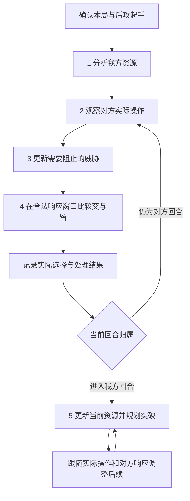

# 后攻实战辅助讨论初稿

版本：0.2。记录日期：2026-09-23。状态：讨论中；本文描述的新增能力尚未实现。

本文用于逐项记录讨论、比较方案和确定后续实施范围。除“已确认”条目外，流程、界面和实施顺序均为初步建议，不能据此直接启动整套功能开发。

## 1. 已确认方向与当前起点

| 编号 | 状态 | 讨论记录 |
| --- | --- | --- |
| C01 | 已确认 | 围绕五点拆解：我方起手、对方意图、优先阻止的威胁、响应时机、我方回合的突破与后续。 |
| C02 | 已确认 | 优先按现有实战辅助讨论：跟随游戏中的对局，给出操作建议，由用户在游戏中操作。 |
| C03 | 已确认 | 当前工作是建立初稿并继续讨论方向和落地流程。 |
| C04 | 已确认 | 后攻起手优先看手坑数量与压制能力，再考虑自身副作用、护航、解场、启动与补点、取胜节奏及不希望上手的组件。 |
| C05 | 已确认 | 起手分析需要考虑干扰和解场选择对自己展开的影响，并结合对方实际牌组继续调整。 |
| C06 | 已确认 | 展开部分需要关注关键启动牌、补点、试探对方干扰、扩大场面和斩杀／长盘方向；废件需要说明为何不希望上手或为何上手后失去作用。 |
| A01 | 暂定 | 先以普通 BO1 后攻为讨论示例；具体规则环境、客户端和首批覆盖卡组待确定。 |
| A03 | 建议 | 自动采集可核验的信息，保留人工补充和纠正入口；具体自动化程度逐项讨论。 |

2026-09-23 对当前代码和文档作了只读核对，得到以下起点；本次没有重新进行实机验收：

| 能力 | 当前依据与边界 | 本轮可讨论的复用方向 |
| --- | --- | --- |
| 正式先后攻、本局构筑和初始起手 | [智能识别](smart-recognition.md)及各平台适配说明已有开局流程；各平台验证范围不同。 | 沿用局次隔离和冻结起手，作为后攻入口。 |
| 后攻入口 | [起手页面](../src/trainer/web/duel-opening.js)仅留存起手；[方案筛选](../src/trainer/duel.py)仍排除后攻方案。 | 增加独立后攻流程需要后续设计与实现。 |
| 手坑和解场资料 | [常用卡资料](staple-catalog.md)已有用途、效果和条件。 | 用作起手解释和候选动作资料，逐局合法性另行核验。 |
| 对策与对手路线 | [断点资料](matchup-catalog.md)、[对手卡组资料](opponent-catalog.md)已有来源和稳定引用。 | 用于解释对方可能的路线与干扰位置；文字路线尚不等于可执行、已验证的引擎路线。 |
| 实时局面与后攻续算 | [回退记录](verification-1.36.1.md)说明旧后攻实现已撤回；当前资料页没有接入实时对手识别。 | 需重新评估数据获取、状态更新和决策流程。 |

旧后攻归档可在后续设计需要时作为参考；本次不恢复旧实现。[AI 学习计划](ai-learning-archive.md)继续保持封存，本文不启动其采样、教师验证或训练工作。

## 2. 五点之间怎样衔接

核心判断是：结合自己的资源，让对方留下一个自己有机会突破的局面。第 2—4 点会随每次操作反复更新，不是看完一次对方卡组后就固定执行。

| 五点 | 玩家当前要回答的问题 | 工具箱拟提供的结果 |
| --- | --- | --- |
| 1. 我方起手 | 有多少可用手坑，能怎样护航、解场和展开，哪些牌冲突或卡手？ | 按个人思考顺序展示整手资源、条件、取舍及斩杀／长盘的初步方向。 |
| 2. 对方意图 | 已经看到了什么，对方可能走向哪里？ | 已知事实、候选卡组／路线、推测依据和未知项。 |
| 3. 阻止目标 | 哪种结果最妨碍我这手牌获胜？ | 威胁优先顺序及其与我方解场、展开资源的关系。 |
| 4. 响应时机 | 现在交、换另一种干扰，还是保留？ | 当前可用动作、理由、代价、放行风险与替代选择。 |
| 5. 我方回合 | 从现在的真实资源出发，怎样突破并留下后续？ | 回合目标、短段操作路线，以及遇到响应后的调整。 |

图示省略了结束、取消和信息缺失分支。起手分析进行时也要持续观察对方，不能因等待计算而遗漏操作。任何阶段发现关键状态缺失，都先标明缺失并核对；不能继续把过期路线当作当前建议。

## 3. 第一点：按个人习惯评估整手后攻资源

**本轮已确认的方向**：先看手坑及其阻拦能力，再评估它对自己的影响，随后盘点护航、解场和展开资源，形成对斩杀、长盘与卡手风险的初步判断。分析要把这些因素联系起来，不能停留在逐卡分类。

用户提到的“大宇宙人”在本稿中暂按“次元吸引者”理解，“墓指”“剑指”“结界波”分别按“墓穴的指名者”“抹杀之指名者”“冥王结界波”记录。“G”保留为用户的泛称，具体分析必须落到实际卡号，不能把不同 G 或抽牌手坑的发动条件混用。

以下分类细节、界面、数据组织和实现步骤是对已确认方向的细化建议，仍可继续调整。卡片示例用于说明功能；是否能在某一环境投入，需按 Q01 所选环境与时间另行核验。

### 3.1 按实际思考顺序展示七项内容

| 顺序 | 用户关注的事情 | 起手分析需要回答 |
| --- | --- | --- |
| 1. 手坑 | 上手几张，是否有能明显影响对方展开的牌，单点干扰是否足够。 | 分开显示实际张数、类型、同名使用限制和当前条件；区分抽牌威慑、持续限制与单次响应，说明可能覆盖的动作。 |
| 2. 自身影响 | 次元吸引者等牌会不会连自己的展开也封住。 | 说明费用、限制何时生效、影响谁、持续到何时，以及我方哪些已知路线受影响、有无替代方向。 |
| 3. 护航 | 墓指、剑指等是否能保护关键启动。 | 说明能应对哪些干扰、可用的回合／时点、所需对象或配套资源是否仍在，以及使用后对己方其他卡片的影响。 |
| 4. 解场 | 是否有结界波等处理终场的手段，能否因此调整交坑目标。 | 说明可处理的威胁、不能覆盖的威胁、使用条件与后续限制；结合对方已知牌组动态调整。 |
| 5. 展开 | 有没有关键启动牌、一卡启动、补点，以及可以尝试引出对方干扰的动作。 | 说明启动条件、对通常召唤／额外资源的依赖、受阻后能否继续，以及扩大场面的可选投入。 |
| 6. 取胜节奏 | 这手牌更适合争取斩杀，还是解场后打长盘。 | 结合可用资源、已知对手信息和限制给出带前提的倾向；开局仅判断潜力，实际斩杀结论留到真实局面中核验。 |
| 7. 废件与卡手 | 是否有不希望上手、需要留在卡组或上手后失去原用途的牌。 | 指出影响的具体路线、失去的用途及可否转作费用／素材／其他用途；资料不足时保持待判断。 |

“强力手坑／普通手坑”保留为用户理解方式，策略判断用具体作用与适配情况解释。用户指出一两张灰流丽、无限泡影可能无法阻断对方；这应记录为需要评估的风险，不能写成“一两张必定不够”。对方的牌组、补点、交坑位置和我方后续资源都会影响结论。

一张牌可以同时属于多种用途，例如用于对方回合干扰，也可以留到我方回合处理威胁。界面可展示多种用途，但合计时不能把同一个副本当作两份可同时消耗的资源；同名多张也不能直接等价为多次同回合效果。

### 3.2 展开牌、补点与骗康怎样区分

为保持用户的原意，同时便于后续计算，建议分别记录以下作用；同一张牌在不同局面可以承担不同作用：

| 作用 | 在本功能中的含义 |
| --- | --- |
| 启动点 | 能进入一条有效路线的起始资源；说明是否依赖另一张手牌、通常召唤、卡组目标或额外卡组资源。 |
| 一卡启动 | 在明确前提下，以一张指定手牌启动；若还要额外手牌支付费用，应明确写出，不能忽略该资源。 |
| 补点／延伸 | 在已有动作后继续提供资源，或在某个环节受阻后使展开继续；分别标明受阻后的具体恢复条件。 |
| 备用启动 | 主线受阻时可改走的另一条入口；若仍依赖已经用掉的通常召唤或同名次数，不能当作独立后备。 |
| 试探／骗康 | 一种操作意图：用有价值的动作争取引出对方干扰，再保留其他路线。对方可能不响应，必须同时说明放行后的实际收益。 |
| 扩大场面 | 在已有可接受结果上，投入更多资源增加场面、伤害或续航；比较收益与过度投入的风险。 |

“补点”与“骗康”可以出现在同一张牌上，但不完全等同。为了骗康而先交掉唯一补点，可能失去后续；因此需要分析“被阻止”和“被放行”两种结果，不能默认对方一定会使用效果。

### 3.3 废件需要附带原因与可恢复用途

建议把“废件”作为与构筑、路线和当前手牌有关的判断，保留用户自己的标记，并细分原因：

- **需要留在卡组的组件**：上手后使某条依赖卡组目标的路线失效；是否仍有其他副本、手牌调用方法或回卡组手段要分别核对。
- **不理想但仍能使用的组件**：上手降低效率，仍可能作为素材、费用或另一条路线的资源。
- **缺配合牌／重复牌导致卡手**：当前没有满足条件的搭配，或额外副本受同名使用次数等限制。
- **暂时缺少使用场景**：例如尚未出现合适对象或时点；与上手就破坏原路线的组件分别说明。

不因“废件”标签自动排除卡牌、建议丢弃或改动用户牌组。没有知识资料的卡标为“待补充”，不能直接认定为废件。

### 3.4 已核对的规则例子与分析含义

2026-09-23 核对下列官方卡文／Q&A。卡文事实与基于事实提出的功能要求分列；这里不声称已经实现规则检测或通过引擎验收。

| 例子 | 核对结果 | 对起手分析的要求 |
| --- | --- | --- |
| 次元吸引者 | 发动要求我方墓地没有卡，将自身从手牌送墓；送墓改除外的效果适用至下个回合结束，涉及双方。见[官方卡文](https://www.db.yugioh-card.com/yugiohdb/card_search.action?cid=14740&ope=2&request_locale=ja)。 | 若在对方第一回合适用，就需要评估紧接着的我方回合；影响可能是路线不可用、效率下降或可绕开，不能只写“有负面效果”。 |
| 手坑使用顺序 | 送墓改除外适用时，要求送墓的费用不能支付，见[官方费用裁定](https://www.db.yugioh-card.com/yugiohdb/faq_search.action?fid=14540&ope=5&request_locale=ja)。[增殖的G](https://www.db.yugioh-card.com/yugiohdb/card_search.action?cid=9455&ope=2&request_locale=ja)与[锁鸟](https://www.db.yugioh-card.com/yugiohdb/card_search.action?cid=9279&ope=2&request_locale=ja)均有从手牌送墓的费用。 | 由这些规则可知，吸引者已经适用后，两者不能再支付该费用发动；若先交其他牌令我方墓地不再为空，吸引者也可能失去发动条件。发动前、连锁处理中与效果已适用须分开判断。 |
| 锁鸟与 G | 锁鸟限制本回合双方从卡组加手；官方说明，其适用期间增殖的G及所列欢聚友伴效果不能实际抽牌，见[官方组合裁定](https://www.db.yugioh-card.com/yugiohdb/faq_search.action?fid=12797&ope=5&request_locale=ja)。 | 起手同时出现这些牌时，应提示取舍和顺序；不能把抽牌收益与锁鸟限制当作可以无冲突叠加的优势。 |
| 灰流丽与无限泡影 | [灰流丽](https://www.db.yugioh-card.com/yugiohdb/card_search.action?cid=12950&ope=2&request_locale=ja)有同名每回合使用限制；[泡影](https://www.db.yugioh-card.com/yugiohdb/card_search.action?cid=13631&ope=2&request_locale=ja)从手牌发动要求己方场上没有卡。 | 同名份数、已用次数和是否仍可手发分别核对；“有两张手坑”不直接换算为“两次当前可用阻断”。 |
| 墓指与剑指 | [墓指](https://www.db.yugioh-card.com/yugiohdb/card_search.action?cid=13619&ope=2&request_locale=ja)需要对方墓地怪兽，其同原本卡名无效持续到下回合结束；[剑指官方说明](https://www.db.yugioh-card.com/yugiohdb/faq_search.action?cid=14627&ope=4&request_locale=ja)要求宣言自己卡组中存在的卡名，且会影响双方的对应效果。 | 护航能力需要核对目标、卡组剩余配套和对己方同名牌的影响；不能仅凭护航牌上手就保证启动能通过。 |
| 冥王结界波 | 其伤害归零效果适用后，本回合对方受到的全部伤害为零，见[官方处理说明](https://www.db.yugioh-card.com/yugiohdb/faq_search.action?cid=14742&ope=4&request_locale=ja)。 | 可以讨论先处理威胁、建立场面与续航；不能在该限制适用后仍安排依赖伤害的当回合斩杀。解场能力与取胜节奏必须一起分析。 |

### 3.5 起手分析怎样实际落地

以下为实现建议，当前仅记录流程：

1. **读取本局输入**：确认初始手牌、本局构筑和环境。保存原始起手，另行维护当前手牌与已确认消耗；不同用途引用同一个卡片副本。
2. **取得基础用途资料**：复用情报站现有手坑、解场和效果备注，结合用户牌组／展开资料补充护航、启动、补点和组件说明。哪些自动生成、哪些由用户维护仍待讨论；护航等缺少现成结构的内容需后续设计。
3. **核对依赖与冲突**：识别费用、持续限制、同名次数、配套卡必须所在的区域，以及干扰与自己路线之间的影响。规则事实附来源；路线影响附适用条件和验证状态。
4. **形成整手概览**：按本节七项顺序，先给手坑概况和关键冲突，再给护航／解场覆盖、启动与补点、卡手原因及初步取胜方向。不同用途数量可能重叠，不能直接相加成手牌总数或确定阻抗数。
5. **随对局补全判断**：对方牌组未知时给带前提的方向；对方动作、己方交坑或抽牌发生后更新相关结论。若资料缺失则具体指出，不用未知的第六张牌填补启动或斩杀条件。

**界面草案**：保留逐张卡图，旁边按“手坑与冲突 → 护航／解场 → 启动／补点 → 节奏与卡手”展示概览。展开某一结论时能看到涉及的牌、依据、受影响的路线和待核对条件。先做可解释的关系，不预设整手总评分。

**需要继续讨论**：基础用途与组件身份由谁维护？用户标记与自动分析冲突时如何配合？“一卡启动／补点／废件”如何绑定具体牌组和路线？第一版支持哪些可验证关系与路线？

**建议验收例**：

- 多张同名灰流丽不会被计算成相同回合可连续使用多次该效果。
- 同一张泡影显示干扰与解场两种用途，但实际用掉后两个候选用途都随之更新。
- 吸引者与我方主线冲突时，指出具体依赖和持续到何时；有可核验替代路线时一并列出。
- G 与锁鸟同时在手时，显示互相影响，而不是直接累加预期收益。
- 剑指的宣言配套已全部离开卡组时，不再把该宣言记为可用护航。
- 结界波伤害限制已经适用时，不再推荐依赖当回合伤害的斩杀路线。
- 被标为废件的组件如果仍能按规则用作费用或素材，应保留这些用途；影响主线时指出是哪条路线。
- 用作试探的动作分别描述对方响应和不响应的结果，不保证一定骗出干扰。
- 没有手坑时仍继续分析护航、解场、展开与卡手情况，不把“零手坑”直接判为无法后攻。

## 4. 第二点：通过对方操作，逐步判断对方在做什么

**判断目标**：持续解释实际发生的操作，并缩小对方可能的路线范围。

**需要的信息**：回合与阶段、行动方、公开卡片及区域、效果发动、已支付费用、连锁和处理结果，以及按规则公开后仍可确认的手牌信息。对方未公开手牌、盖卡身份和未来抽牌保持未知。

**建议流程**：

1. 收到一次实际操作，先确定它是发动、支付费用、选对象、处理结果还是不入连锁的行动；不能看到发动就认为效果已经成功。
2. 将可确认内容加入本局事实记录；人工补充附带来源，推测另列。
3. 用环境相符的对手资料、系列 TAG 和已见操作寻找候选；通用卡、外挂或混合构筑可能对应多条路线。
4. 展示候选的支持依据和相冲突的信息。第一版可用文字说明“依据充分／信息不足”，不预设未经校准的概率数值。
5. 新操作与资料不符时降低或撤销匹配，继续从已知卡片分析，不强行把对方塞进某套固定模板。

**界面草案**：将“对方已做的操作”与“可能的后续”分开显示；候选路线旁可展开资料来源，并允许用户修正牌型判断。修正牌型不等于确认对方完整构筑。

**需要讨论**：优先接入哪个客户端？哪些事件必须自动读取，哪些允许人工补充？对方路线显示一个主要候选，还是少量候选并列？资料缺失时最少提供什么？

**建议验收例**：一个通用检索动作不会直接确认整副牌组；效果被无效后不产生虚构的检索结果；断流后不能沿用旧事实给出确定操作指令。

## 5. 第三点：结合自己的手牌，判断最需要阻止什么

**判断目标**：把对方的威胁与自己的应对能力对应起来，决定有限干扰优先用在哪里。

**需要的信息**：已确认的对方资源、可能的关键后续、我方当前手牌和可用额外资源、双方已用效果与限制，以及已知的保护和续航。不同威胁分别说明作用条件，不能只汇总成“几康”。

**建议流程**：

1. 从已知场面和有依据的候选路线中列出威胁，例如限制我方关键行动、阻止启动、保护关键资源或持续续航。
2. 对照我方已持有的解场与展开能力，逐项判断“已有可行处理方法”“需要额外条件”“目前缺少答案”。
3. 比较阻止某个环节与放行的后果，考虑对方已知补点、我方投入资源和下一回合可保留的选择。
4. 给出可解释的优先顺序；涉及未知补点时按条件分支描述，不把参考路线的终场当作必然结果。
5. 对方换线、我方用牌或出现新限制时重新排序。

**讨论用假设例**：我方已有经核验能处理某只大型怪兽的办法，却没有处理另一项持续限制的资源，那么阻止持续限制可能更重要。该例表达比较方法，不代表任意卡组的固定交坑结论。

**界面草案**：每项重点威胁附上“为什么影响这手牌”“我方现有答案”“建议提前阻止的环节”，默认只展示与当前决策有关的内容。

**需要讨论**：优先比较哪些维度？用户能否指定最想避免的限制？是否需要“稳健／争取本回合取胜”等目标偏好？若引入评分，必须先定义含义和验证方式。

**建议验收例**：同一对方场面，给我方更换一张有明确用途的解场牌后，威胁顺序可以相应改变，并解释变化的原因。

## 6. 第四点：在实际响应窗口决定交还是留

**判断目标**：在有限时间内，给出当前能够理解和执行的选择。

**需要的信息**：准确的当前窗口、连锁、卡片身份和效果、发动条件、可选对象、费用、已用次数及生效限制。界面显示卡牌或游戏弹出询问，都不能单独证明某项具体建议合法。

**建议流程**：

1. 核对当前状态足以判断哪些动作；不能判断的条件明确列出。
2. 在候选中同时比较“现在使用”“使用另一种资源”和“保留”。选择展示数量与默认展开程度待讨论。
3. 每条建议列出所用卡片／效果、响应的动作、时点／对象、代价、预期作用、放行风险，以及对我方后续的影响。
4. 用户在游戏中操作；工具箱观察结果，或在无法自动确认时请求补充。点击查看或选择建议不应直接记为已经发动。
5. 分别记录实际选择、已经支付的费用与最终处理结果。即使效果被无效，资源消耗和次数变化也按该次实际规则结果记录。
6. 窗口变化、关闭或局面改变后使旧建议失效；迟到的计算结果不能重新覆盖当前提示。

**界面草案**：先给一条简短建议及关键理由，展开后比较备选。提示“暂时保留”时，也说明等待条件和可能错过的机会。信息不足时展示缺失项和条件说明。

**需要讨论**：默认展示一条建议还是交／留对照？自动更新频率与可接受响应时间如何衡量？是否允许手动暂停提示？实际动作未被确认时如何用最少操作补记？

**建议验收例**：查看建议后选择不发动，当前手牌不变；窗口结束后晚到建议不再出现；发动被无效时，不能把实际已付费用恢复为可用资源。

## 7. 第五点：进入我方回合后，从真实资源规划突破

**判断目标**：根据实际留下的场面，确定本回合目标并安排可调整的操作顺序。

**需要的信息**：当前手牌、新抽到的牌、双方已知场面、墓地和公开除外资源、LP、回合／阶段、已用效果、攻击及召唤等相关限制。对方未公开的响应保持未知。

**建议流程**：

1. 在进入我方回合及通常抽牌完成等关键时点核对当前资源；期间合法窗口仍需处理，不能一律等到主要阶段才提供帮助。
2. 用实际资源更新输入，不以“原始五张加一张”代替当前手牌；对方回合的消耗、抽牌和资源转移都可能改变局面。
3. 比较本回合可行目标：争取取胜、解除主要威胁并建立干扰，或保留资源争取后续。目标由系统建议还是用户选择待讨论。
4. 为候选路线检查费用、对象、保护、次数、阶段和已有约束；现有先攻方案不能直接视为适用后攻的解场路线。
5. 先给一段可执行操作，并标明关键分支。对方响应或随机结果出现后，保留已执行历史，仅重算尚未执行的部分。
6. 结束前核对当前结果和剩余资源，供后续回合或复盘使用。仅在明确、已验证的场景下描述可完成的伤害，未知响应作为条件保留。

**界面草案**：同时看见本回合目标、当前步骤和关键备选；已经执行的步骤保留，新路线从真实当前位置开始。具体布局在前四点确定后再讨论。

**需要讨论**：第一版做到解场思路、少量已验证路线，还是完整逐步教程？取胜与续航如何取舍？战斗阶段先支持哪些场景？不认识对方卡片时仍能提供哪些有用信息？

**建议验收例**：对方回合消耗两张牌后，不再出现需要原五张手牌的路线；对方追加一次干扰后，从剩余资源重新规划；不能确认场面时暂停确定性步骤。

## 8. 五点共用的实现基础

以下是实现前需要核对的能力，不预定数据库、框架或模型方案：

| 基础 | 拟实现行为 | 为什么五点都需要它 |
| --- | --- | --- |
| 本局身份与更新序号 | 建议绑定客户端实例、局次和对应状态；新局或新状态拒绝旧结果。 | 防止把上一局或上一窗口的信息带进来。 |
| 起手与当前资源分开 | 保存原始起手，独立维护当前卡片身份、份数、区域、已用效果及限制。 | 交坑、费用和抽牌会改变后续可行性。 |
| 信息来源与未知项 | 区分自动观察、人工确认和推测，标明更新时间及缺失信息。 | 让建议能够解释，也能判断何时需要重新核对。 |
| 实际事件与建议分开 | 分别记录想做什么、实际做了什么、效果怎样处理。 | 避免把点选建议当成已经成功执行。 |
| 资料适用性 | 核对规则环境、卡池／禁限、卡文、资料版本与来源；保留个人修改。 | 旧参考牌表和攻略不能直接作为当前合法动作。 |
| 规则与策略分开 | 分别表达规则条件、限定场景引擎验证结果、策略判断和未知前提。 | 规则合法不等于策略最优，资料导入不等于逐局可执行。 |
| 状态不足时降级 | 保留可核验事实和参考说明，提示缺失项；补齐后再更新操作建议。 | 避免用不完整局面继续给出确定路线。 |

客户端各自建立能力清单，分别说明开局、我方当前资源、公开区域、阶段和连锁哪些能读、哪些已验证。某个平台通过测试，不自动扩大其他平台的支持范围。

计算方式保持待定：先确定输入、合法性和输出要求，再比较资料匹配、规则判断、限定搜索和模型解释的用途。若使用模型，其文字建议仍需有来源和条件校验；不因本讨论恢复已封存的 AI 学习计划。

对局、个人备注及验收材料沿用本地数据边界；新记录格式确定后再讨论兼容与备份，不覆盖已有正式方案、原始资料或历史记录。

## 9. 建议的落地顺序

这是讨论用的实施分段，尚未批准执行；五个判断环节可以在同一后攻工作区中协作，不预设必须做成五个页面。

| 阶段 | 交付目标 | 进入下一阶段的条件 |
| --- | --- | --- |
| P0：确定范围 | 确定规则环境、首个客户端、试点卡组、提示深度及信息补充方式。 | 关键待定项有结论，产出可执行需求。 |
| P1：核对信息 | 用隔离样例验证必要数据与更新流程，再在获准的实战中核对；先能清楚显示已知、未知和当前资源。 | 不串局、不虚构处理结果、能识别过期状态；人工补充不会伪装成自动读取。 |
| P2：起手分析 | 按个人顺序分析手坑、自身影响、护航、解场、启动／补点、取胜节奏和废件；复用资料并补齐选定范围的关系说明。 | 重复卡、多用途不重复计资源；规则冲突、路线依赖、卡手原因与消耗后的变化均可解释。 |
| P3：对方回合干扰 | 在选定卡组与场景中联通第 2—4 点，输出有条件、可解释的交／留建议。 | 时点、费用与结果核对通过，资料缺失和迟到结果处理明确。 |
| P4：我方回合衔接 | 完成第 5 点选定范围，从真实当前状态生成并调整路线。 | 实际消耗可延续到我方回合，受到响应后只重算未执行部分。 |
| P5：扩展与复盘 | 在已有流程通过验收后扩展卡组、客户端、复杂战斗和复盘能力。 | 每项新增支持有独立证据，不以单个成功示例代替全面支持。 |

未来实现验收使用隔离数据和本应用内部测试接口，按变更运行 `npm run test:desktop` / `npm run test:packaged`。游戏输入由用户完成，测试不移动系统鼠标或发送全局按键。仅完成本文不代表上述产品验收已经执行。

## 10. 后续讨论清单与记录方式

建议先细化第 1 点，再按第 2—5 点继续；每次只集中决定一小组问题，避免尚未讨论的建议被当作需求。

| 编号 | 关联 | 待决定问题 | 当前状态 |
| --- | --- | --- | --- |
| Q01 | 整体 | 规则环境、首个客户端和试点卡组是什么？ | 待讨论 |
| Q02 | 第 1 点 | 起手分析先做用途说明，还是同时说明对自己的展开与取胜方向的影响？ | 方向已确认：需要同时分析影响；具体路线覆盖和实现方法待讨论。 |
| Q03 | 第 1 点 | 自动用途和个人标记如何配合，哪些信息允许人工补充？ | 待讨论 |
| Q04 | 第 2 点 | 自动观察的最低范围与候选路线的显示方式是什么？ | 待讨论 |
| Q05 | 第 3 点 | 威胁比较依据和用户可调目标是什么？ | 待讨论 |
| Q06 | 第 4 点 | 一条建议还是交／留对照，怎样补记实际选择与处理结果？ | 待讨论 |
| Q07 | 第 4 点 | 怎样验证建议来得及使用，窗口结束后如何处理未完成计算？ | 待讨论 |
| Q08 | 第 5 点 | 解场建议与逐步教程分别做到什么程度，首批验证哪些场景？ | 待讨论 |
| Q09 | 第 1 点 | 启动、补点、护航与废件的基础资料如何维护，并关联到具体牌组／路线？ | 待讨论；建议复用情报站和现有展开资料。 |
| Q10 | 第 1 点 | 首版怎样展示手坑作用、卡片冲突和整手倾向，哪些结论需要引擎验证后才提供？ | 待讨论 |

每个问题确定后，补充“结论、理由、影响范围、可观察验收例”，并将对应正文同步改为已确认。修改既有结论时保留一条简短变更说明。

| 日期 | 版本 | 本轮记录 |
| --- | --- | --- |
| 2026-09-23 | 0.1 | 建立五点框架；确认现有实战辅助场景；核对当前起点；其余流程、界面和实施分段作为建议保留。 |
| 2026-09-23 | 0.2 | 按用户习惯细化第 1 点，确认七项关注内容及自身影响分析；补充护航、启动／补点／试探区别、废件原因和规则例子；基础资料维护方式与计算范围待讨论。 |

规则讨论参考此前核对的 [KONAMI 官方规则书](https://img.yugioh-card.com/en/downloads/rulebook/SD_RuleBook_EN_10.pdf)与[效果时点说明](https://www.yugioh-card.com/en/play/fast-effect-timing/)。这些 TCG 基础资料用于说明一般结构；实际落地须按 Q01 选定的环境重新核对具体卡文、时点和裁定。
