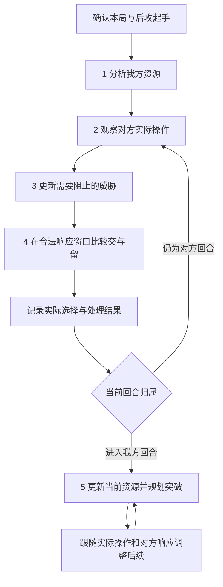

# 后攻实战辅助讨论初稿

版本：0.6。记录日期：2026-09-23。状态：第一点已有首版实现，第 2—5 点继续完善计划，尚未实施。

本文用于逐项记录讨论、比较方案和确定后续实施范围。除“已确认”条目外，流程、界面和实施顺序均为初步建议，不能据此直接启动整套功能开发。

当前第一点的实际范围见[起手分析说明](going-second-opening.md)和[1.42.2 复核记录](verification-1.42.2.md)。第 2—5 点按相同问询方式补充的推荐答案、具体流程、界面、分段与验收见[后攻实战辅助完善计划](going-second-live-plan.md)；本轮只维护计划文档。

## 1. 已确认方向与当前起点

| 编号 | 状态 | 讨论记录 |
| --- | --- | --- |
| C01 | 已确认 | 围绕五点拆解：我方起手、对方意图、优先阻止的威胁、响应时机、我方回合的突破与后续。 |
| C02 | 已确认 | 优先按现有实战辅助讨论：跟随游戏中的对局，给出操作建议，由用户在游戏中操作。 |
| C03 | 已确认 | 本轮继续补充第 2—5 点的方向与落地计划；不会因完善计划直接进入实现。 |
| C04 | 已确认 | 后攻起手优先看手坑数量与压制能力，再考虑自身副作用、护航、解场、启动与补点、取胜节奏及不希望上手的组件。 |
| C05 | 已确认 | 起手分析需要考虑干扰和解场选择对自己展开的影响，并结合对方实际牌组继续调整。 |
| C06 | 已确认 | 展开部分需要关注关键启动牌、补点、试探对方干扰、扩大场面和斩杀／长盘方向；废件需要说明为何不希望上手或为何上手后失去作用。 |
| C07 | 已确认 | 先理解卡组基本展开与系列运转，再归纳主 TAG 内卡片的主要效果和分工；通用手坑等采用统一效果表示，小轴记录内部作用及与主系列、其他构筑的关系。 |
| C08 | 已确认 | 人与 AI 使用同一套标记系统；人工只选择性修改已经归类、确定的通用效果表示，局部推导结果不能直接修改，一般通过备注补充。 |
| C09 | 已确认 | 一卡动、补点等身份以展开方案和目标为依据；能替代现有路线到达相同结果，或增强已有场面的资源，都纳入用户所说的补点。 |
| C10 | 已确认 | 废件是相对评价：可以指对当前展开没有贡献的牌，也可以指不希望上手的中间组件、缺少配合而不能单独起作用的牌。评价需注明具体目标和场景。 |
| C11 | 已确认 | 主 TAG 是构筑中浓度最高的系列部分；两个系列浓度相近时，可以有两个主 TAG。第一点首版已采用 D01 的可配置初值，仍需按真实构筑校准。 |
| C12 | 已确认 | 先讨论整套卡组的启动点、阻抗、终场和斩杀等基本展开思路，再根据卡片／效果在方案中的参与程度与重复使用情况归纳主要效果标识。 |
| C13 | 已确认 | 人工编辑按通用与局部的稳定性划分权限；局部备注不能直接改变效果含义、方案关系或计算结果。此规则替代 0.3 中各层均可编辑的宽泛建议。 |
| C14 | 已确认 | 相同指方案结果相同；增强的主要判断是终场效果更多。其他收益与代价单独说明，不擅自换成综合强度评分。 |
| C15 | 已确认 | 以本地归纳为主，沿用同一套结构化资料与标记；首版不依赖在线模型。 |
| C16 | 已确认 | 第 2—5 点首个客户端选择 YGOPro；具体构建与房间规则需要在实施前核对。 |
| A01 | 暂定 | 先以普通 BO1 后攻为讨论示例；推荐沿用本次杀手级调整曲作为我方试点，首批对手资料与具体规则待落实。 |
| A03 | 建议 | 自动采集可核验的信息，保留人工补充和纠正入口；具体自动化程度逐项讨论。 |

下表保留 0.5 讨论时的只读核对起点，不代表 1.42.2 的最新完成情况。第一点后来已实现，其余四点的当前基础与缺口见[新计划的当前起点](going-second-live-plan.md#1-共同原则与当前起点)；本轮没有进行实机验收：

| 能力 | 当前依据与边界 | 本轮可讨论的复用方向 |
| --- | --- | --- |
| 正式先后攻、本局构筑和初始起手 | [智能识别](smart-recognition.md)及各平台适配说明已有开局流程；各平台验证范围不同。 | 沿用局次隔离和冻结起手，作为后攻入口。 |
| 后攻入口 | [起手页面](../src/trainer/web/duel-opening.js)仅留存起手；[方案筛选](../src/trainer/duel.py)仍排除后攻方案。 | 增加独立后攻流程需要后续设计与实现。 |
| 手坑和解场资料 | [常用卡资料](staple-catalog.md)已有用途、效果和条件。 | 用作起手解释和候选动作资料，逐局合法性另行核验。 |
| 系列成员与用途标记 | [TAG 关联](tag-relations.md)已有系列成员和直接关联依据；[情报站](intelligence.md)已有逐效果备注、来源、文本核对和版本冲突处理。 | 作为统一效果标记的起点，扩展系列内部分工与小轴关系；关联卡片不等于已理解运转路线。 |
| 构筑主 TAG | [构筑 TAG 计算](../src/trainer/deck_tags.py)按主卡组与额外卡组副本数统计，排除用途 TAG，自动建议目前仅选择浓度最高的一项为主 TAG；[公共选择结构](../src/trainer/plan_tags.py)允许保存多个主 TAG。 | 保留现有分类数据；浓度接近时自动识别双主 TAG 仍需实现，不把支持保存多个主 TAG 当作自动规则已完成。 |
| 方案资源依据 | [隐性条件](implicit-precompute.md)已有起手之外的步骤资源与区域依赖；[临时方案](duel-temporary-plans.md)保留来源及目标约束。 | 用方案证据解释一卡动、补点和相对废件；目前没有据此完成这套统一身份推导。 |
| 终场比较 | [现有终场评价](../src/trainer/plan_endboard.py)已有标记卡片与标记效果数量，过滤被无效的卡片；文档明确效果数不等于已验证的阻抗次数。 | 作为终场效果比较的起点；新流程的结果一致性、有效效果与共享资源核验仍需细化。 |
| 对策与对手路线 | [断点资料](matchup-catalog.md)、[对手卡组资料](opponent-catalog.md)已有来源和稳定引用。 | 用于解释对方可能的路线与干扰位置；文字路线尚不等于可执行、已验证的引擎路线。 |
| 实时局面与后攻续算 | [回退记录](verification-1.36.1.md)说明旧后攻实现已撤回；当前资料页没有接入实时对手识别。 | 需重新评估数据获取、状态更新和决策流程。 |

旧后攻归档可在后续设计需要时作为参考；本次不恢复旧实现。[AI 学习计划](ai-learning-archive.md)继续保持封存，本文不启动其采样、教师验证或训练工作。

## 2. 五点之间怎样衔接

核心判断是：结合自己的资源，让对方留下一个自己有机会突破的局面。第 2—4 点会随每次操作反复更新，不是看完一次对方卡组后就固定执行。

| 五点 | 玩家当前要回答的问题 | 工具箱拟提供的结果 |
| --- | --- | --- |
| 1. 我方起手 | 有多少可用手坑，能怎样护航、解场和展开，哪些牌冲突或卡手？ | 按个人思考顺序展示整手资源、条件、取舍及斩杀／长盘的初步方向。 |
| 2. 对方意图 | 已经看到了什么，对方可能走向哪里？ | 已知事实、候选卡组／路线、推测依据和未知项。 |
| 3. 阻止目标 | 哪种结果最妨碍我这手牌获胜？ | 威胁优先顺序及其与我方解场、展开资源的关系。 |
| 4. 响应时机 | 现在交、换另一种干扰，还是保留？ | 当前可用动作、理由、代价、放行风险与替代选择。 |
| 5. 我方回合 | 从现在的真实资源出发，怎样突破并留下后续？ | 回合目标、短段操作路线，以及遇到响应后的调整。 |

图示省略了结束、取消和信息缺失分支。起手分析进行时也要持续观察对方，不能因等待计算而遗漏操作。任何阶段发现关键状态缺失，都先标明缺失并核对；不能继续把过期路线当作当前建议。

## 3. 第一点：按个人习惯评估整手后攻资源

**本轮已确认的方向**：先看手坑及其阻拦能力，再评估它对自己的影响，随后盘点护航、解场和展开资源，形成对斩杀、长盘与卡手风险的初步判断。分析要把这些因素联系起来，不能停留在逐卡分类。

用户提到的“大宇宙人”在本稿中暂按“次元吸引者”理解，“墓指”“剑指”“结界波”分别按“墓穴的指名者”“抹杀之指名者”“冥王结界波”记录。“G”保留为用户的泛称，具体分析必须落到实际卡号，不能把不同 G 或抽牌手坑的发动条件混用。

以下分类细节、界面、数据组织和实现步骤是对已确认方向的细化建议，仍可继续调整。卡片示例用于说明功能；是否能在某一环境投入，需按 Q01 所选环境与时间另行核验。

### 3.1 按实际思考顺序展示七项内容

| 顺序 | 用户关注的事情 | 起手分析需要回答 |
| --- | --- | --- |
| 1. 手坑 | 上手几张，是否有能明显影响对方展开的牌，单点干扰是否足够。 | 分开显示实际张数、类型、同名使用限制和当前条件；区分抽牌威慑、持续限制与单次响应，说明可能覆盖的动作。 |
| 2. 自身影响 | 次元吸引者等牌会不会连自己的展开也封住。 | 说明费用、限制何时生效、影响谁、持续到何时，以及我方哪些已知路线受影响、有无替代方向。 |
| 3. 护航 | 墓指、剑指等是否能保护关键启动。 | 说明能应对哪些干扰、可用的回合／时点、所需对象或配套资源是否仍在，以及使用后对己方其他卡片的影响。 |
| 4. 解场 | 是否有结界波等处理终场的手段，能否因此调整交坑目标。 | 说明可处理的威胁、不能覆盖的威胁、使用条件与后续限制；结合对方已知牌组动态调整。 |
| 5. 展开 | 有没有关键启动牌、一卡启动、补点，以及可以尝试引出对方干扰的动作。 | 说明启动条件、对通常召唤／额外资源的依赖、受阻后能否继续，以及扩大场面的可选投入。 |
| 6. 取胜节奏 | 这手牌更适合争取斩杀，还是解场后打长盘。 | 结合可用资源、已知对手信息和限制给出带前提的倾向；开局仅判断潜力，实际斩杀结论留到真实局面中核验。 |
| 7. 废件与卡手 | 是否有不希望上手、需要留在卡组或上手后失去原用途的牌。 | 指出影响的具体路线、失去的用途及可否转作费用／素材／其他用途；资料不足时保持待判断。 |

“强力手坑／普通手坑”保留为用户理解方式，策略判断用具体作用与适配情况解释。用户指出一两张灰流丽、无限泡影可能无法阻断对方；这应记录为需要评估的风险，不能写成“一两张必定不够”。对方的牌组、补点、交坑位置和我方后续资源都会影响结论。

一张牌可以同时属于多种用途，例如用于对方回合干扰，也可以留到我方回合处理威胁。界面可展示多种用途，但合计时不能把同一个副本当作两份可同时消耗的资源；同名多张也不能直接等价为多次同回合效果。

### 3.2 展开牌、补点与骗康怎样区分

本轮确认按用户的广义用法记录“补点”：包括另一条可达相同目标的选择，也包括增强原有场面的资源。以下子类型用于解释具体作用，不把它们固化为卡牌永久身份；判断依据是当前构筑、方案／分支、目标和剩余资源。

| 作用 | 在本功能中的含义 |
| --- | --- |
| 启动点 | 能进入当前目标所需路线的起始资源；说明是否依赖另一张手牌、通常召唤、卡组目标或额外卡组资源。 |
| 一卡动 | 已有方案证明，在列明的构筑、起点和规则前提下，只需一张起手资源即可完成指定目标；若仍需另一张手牌支付费用，应明确列出，不能省略。 |
| 替代补点／备用启动 | 另一条可到达相同目标的入口。若原动作已消耗通常召唤或同名次数，必须重新检查替代路线是否还能执行。 |
| 续接补点 | 某个环节受阻后，从实际剩余资源继续展开；必须有对应受阻场景和后续路线依据，不能仅凭另有启动点保证能续。 |
| 增强补点／延伸 | 依照本轮确定的口径，在原有一卡动或其他基线上增加终场效果；伤害、保留资源等其他收益及额外投入、限制分别说明。 |
| 试探／骗康 | 一种操作意图：用有价值的动作争取引出对方干扰，再保留其他路线。对方可能不响应，必须同时说明放行后的实际收益。 |
| 扩大场面 | 在已有可接受结果上，投入更多资源增加场面、伤害或续航；比较收益与过度投入的风险。 |

例如，在相同已列明前提下，方案 A 仅需起手卡甲达到目标 X，方案 B 仅需起手卡乙也达到 X，那么两者各有一卡动证据；选择 A 为本局基线时，卡乙可被描述为替代补点。若甲加乙能在 X 的基础上增加终场效果而达到 Y，则乙还可能是增强补点。该例只说明评价关系，实际可执行性仍需核对资源和限制。

“补点”与“骗康”可以出现在同一张牌上。将乙先用于试探时，要检查被阻止后甲能否继续、被放行后乙能取得什么结果。两条路线都能从空场开始，不证明先做其中一条后另一条仍能执行。

### 3.3 废件需要附带原因与可恢复用途

按用户本轮说明，“废件”是相对于正在评价的任务而言的。需要同时保留“当前展开是否用得到”和“它在整场决斗中还有什么用途”，并标明评价所用的方案与目标。建议细分原因：

- **对当前展开无贡献**：例如某张手坑不参与这条展开时，可以按用户习惯称为“这条展开的废件”，同时保留它在对方回合的干扰用途；能用作费用、素材时另行注明。
- **需要留在卡组的组件**：上手后使某条依赖卡组目标的路线失效；是否仍有其他副本、手牌调用方法或回卡组手段要分别核对。
- **不理想但仍能使用的组件**：上手降低效率，仍可能作为素材、费用或另一条路线的资源。
- **缺配合牌／重复牌导致卡手**：当前没有满足条件的搭配，或额外副本受同名使用次数等限制。
- **暂时缺少使用场景**：例如尚未出现合适对象或时点；与上手就破坏原路线的组件分别说明。

中间组件应标明在什么步骤、从什么区域被调用，以及需要谁提供前置条件。上手后可能导致主线缺少卡组目标，也可能仍能从手牌使用，必须依据具体方案区分。用户所说的“亏卡”在这里描述有效起手资源受损；实际卡差按真实消耗另记，不因加上标签就记为已经少了一张牌。

不因“废件”标签自动排除卡牌、建议丢弃或改动用户牌组。没有知识资料或没有找到适用方案时标为“待补充／尚无方案依据”，不能据此证明该卡无用。

### 3.4 已核对的规则例子与分析含义

2026-09-23 核对下列官方卡文／Q&A。卡文事实与基于事实提出的功能要求分列；这里不声称已经实现规则检测或通过引擎验收。

| 例子 | 核对结果 | 对起手分析的要求 |
| --- | --- | --- |
| 次元吸引者 | 发动要求我方墓地没有卡，将自身从手牌送墓；送墓改除外的效果适用至下个回合结束，涉及双方。见[官方卡文](https://www.db.yugioh-card.com/yugiohdb/card_search.action?cid=14740&ope=2&request_locale=ja)。 | 若在对方第一回合适用，就需要评估紧接着的我方回合；影响可能是路线不可用、效率下降或可绕开，不能只写“有负面效果”。 |
| 手坑使用顺序 | 送墓改除外适用时，要求送墓的费用不能支付，见[官方费用裁定](https://www.db.yugioh-card.com/yugiohdb/faq_search.action?fid=14540&ope=5&request_locale=ja)。[增殖的G](https://www.db.yugioh-card.com/yugiohdb/card_search.action?cid=9455&ope=2&request_locale=ja)与[锁鸟](https://www.db.yugioh-card.com/yugiohdb/card_search.action?cid=9279&ope=2&request_locale=ja)均有从手牌送墓的费用。 | 由这些规则可知，吸引者已经适用后，两者不能再支付该费用发动；若先交其他牌令我方墓地不再为空，吸引者也可能失去发动条件。发动前、连锁处理中与效果已适用须分开判断。 |
| 锁鸟与 G | 锁鸟限制本回合双方从卡组加手；官方说明，其适用期间增殖的G及所列欢聚友伴效果不能实际抽牌，见[官方组合裁定](https://www.db.yugioh-card.com/yugiohdb/faq_search.action?fid=12797&ope=5&request_locale=ja)。 | 起手同时出现这些牌时，应提示取舍和顺序；不能把抽牌收益与锁鸟限制当作可以无冲突叠加的优势。 |
| 灰流丽与无限泡影 | [灰流丽](https://www.db.yugioh-card.com/yugiohdb/card_search.action?cid=12950&ope=2&request_locale=ja)有同名每回合使用限制；[泡影](https://www.db.yugioh-card.com/yugiohdb/card_search.action?cid=13631&ope=2&request_locale=ja)从手牌发动要求己方场上没有卡。 | 同名份数、已用次数和是否仍可手发分别核对；“有两张手坑”不直接换算为“两次当前可用阻断”。 |
| 墓指与剑指 | [墓指](https://www.db.yugioh-card.com/yugiohdb/card_search.action?cid=13619&ope=2&request_locale=ja)需要对方墓地怪兽，其同原本卡名无效持续到下回合结束；[剑指官方说明](https://www.db.yugioh-card.com/yugiohdb/faq_search.action?cid=14627&ope=4&request_locale=ja)要求宣言自己卡组中存在的卡名，且会影响双方的对应效果。 | 护航能力需要核对目标、卡组剩余配套和对己方同名牌的影响；不能仅凭护航牌上手就保证启动能通过。 |
| 冥王结界波 | 其伤害归零效果适用后，本回合对方受到的全部伤害为零，见[官方处理说明](https://www.db.yugioh-card.com/yugiohdb/faq_search.action?cid=14742&ope=4&request_locale=ja)。 | 可以讨论先处理威胁、建立场面与续航；不能在该限制适用后仍安排依赖伤害的当回合斩杀。解场能力与取胜节奏必须一起分析。 |

### 3.5 先理解基本展开，再归纳主要效果标识

**已确认方向**：主 TAG 根据构筑浓度确定，最高者为主，两个系列浓度相近时可以并列。先讨论整套卡组如何启动、建立阻抗、到达终场及斩杀，再从参与程度高、重复使用多的作用归纳卡片的主要效果标识。当前不预先要求用户逐卡选择一套效果标签。

**浓度口径**：第一点首版已采用主卡组与额外卡组的实际副本数及 3.9.1 的初始参数。系列父子 TAG 或成员重叠可能使两项同时较高，应展示成员依据并单独处理，不把用途 TAG 的数量当作第二个主系列。1.42.2 另将“同调／融合”宽泛支援标签从系列浓度排名中单列；构筑浓度与方案参与度分别记录。

**基本展开思路的建议记录顺序**：

1. **启动点**：有哪些入口，各自需要哪些手牌、卡组／额外资源和前置条件。
2. **展开过程与阻抗**：关键资源怎样流转，经由哪些中间组件，能建立哪些干扰；哪里受阻会影响后续，现有补点怎样接入。
3. **终场**：各条基本路线最终留下什么卡片与效果，以及可继续使用的资源。
4. **斩杀与后续**：哪些路线具备伤害推进能力，哪些更偏续航；成立前提分别说明。
5. **归纳卡片作用**：对照上述方案，识别同一卡片哪些具体效果反复承担关键工作，据此产生主要效果标识的候选。

**参与度与重复次数的计数建议**：记录所覆盖的不同有效方案、该卡及具体效果的实际参与步骤和使用次数，并保留来源。相同方案的复制、共用前缀和同一路线内循环应区分，避免把重复录制当作新的支持证据。作为素材、被检索或被送墓不等于发动了自身效果，应分别记录。统计范围、去重方式及并列主要效果如何选择尚待确定。

主要效果标识用于概括常见作用，不删除其他效果。低频但关系到特定阻抗、终场或斩杀的效果仍保留条件化说明；方案不足时显示依据不足，不能仅凭少量重复记录认定为整个系列的固定结论。

在基本思路明确后，再用同一套表示方式归档下列信息，具体字段和存储设计仍待实施前确定：

| 层次 | 记录内容 | 复用与作用范围 |
| --- | --- | --- |
| 通用效果 | 卡牌的具体效果、条件、费用、得到或消耗的资源、限制和来源。 | 同一效果在不同卡组中共用依据；手坑、护航和解场用途使用一致的描述方式。 |
| 主系列分工 | 从基本方案归纳主 TAG 内卡片的主要作用、参与依据、前置资源和连接环节。 | 双主 TAG 分别保留内部关系及相互衔接，不强行归为唯一主系列。 |
| 小轴内部关系 | 这套小轴需要的卡与份数、入口、中间组件、得到的资源以及限制。 | 小轴可以跨构筑复用；只读浏览或引用不自动改变现有 TAG 成员。 |
| 小轴与主系列的搭配 | 在当前构筑中小轴是独立启动、提供素材、补充资源、护航、解场还是增强终场，以及与主系列竞争或共享什么。 | 相同小轴在不同主系列中分别描述用途、收益和冲突，不复制成全局固定结论。 |
| 方案与当前手牌中的角色 | 一卡动、替代／续接／增强补点、试探意图、当前展开无贡献或不希望上手的组件。 | 按具体方案、目标与当前资源推导，保留证据和前提。 |

系列运转说明建议包含“从哪里启动 → 获得什么资源 → 通过哪些中间组件转换 → 达到什么结果 → 保留什么后续”，每条联系能指向卡文或已有方案。AI 可参与整理与归纳，但资料不足的连接需要保留为待核对；本轮仅讨论记录方式，不启动任何模型训练或引擎采样计划。

效果标记关联具体效果及其文本版本，不能仅凭“①／②”的序号沿用旧含义。系列内的“启动候选”说明一般分工；要显示“本局一卡动”，还需要对应方案、目标和当前资源的依据。

系列归属与功能用途是不同维度。常见通用手坑可以独立于主 TAG 管理；如果某张主系列卡也有手牌干扰用途，同样允许标记。一个卡片副本参与多个角色时仍只是一份资源。

现有 [TAG 关联](tag-relations.md)可用于发现成员和支援关系，[情报站](intelligence.md)可作为逐效果备注与来源的维护入口。当前手坑、解场、终场资料有各自上下文；后续统一表示需要兼容这些已有记录并保留来源，不能为统一而直接覆盖或丢弃个人备注。

### 3.6 同一套系统中的人工编辑边界

**已确认方向**：人和 AI 共用效果表示、来源与版本体系，但并非所有对象都开放人工编辑。人工只选择性修改已经归类、确定的通用效果表示；依赖某个方案、某手牌或某局面的局部推导保持只读，一般只允许附加备注。

| 内容 | 人工操作边界 | 系统／AI 处理建议 |
| --- | --- | --- |
| 已归类并确定的通用效果表示 | 在受控选项和允许字段中选择性修改；不自由改写卡文事实或执行规则。 | 核对结构、依据与版本，保留改动并重新核验受影响关系。 |
| 待归类或尚未确定的主要效果候选 | 查看与备注，不直接改成确定的执行含义。 | 根据方案与规则依据继续归纳；达到确定条件后再进入通用表示。 |
| 局部角色、连接条件和计算结果 | 结构化部分只读，可添加备注。 | 根据当前方案、目标和状态计算；变化后重新生成。 |
| 备注 | 允许补充个人理解、疑点和说明。 | 作为说明保留，不自动转成条件、动作、角色或评分。 |

建议把“局部”按依赖范围判断，而不是按作者判断：即使由 AI 生成，只要仍依赖特定手牌和状态，就不能自动升级为通用知识。同一卡在不同系列、构筑或方案里承担不同作用可以并存。

同一通用表示发生并发修改时，继续按版本核对并保留新旧依据；不能用迟到的 AI 结果覆盖新的人工修改。发现局部推导有误时，通过备注提出问题，再检查来源方案或生成规则并重新计算，不提供任意改写局部结构的入口。自由文本备注不应被 AI 默认为已经批准的规则修改。

通用效果的允许字段、候选转为确定状态的判据，以及 AI 是否默认参与整理仍需细化。这里约束的是新标记体系，不在本轮修改现有个人资料编辑器；原有数据和已保存方案快照继续保留。

### 3.7 用展开方案确定一卡动、补点与相对废件

**已确认方向**：这些角色由展开方案所证明的作用决定。效果标记用于解释机制，方案提供“在这些前提下如何到达结果”的依据。

建议按以下顺序建立关联：

1. 明确本次评价的构筑版本、方案／分支与起点，并记录目标结果；按本轮确定的方向比较“结果相同”与“终场效果更多”，具体判定建议见下文。
2. 从方案的起手条件、费用、逐步操作和隐性区域依赖提取所需资源，区分起手必须有、途中取得、必须留在卡组／额外等位置的组件。
3. 检查方案是否确实只需要一张起手资源达到目标；另一张手牌即便只承担通用费用，也属于依赖。录制时五张手牌中有四张未参与，不应直接认定五张都必要；仅记录了单卡开局也不自动证明无其他隐藏依赖。
4. 以选定路线为基线比较其他方案：相同结果的替代入口标明替代补点；受阻后能继续的分支标明续接补点；终场效果更多的路线标明增强补点，同时列出增加的投入和其他差异。
5. 检查中间组件上手后是否破坏资源条件；对当前路线没有贡献的卡说明评价范围，并继续展示其他用途。
6. 保存判断依据及适用前提；方案、构筑、效果文本或实际状态变化后使相关判断重新核对。缺少方案、随机结果或引擎证据时保留缺失原因，不把未找到路线写成“绝对没有用途”。

已有 [隐性条件](implicit-precompute.md)记录步骤所需的来源区域、实例与流转；[临时方案](duel-temporary-plans.md)已有来源、分支和目标约束。这些可作为证据入口，但新角色推导和系列关系尚未实现；已有必要条件检查也不能替代整条路线的规则验证。

**结果比较的已确认原则与具体化建议**：相同是结果一样，增强主要看终场效果更多。建议将现有终场标记中的卡片、对应效果及其有效状态作为可核对的结果依据；手牌余量、投入成本、伤害与限制另列，不擅自取代用户的主要判断。

| 比较情形 | 建议表达 |
| --- | --- |
| 终场结果一致，展开路径不同 | 到达相同结果，可作为替代路线比较。 |
| 同样数量的效果，但具体作用不同 | 效果数相同、结果不同，分别展示构成。 |
| 原有终场结果上增加有效效果 | 终场效果更多，属于明确的增强示例。 |
| 效果数增加，同时替换了原有作用或增加限制 | 按数量口径展示效果更多，同时明确替换和代价，不表述为所有方面都更优。 |

效果数量不按备注条数或卡文段落数计算，也不直接等同于可连续使用的阻抗次数。效果是否已用、能否满足适用条件、是否共享次数或资源，需要单独核对；这些细则尚未通过本功能验收。

### 3.8 起手分析怎样实际落地

以下为实现建议，当前仅记录流程：

1. **识别构筑组成**：按浓度确定一个或两个主 TAG，再整理通用卡与小轴；展示依据，相近阈值按后续确定的规则执行。
2. **整理基本展开思路**：先从已有方案及有依据的说明梳理启动点、展开与阻抗、终场、斩杀及后续，不要求先完成逐卡标签。
3. **归纳主要效果与分工**：按代表性方案中的参与和重复使用情况产生主要效果候选，核对具体效果与运转关系；确定的通用表示开放受控修改，局部部分保留为只读推导与备注。
4. **建立方案角色证据**：结合起手条件、目标结果和组件依赖，确定对应路线的一卡动、替代／续接／增强补点及相对废件；哪些资料可复用、哪些需要补充分别显示。
5. **读取本局并核对冲突**：确认起手、构筑与环境，独立维护当前资源；将通用效果、系列分工和方案依据应用到本局，检查费用、限制、次数及配套卡位置。
6. **形成整手概览**：按本节七项顺序展示资源和取舍，各用途引用同一个卡片副本，每条判断能查看对应方案与条件；备注不会直接改变计算结果。
7. **随对局补全判断**：对方牌组未知时给带前提的方向；对方动作、己方交坑或抽牌发生后更新相关结论。若资料缺失则具体指出，不用未知的第六张牌填补启动或斩杀条件。

**界面草案**：保留逐张卡图，旁边按“手坑与冲突 → 护航／解场 → 启动／补点 → 节奏与卡手”展示概览。展开某一结论时能看到涉及的牌、依据、受影响的路线和待核对条件。先做可解释的关系，不预设整手总评分。

**需要继续讨论**：浓度“相近”的阈值与成员重叠如何处理？基本展开思路选取哪些代表方案，怎样统计参与与重复使用？通用效果开放哪些受控字段？终场效果的有效性、共享次数和结果一致性怎样具体核对？这四项的推荐答案见 3.9，均待确认；暂不要求指定某个试点系列。

**建议验收例**：

- 多张同名灰流丽不会被计算成相同回合可连续使用多次该效果。
- 同一张泡影显示干扰与解场两种用途，但实际用掉后两个候选用途都随之更新。
- 吸引者与我方主线冲突时，指出具体依赖和持续到何时；有可核验替代路线时一并列出。
- G 与锁鸟同时在手时，显示互相影响，而不是直接累加预期收益。
- 剑指的宣言配套已全部离开卡组时，不再把该宣言记为可用护航。
- 结界波伤害限制已经适用时，不再推荐依赖当回合伤害的斩杀路线。
- 被标为废件的组件如果仍能按规则用作费用或素材，应保留这些用途；影响主线时指出是哪条路线。
- 用作试探的动作分别描述对方响应和不响应的结果，不保证一定骗出干扰。
- 没有手坑时仍继续分析护航、解场、展开与卡手情况，不把“零手坑”直接判为无法后攻。
- 人工与 AI 共用同一效果表示和来源；人工只能修改已确定通用表示的允许字段，局部推导不可直接编辑。
- 添加或修改局部备注不会改变方案条件、卡片角色、合法动作或终场效果计数。
- 高浓度系列按已确定的阈值识别为单主或双主 TAG，不使用用途 TAG 凑成双主；阈值未定时不能声称已实现相近判断。
- 复制同一方案不会无限增加主要效果的支持证据；作为素材出现不能误计为该卡发动了效果。
- 主要效果标识从基本展开思路和方案证据归纳，低频但有明确用途的效果仍能查看。
- 同一小轴在两种主系列中可以具有不同搭配作用；更新其中一个构筑的分工，不覆盖另一个构筑的评价。
- 同一张手坑可以显示“当前展开无贡献”和“对方回合可干扰”，两种描述分别保留评价范围。
- 甲、乙分别有达成同一目标的单卡方案时，可按选定基线显示替代补点；通常召唤已消耗后不能继续沿用不再成立的替代结论。
- 需要留在卡组的组件上手后，分别检查“仍有另一副本”“可以从手牌调用”和“该路线失效”，不按卡名一律判废件。
- 两个终场的效果数量一样但作用不同，不判为结果相同；效果更多时同时展示新增作用及代价，不将效果数直接显示为阻抗次数。

### 3.9 四项默认规则建议与首版状态

本节保留最初推荐方案 D01—D04。后续第一点首版采用了浓度、代表方案统计和通用编辑规则；终场先实现来源效果清单比较，不能把下述完整有效性、共享次数和结果核验都视为已完成。数值是可配置的产品参数，不是官方分类标准或统计可靠性的证明。实际实现与限制以[使用说明](going-second-opening.md)为准。

#### 3.9.1 D01：构筑浓度与双主 TAG

建议沿用主卡组加额外卡组的实际副本数，每份权重为 1，副卡组不计入。界面同时显示主卡与额外的分项数量，便于解释浓度来源；通用用途 TAG 不参与系列排名。

先处理重复归属，再计算排名：

1. 同一 TAG 的别名不重复计数。已确认的父子系列归入同一候选组，不占用两个主 TAG 名额；组内用能覆盖本构筑成员最多的标签代表，同覆盖量时优先更具体的标签，保留层级说明。关系未核实的条目标明待核对，不根据名字相似自动合并。
2. 同一卡片属于多个无父子关系的候选系列时，原始成员归属都保留；仅在主 TAG 浓度计算中，将该副本的权重在这些系列之间均分。例如同时属于两组，每组计 0.5 份。同一实体在浓度总账中最多贡献 1 份，不改写 TAG 库成员。
3. 展示每个候选的独占份数、共享折算份数和浓度。父子组内的多重归属只算该组一次，共享均分在组之间进行。

设总副本数为 N，折算后的前两组份数为 S1、S2，浓度为 p1=S1/N、p2=S2/N。首版建议同时满足下列两项才自动给双主 TAG：

- **相近条件：p2/p1 ≥ 80%。** 这是第二名相对于第一名的比例，不是相差 20 个百分点。
- **最低规模：p2 ≥ 15%。** 防止两个很小的外挂仅因数量相同就自动成为双主；未达到时保留第二系列／小轴候选说明。

例如，总计 55 份且没有成员重叠时，第一系列 20 份、第二系列 16 份，比例为 80%，可判双主；20 份对 10 份则保留单主。15% 的门槛约等于 55 份构筑中的 9 份，是保守的初值，后续可按真实构筑调整。

首版最多自动确认两组；若第三组也达到双主条件，显示“多个系列接近，主系列待核对”，不任意截取两个当作已确定结果。没有有效系列证据时显示未识别，不用用途标签填补。参数只作用于新的判定，不静默覆盖既有手动分类。

#### 3.9.2 D02：代表方案与主要效果归纳

**建议先选 6—10 组独立的基本方案，目标约 8 组。** 优先覆盖主要启动入口，再补充增强、妥协续接、斩杀和小轴衔接。已有材料不足时保留缺口，不为了凑数复制方案或生成未经核验的路线。

| 代表范围 | 选取方法 |
| --- | --- |
| 基本启动 | 每个主要启动入口至少保留一条能到达明确目标的路线；包含主要的一卡动与必要的多卡启动。 |
| 增强 | 在基本路线之上增加终场效果的典型搭配。 |
| 妥协／续接 | 明确一个受阻位置及剩余资源，保留有依据的继续路线。 |
| 斩杀 | 有具体场面前提、伤害与限制依据的路线，不只看无干扰时的攻击力总和。 |
| 小轴衔接 | 能说明小轴如何接入主系列、提供什么资源或限制的代表路线。 |

方案按构筑与规则版本、起手条件、关键效果顺序、目标结果及干扰前提分组。只改名称、复制记录或无关展示布局不构成新组；会影响规则的区域、位置和操作顺序不能直接忽略。分支保留自己的条件，共用前缀在同一组中只投一票。

主要效果采用“跨方案覆盖优先、实际使用次数辅助”的方式，不先设计综合分数：

- **卡片参与覆盖**：该卡在多少组有效基本方案中承担实际作用／本次有效方案总组数。
- **效果覆盖**：该具体效果在多少组中发挥作用／该卡参与的方案组数。每组对同一效果最多贡献一票。
- **实际使用次数**：另记每组内的效果使用与处理次数，用于解释反复利用，不让一条循环路线压过多条独立路线。

发动尝试、处理成功与持续效果适用分别保留证据；支付费用、选对象和同一次效果的后续动画不重复算发动。被无效的尝试不能算作已经产生资源的成功处理；持续效果有适用证据时可计作用覆盖，不要求它必须出现一次发动事件。作为素材、被检索或成为处理对象单独记参与方式。

建议该卡至少有 **3 组独立且已核对的方案依据** 后再给主要效果推荐；不足时显示候选与样本数，但不阻止已有验证方案参与匹配。覆盖最高的效果优先；前两项覆盖差不超过 **10 个百分点** 且均有实际作用证据时，可以并列显示两个主要效果。3 组只是资料门槛，10 个百分点只是展示规则，二者都不代表结论已经普遍可靠。

例如，该卡参与 6 组方案，效果甲发挥作用于 5 组、效果乙于 2 组，则分别展示 5/6 与 2/6，甲优先作为主要标识。原方案复制十次不增加票数。未核验的文字路线可供讨论，但与已核对的统计依据分开；主要用途推荐也不会仅凭次数自动升级为已验证的通用规则。

#### 3.9.3 D03：人工可编辑字段与默认冲突处理

建议只对“已归类、已确定”的通用效果开放以下字段，选项来自系统已核对的候选集合：

| 字段 | 推荐边界 |
| --- | --- |
| 通用用途选择 | 可在该效果适用的预定义用途中选择或取消，例如干扰、解场、护航、检索、资源补充；不接受自由文字充当新的执行含义。 |
| 主要／次要用途的展示选择 | 可调整已确认候选的展示优先级；自动统计结果与人工展示偏好分别保存。 |
| 通用用途的展示顺序 | 可排序，排序不改变规则、费用或方案可行性。 |
| 通用说明与备注 | 可编辑供人阅读的说明；局部内容也可附备注，但备注不参与执行条件和计数。 |

卡号、具体效果身份、卡文与版本、费用、对象规则、时点、持续时间、同名／单卡次数、共享次数组、方案依赖、局部角色、终场计数及验证状态全部只读。分类修改可影响检索与解释，不能替代规则合法性核对。

默认冲突处理建议是：**保留人工对允许字段的明确修改，AI 的不同结论作为候选列出；用户可以恢复自动结果。** AI 可更新未被人工覆盖的允许字段，但仍要核对版本；卡文或证据版本变化使既有覆盖不再适用时，将其保留为待核对，不无声沿用或删除。

所有入口使用同一表示和服务端字段校验，不能只把界面按钮置灰而允许其他入口任意写局部结构。来源、变更前后值和作用范围保留。即使 AI 阅读备注，也只能据此提出新的待核对建议，不能直接把备注当作规则更新。

#### 3.9.4 D04：终场有效性、共享次数与相同结果

建议先固定比较时点：双方候选均取路线已完成且连锁已处理完的终场，以“进入下个对方回合时准备提供哪些作用”为主要观察范围；斩杀另在当前战斗情景核对。规则、脚本和已知状态必须匹配。每回合重置与表侧存在期间一次等限制按实际规则处理，不能把本回合已使用直接等同于下回合也不可用。

每项效果核对实际来源卡与区域、效果状态、对象／响应条件、费用、素材、剩余次数、持续限制与互斥关系，建议显示四种状态：

| 状态 | 含义及计入方式 |
| --- | --- |
| 有效 | 在约定比较范围内已有足够依据确认其作用能力；记入已确认效果项。 |
| 条件性有效 | 还依赖明确列出的触发、目标或其他前提；单列条件，不包装成无条件阻抗。 |
| 不可用 | 已知限制、费用不足、次数耗尽等使其无法在比较范围内使用；给出原因。 |
| 待核对 | 数据缺失、规则未覆盖或引擎校验不足；不当作零能力，也不加到已确认数量。 |

每次核验要声明对应情景，例如“对方在合法窗口发动这一类效果”。正常的响应触发作为能力前提保留；在该情景下已有资源足够、效果核验通过，可以记为有效。若仍依赖未确认的额外资源或对象，则归为条件性有效。有效不表示对方必然作出该动作，也不表示能应对任意动作。

响应类效果需要等对方作出某种动作，是正常的触发前提；当前仍在结束阶段没有发动窗口，不足以判它下回合无用。合法时点按[官方效果时点说明](https://www.yugioh-card.com/en/play/fast-effect-timing/)及所选环境的具体裁定核对；本节的分类、计数与比较方式是产品建议。

**分别显示效果项与可使用次数**：

1. 同一具体效果的多个适用项目不拆成多次效果；不同备注和用途标签也不增加数量。
2. 同名重复副本若共享同一效果次数，合并展示该效果项并列出来源副本；若各副本拥有独立机会，则保留独立数量，依据实际规则区分。
3. 不同效果共用次数时，保留各效果项目及其共享组。假设效果甲、乙共用一次机会，显示“2 项效果，共享 1 次使用机会”，不能当作两次独立阻抗。
4. 不共用次数也可能竞争同一张弃牌、同一份素材、同一怪兽或 LP。实际验证要顺序执行并消耗资源，再检查后续动作；从同一初始状态分别通过的两个单项测试不能证明可以连续使用。
5. 只有已验证的使用序列才报告该场景可实现的次数；搜索未穷尽时标为已验证下界，不宣称最大次数。未知补牌与对方未知操作不作为确定资源。

现有 [终场标记计数](../src/trainer/plan_endboard.py)可复用为展示基础；[模块化终场验证](../src/trainer/modular.py)目前只保留限定的下一回合响应场景及下界证据，不能当作通用次数核验已完成。本节要求的通用计数与条件核验仍需后续开发。

**结果一致性推荐按“标记终场与有效能力”比较**：核对目标卡片及份数、控制方、区域／表示、对应效果、影响这些效果的素材／计数器、共享组及剩余次数、保护与限制。位置只有在影响规则或作用时参与比较；路径名称、无关显示顺序和运行时实例编号不作为结果差异。未知条件不能当作相等的证明。

只影响后续续航、且不改变这些终场作用的余牌差异，显示“同终场，保留资源不同”；如果余牌恰是发动某效果的必要费用，则会影响能力比较。这里不声称双方完整局面完全相同。

增强仍按用户确定的“终场效果更多”展示：原结果保留并新增有效效果时可明确列为增强；若效果项目更多但共享次数没增加，注明“选择更多，独立次数未增加”；若同时替换了原作用，则展示“效果数量更多，有作用取舍”。条件性效果增加与已确认效果增加分别列出，不能混成一个保证值。

## 4. 第二点：通过对方操作，逐步判断对方在做什么

**判断目标**：持续解释实际发生的操作，并缩小对方可能的路线范围。

**需要的信息**：回合与阶段、行动方、公开卡片及区域、效果发动、已支付费用、连锁和处理结果，以及按规则公开后仍可确认的手牌信息。对方未公开手牌、盖卡身份和未来抽牌保持未知。

**建议流程**：

1. 收到一次实际操作，先确定它是发动、支付费用、选对象、处理结果还是不入连锁的行动；不能看到发动就认为效果已经成功。
2. 将可确认内容加入本局事实记录；人工补充附带来源，推测另列。
3. 用环境相符的对手资料、系列 TAG 和已见操作寻找候选；通用卡、外挂或混合构筑可能对应多条路线。
4. 展示候选的支持依据和相冲突的信息。第一版可用文字说明“依据充分／信息不足”，不预设未经校准的概率数值。
5. 新操作与资料不符时降低或撤销匹配，继续从已知卡片分析，不强行把对方塞进某套固定模板。

**界面草案**：将“对方已做的操作”与“可能的后续”分开显示；候选路线旁可展开资料来源，并允许用户修正牌型判断。修正牌型不等于确认对方完整构筑。

**0.6 推荐答案**：YGOPro 已由用户确认。先解释实际动作，再识别已见系列与候选路线，最多显示三条有证据的候选；不凭通用牌或单个组件推定整副牌表与浓度。已验证的自动观察优先，缺失字段通过结构化人工确认补足并标来源；没有路线资料时仍解释已知动作。具体问询、证据更新和流程见[第二点计划](going-second-live-plan.md#3-第二点对方在做什么接下来可能怎样走)。

**建议验收例**：一个通用检索动作不会直接确认整副牌组；效果被无效后不产生虚构的检索结果；断流后不能沿用旧事实给出确定操作指令。

## 5. 第三点：结合自己的手牌，判断最需要阻止什么

**判断目标**：把对方的威胁与自己的应对能力对应起来，决定有限干扰优先用在哪里。

**需要的信息**：已确认的对方资源、可能的关键后续、我方当前手牌和可用额外资源、双方已用效果与限制，以及已知的保护和续航。不同威胁分别说明作用条件，不能只汇总成“几康”。

**建议流程**：

1. 从已知场面和有依据的候选路线中列出威胁，例如限制我方关键行动、阻止启动、保护关键资源或持续续航。
2. 对照我方已持有的解场与展开能力，逐项判断“已有可行处理方法”“需要额外条件”“目前缺少答案”。
3. 比较阻止某个环节与放行的后果，考虑对方已知补点、我方投入资源和下一回合可保留的选择。
4. 给出可解释的优先顺序；涉及未知补点时按条件分支描述，不把参考路线的终场当作必然结果。
5. 对方换线、我方用牌或出现新限制时重新排序。

**讨论用假设例**：我方已有经核验能处理某只大型怪兽的办法，却没有处理另一项持续限制的资源，那么阻止持续限制可能更重要。该例表达比较方法，不代表任意卡组的固定交坑结论。

**界面草案**：每项重点威胁附上“为什么影响这手牌”“我方现有答案”“建议提前阻止的环节”，默认只展示与当前决策有关的内容。

**0.6 推荐答案**：默认按“稳健突破”比较，以这手牌最缺少答案的威胁为重点；共同检查保护关系、解场顺序、已知补点及资源争用。可选择取胜／续航目标及希望保留的资源，但不能人工改写局部排序结果。首版显示优先处理、可以放行、条件性和资料不足及其理由，不提供未经校准的总分。流程见[第三点计划](going-second-live-plan.md#4-第三点这手牌最需要阻止什么)。

**建议验收例**：同一对方场面，给我方更换一张有明确用途的解场牌后，威胁顺序可以相应改变，并解释变化的原因。

## 6. 第四点：在实际响应窗口决定交还是留

**判断目标**：在有限时间内，给出当前能够理解和执行的选择。

**需要的信息**：准确的当前窗口、连锁、卡片身份和效果、发动条件、可选对象、费用、已用次数及生效限制。界面显示卡牌或游戏弹出询问，都不能单独证明某项具体建议合法。

**建议流程**：

1. 核对当前状态足以判断哪些动作；不能判断的条件明确列出。
2. 在候选中同时比较“现在使用”“使用另一种资源”和“保留”。选择展示数量与默认展开程度待讨论。
3. 每条建议列出所用卡片／效果、响应的动作、时点／对象、代价、预期作用、放行风险，以及对我方后续的影响。
4. 用户在游戏中操作；工具箱观察结果，或在无法自动确认时请求补充。点击查看或选择建议不应直接记为已经发动。
5. 分别记录实际选择、已经支付的费用与最终处理结果。即使效果被无效，资源消耗和次数变化也按该次实际规则结果记录。
6. 窗口变化、关闭或局面改变后使旧建议失效；迟到的计算结果不能重新覆盖当前提示。

**界面草案**：先给一条简短建议及关键理由，展开后比较备选。提示“暂时保留”时，也说明等待条件和可能错过的机会。信息不足时展示缺失项和条件说明。

**0.6 推荐答案**：默认一条主建议与一句理由，交／留和另一种干扰作为展开备选；可以静音提示，观察继续记录。实际动作、费用与结果分别确认，选择建议不扣资源。初始工程预算建议为可靠状态到达后 500 ms 内给本地快速提示、较复杂比较 2 s；需测量采集与窗口命中，不能把预算当成已达到。窗口变化使旧结果立即失效。流程见[第四点计划](going-second-live-plan.md#5-第四点现在交换一种交法还是留)。

**建议验收例**：查看建议后选择不发动，当前手牌不变；窗口结束后晚到建议不再出现；发动被无效时，不能把实际已付费用恢复为可用资源。

## 7. 第五点：进入我方回合后，从真实资源规划突破

**判断目标**：根据实际留下的场面，确定本回合目标并安排可调整的操作顺序。

**需要的信息**：当前手牌、新抽到的牌、双方已知场面、墓地和公开除外资源、LP、回合／阶段、已用效果、攻击及召唤等相关限制。对方未公开的响应保持未知。

**建议流程**：

1. 在进入我方回合及通常抽牌完成等关键时点核对当前资源；期间合法窗口仍需处理，不能一律等到主要阶段才提供帮助。
2. 用实际资源更新输入，不以“原始五张加一张”代替当前手牌；对方回合的消耗、抽牌和资源转移都可能改变局面。
3. 比较本回合可行目标：争取取胜、解除主要威胁并建立干扰，或保留资源争取后续。目标由系统建议还是用户选择待讨论。
4. 为候选路线检查费用、对象、保护、次数、阶段和已有约束；现有先攻方案不能直接视为适用后攻的解场路线。
5. 先给一段可执行操作，并标明关键分支。对方响应或随机结果出现后，保留已执行历史，仅重算尚未执行的部分。
6. 结束前核对当前结果和剩余资源，供后续回合或复盘使用。仅在明确、已验证的场景下描述可完成的伤害，未知响应作为条件保留。

**界面草案**：同时看见本回合目标、当前步骤和关键备选；已经执行的步骤保留，新路线从真实当前位置开始。具体布局在前四点确定后再讨论。

**0.6 推荐答案**：首版提供选定场景的短段操作与受阻分支，默认最多预览到下一关键决策点的三个动作；按实际响应逐段更新。延续本局目标，条件可取胜的路线列为候选，同时比较解场建立干扰、保留续航；原始起手与已执行前缀保留。缺少历史或规则恢复能力时不能宣称已通过完整引擎验证。流程见[第五点计划](going-second-live-plan.md#6-第五点到我方回合后如何突破并留下后续)。

**建议验收例**：对方回合消耗两张牌后，不再出现需要原五张手牌的路线；对方追加一次干扰后，从剩余资源重新规划；不能确认场面时暂停确定性步骤。

## 8. 五点共用的实现基础

以下是实现前需要核对的能力，不预定数据库、框架或模型方案：

| 基础 | 拟实现行为 | 为什么五点都需要它 |
| --- | --- | --- |
| 本局身份与更新序号 | 建议绑定客户端实例、局次和对应状态；新局或新状态拒绝旧结果。 | 防止把上一局或上一窗口的信息带进来。 |
| 起手与当前资源分开 | 保存原始起手，独立维护当前卡片身份、份数、区域、已用效果及限制。 | 交坑、费用和抽牌会改变后续可行性。 |
| 信息来源与未知项 | 区分自动观察、人工确认和推测，标明更新时间及缺失信息。 | 让建议能够解释，也能判断何时需要重新核对。 |
| 实际事件与建议分开 | 分别记录想做什么、实际做了什么、效果怎样处理。 | 避免把点选建议当成已经成功执行。 |
| 资料适用性 | 核对规则环境、卡池／禁限、卡文、资料版本与来源；保留个人修改。 | 旧参考牌表和攻略不能直接作为当前合法动作。 |
| 规则与策略分开 | 分别表达规则条件、限定场景引擎验证结果、策略判断和未知前提。 | 规则合法不等于策略最优，资料导入不等于逐局可执行。 |
| 状态不足时降级 | 保留可核验事实和参考说明，提示缺失项；补齐后再更新操作建议。 | 避免用不完整局面继续给出确定路线。 |

客户端各自建立能力清单，分别说明开局、我方当前资源、公开区域、阶段和连锁哪些能读、哪些已验证。某个平台通过测试，不自动扩大其他平台的支持范围。

用户已选择本地归纳。后续优先采用本地资料匹配、规则核对和支持范围内的有限场景验证，不在响应时联网或依赖在线模型；AI 学习计划继续封存。主要用途标签不能过滤掉在当前局面有用的次要效果。

对局、个人备注及验收材料沿用本地数据边界；新记录格式确定后再讨论兼容与备份，不覆盖已有正式方案、原始资料或历史记录。

## 9. 建议的落地顺序

下表保留最初的整体分段。第一点起手分析后来已先行交付；本轮新增工作按[新计划 S0—S5](going-second-live-plan.md#8-建议的后续实施分段)展开，均仍为计划。五个判断环节在同一后攻工作区协作，不预设五个页面。

| 阶段 | 交付目标 | 进入下一阶段的条件 |
| --- | --- | --- |
| P0：确定范围 | 确定规则环境、首个客户端、试点卡组、提示深度及信息补充方式。 | 关键待定项有结论，产出可执行需求。 |
| P1：核对信息 | 用隔离样例验证必要数据与更新流程，再在获准的实战中核对；先能清楚显示已知、未知和当前资源。 | 不串局、不虚构处理结果、能识别过期状态；人工补充不会伪装成自动读取。 |
| P2：起手分析 | 按浓度整理主系列／小轴，先梳理基本展开，再从参与证据归纳主要效果和方案角色，最后分析七项起手内容；人工仅受控修改确定的通用表示。 | 单／双主 TAG 有依据；主要标识能追溯方案；局部只读、备注不改计算；多用途不重复计资源，冲突和相对废件均可解释。 |
| P3：对方回合干扰 | 在选定卡组与场景中联通第 2—4 点，输出有条件、可解释的交／留建议。 | 时点、费用与结果核对通过，资料缺失和迟到结果处理明确。 |
| P4：我方回合衔接 | 完成第 5 点选定范围，从真实当前状态生成并调整路线。 | 实际消耗可延续到我方回合，受到响应后只重算未执行部分。 |
| P5：扩展与复盘 | 在已有流程通过验收后扩展卡组、客户端、复杂战斗和复盘能力。 | 每项新增支持有独立证据，不以单个成功示例代替全面支持。 |

未来实现验收使用隔离数据和本应用内部测试接口，按变更运行 `npm run test:desktop` / `npm run test:packaged`。游戏输入由用户完成，测试不移动系统鼠标或发送全局按键。仅完成本文不代表上述产品验收已经执行。

## 10. 后续讨论清单与记录方式

第一点已交付首版；本轮按相同问询方式补全第 2—5 点的推荐答案。除用户明确选择 YGOPro 外，新增默认值保持建议状态，后续可按实际使用习惯调整。

| 编号 | 关联 | 待决定问题 | 当前状态 |
| --- | --- | --- | --- |
| Q01 | 整体 | 规则环境、首个客户端和试点卡组是什么？ | YGOPro 已确认；规则与构建在实施前核验。我方推荐沿用本次构筑，对手先取两类已收录路线及未知样例。 |
| Q02 | 第 1 点 | 起手分析先做用途说明，还是同时说明对自己的展开与取胜方向的影响？ | 方向已确认；首版已提供用途、配合、限制和路线前提，未验证的取胜收益继续保留缺口。 |
| Q03 | 第 1 点 | 自动用途和个人标记如何配合，哪些信息允许人工补充？ | D03 的受控编辑与保留人工覆盖已用于首版；本地归纳已由用户确认。 |
| Q04 | 第 2 点 | 自动观察的最低范围与候选路线的显示方式是什么？ | 建议记录实际动作、费用与结算，候选最多三条并附依据；自动覆盖不足时结构化补记，见新计划第 3、7 节。 |
| Q05 | 第 3 点 | 威胁比较依据和用户可调目标是什么？ | 建议对照我方现有答案和保护／资源依赖排序，默认稳健突破，允许选择目标与保留资源，见第 4 节。 |
| Q06 | 第 4 点 | 一条建议还是交／留对照，怎样补记实际选择与处理结果？ | 建议一条主建议、展开交／留备选，实际选择与处理分开记录，见第 5 节。 |
| Q07 | 第 4 点 | 怎样验证建议来得及使用，窗口结束后如何处理未完成计算？ | 建议分别测量采集、计算、显示与窗口命中，窗口修订使迟到结果失效；预算待实测，见第 5.4 节。 |
| Q08 | 第 5 点 | 解场建议与逐步教程分别做到什么程度，首批验证哪些场景？ | 建议选定场景的短段与分支，先验证消耗继承、响应续接及明确伤害限制，见第 6、9 节。 |
| Q09 | 第 1 点 | 启动、补点、护航与废件的基础资料如何维护，并关联到具体牌组／路线？ | 方向已确认：先理解基本展开，再从参与与重复使用情况归纳主要效果；一卡动／补点／废件以方案和目标为依据。 |
| Q10 | 第 1 点 | 首版怎样展示手坑作用、卡片冲突和整手倾向，哪些结论需要引擎验证后才提供？ | 1.42.2 已调整为手牌分工、配合、路线前提与折叠依据；完整实战交坑、斩杀与共享次数核验仍未交付。 |
| Q11 | 第 1 点 | 主 TAG 如何确定，是否要先指定示例牌组？ | 定义已确认并有首版；后续实战试点推荐沿用本次杀手级调整曲，不能从对手少量公开卡反推完整浓度。 |
| Q12 | 第 1 点 | 怎样判断相同结果或增强？ | 原则已确认；首版仅比较来源效果清单。D04 的完整有效性、共享次数和结果核验继续作为后续工作。 |
| Q13 | 第 1 点 | 构筑浓度采用什么范围与权重，什么差距属于“相近”，重叠系列如何处理？ | 主卡加额外、共享均分、80% 与 15% 已作为可配置初值用于首版；后续按真实构筑校准。 |
| Q14 | 第 1 点 | 主要效果归纳采用哪些代表方案，参与和重复次数怎样统计？ | 已采用代表方案去重、覆盖优先和次数另记；当前示例不足目标样本数，不能把卡文补充算成新增录制。 |

每个问题确定后，补充“结论、理由、影响范围、可观察验收例”，并将对应正文同步改为已确认。修改既有结论时保留一条简短变更说明。

| 日期 | 版本 | 本轮记录 |
| --- | --- | --- |
| 2026-09-23 | 0.1 | 建立五点框架；确认现有实战辅助场景；核对当前起点；其余流程、界面和实施分段作为建议保留。 |
| 2026-09-23 | 0.2 | 按用户习惯细化第 1 点，确认七项关注内容及自身影响分析；补充护航、启动／补点／试探区别、废件原因和规则例子；基础资料维护方式与计算范围待讨论。 |
| 2026-09-23 | 0.3 | 确认主系列／通用卡／小轴的统一效果与分工表示、人和 AI 共用可选标记系统、方案决定一卡动与补点、废件的相对含义；同步修订前版定义，并补充方案关联和复用起点。 |
| 2026-09-23 | 0.4 | 确认按浓度识别主 TAG 与接近时双主；将流程改为先基本展开、后归纳主要效果；收紧人工编辑到确定的通用表示，局部仅备注；确认相同结果与终场效果更多的比较原则。 |
| 2026-09-23 | 0.5 | 回应四项待讨论问题，新增 D01—D04 默认规则建议、具体参数、例子、编辑字段与核验流程；全部保持待确认，没有新增已确认要求或启动实现。 |
| 2026-09-23 | 0.6 | 在第一点首版交付后继续完善第 2—5 点；确认 YGOPro 试点，新增逐项推荐答案、状态与人工输入边界、S0—S5 分段和 18 项待执行验收；仅更新文档。 |

规则讨论参考此前核对的 [KONAMI 官方规则书](https://img.yugioh-card.com/en/downloads/rulebook/SD_RuleBook_EN_10.pdf)与[效果时点说明](https://www.yugioh-card.com/en/play/fast-effect-timing/)。这些 TCG 基础资料用于说明一般结构；实际落地须按 Q01 选定的环境重新核对具体卡文、时点和裁定。
