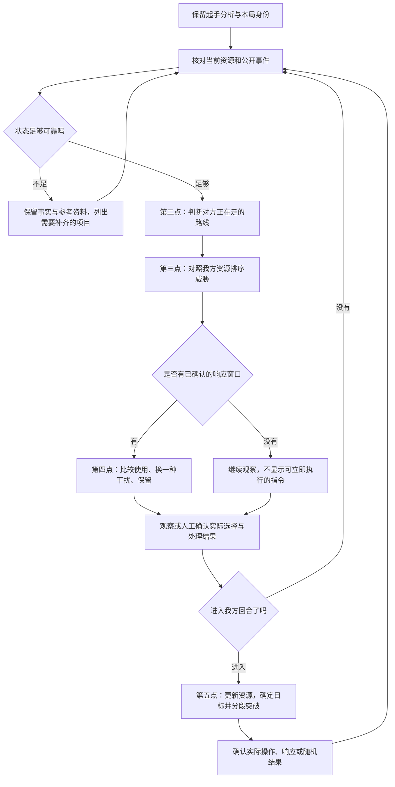

# 后攻实战辅助：第二至第五点完善计划

初稿日期：2026-09-23。实施更新：2026-09-24。版本：0.2。状态：用户已授权按计划执行，并确认 OCG；首版实际范围见[使用说明](going-second-live.md)及[验收记录](verification-1.43.0.md)。

用户已确认以 YGOPro 为首个客户端，沿用实战辅助定位：跟随真实对局给出操作建议，由用户在游戏中操作。第一点的起手分析已在 1.42.1—1.42.2 实现，实际范围见[使用说明](going-second-opening.md)与[验收记录](verification-1.42.2.md)。本文件保留讨论时的完整目标；后续段落中的“建议、待执行”是原始计划，不构成实现完成证明。2026-09-24 已启动获准产品实现，AI 学习计划继续封存。

## 1. 共同原则与当前起点

沿用前面确定的思路：先理解系列如何运转，再把卡片作用与具体路线、当前资源联系起来；采用本地资料、规则和方案归纳。人工可调整确定的通用用途与展示偏好，局部推导只读并允许备注。一卡动、补点和相对废件继续以方案及目标为依据。

用户已要求按本计划执行。以下默认值作为首版方向；实际自动读取能力、场景覆盖和时延仍需逐项验证，不因授权而视为已经通过。

| 已有基础 | 本轮只读核对的依据 | 后续尚需补齐 |
| --- | --- | --- |
| 本局构筑、先后攻与冻结起手 | `ygopro_capture.py` 的 `live_sample()` 提供开局采样；起手分析从已确认局次读取快照。 | 连续当前资源、公开区域、完整事件及真实响应窗口。 |
| 第一点的本地分析 | `opening_workspace.py`、`opening_analysis.py` 与卡组关键资料。 | 分析输入从“起手＋人工补充”扩展到经过核对的当前资源；原起手功能仍独立保留。 |
| 公开对手构筑和断点资料 | [对手资料](opponent-catalog.md)、[断点资料](matchup-catalog.md)，已有稳定引用与卡文来源。 | 对应真实事件、核对适用环境、区分参考路线和经过引擎验证的路线。 |
| 先攻教程与有限续接 | [现有决斗流程](duel.md)、[临时方案](duel-temporary-plans.md)。`duel.py` 的普通筛选仍排除后攻方案。 | 独立后攻入口、对手场面与响应条件、从真实当前位置续接；不能只去掉先攻筛选条件。 |
| YGOPro 只读适配和研究记录 | [读取路径](ygopro-live-state-research.md)。现有配置限定已核对的可执行文件指纹。 | 每项新增读取的独立验证；历史偏移或最新消息缓存不等于可靠完整事件流。 |

YGOPro 是客户端选择，不直接指定卡池、禁限表和房间规则。未来会话应读取可核验的规则配置；读不到时由用户一次性选择或保留未确认。资料按环境和卡文版本筛选，不能默认套用某份历史牌表。当前牌组可作为本地复现基线，不能据此认定它适用于所有规则环境。

## 2. 贯穿四点的决斗流程

第 2—4 点是反复更新的判断循环，第 5 点也会调用它们。计划中的“建议”与“实际发生”分开保存；打开建议、选择路线、查看下一步都不能证明游戏中已发生对应操作。

## 3. 第二点：对方在做什么，接下来可能怎样走

### 3.1 按前面的问询方式给出推荐答案

| 需要回答的问题 | 推荐答案 | 理由与边界 |
| --- | --- | --- |
| 先认出牌组名字，还是先理解动作？ | 先认实际动作和资源变化，再识别所使用的系列、小轴及候选路线。 | 即使还不能确定整副牌组，也能解释当前检索、召唤或送墓带来的作用。 |
| 看到一张系列卡能否确定主 TAG？ | 可以确认已出现该系列组件，不能推断对手完整构筑浓度。通用牌不单独确立牌型。 | 第一点评估自己的完整牌组；这里面对的是部分公开信息，不能复用同一浓度结论。 |
| 多个主系列或小轴怎样处理？ | 保留“已见组件”及其关系，最多展示 3 条有实际依据的路线候选。 | 不强行把混合构筑塞进单一模板，也不把 3 条显示上限误当成已穷举。 |
| 是否显示命中概率？ | 首版显示“依据较强／候选／信息不足”，附证据与缺口。 | 没有校准样本时，80% 等数字没有可靠含义。牌型热度不等于本局手牌概率。 |
| 对方与参考路线不一致时怎么办？ | 保留真实动作，撤销失效的具体路线；仍适用的系列判断可保留。 | 不同顺序、额外补点或未知分支未必否定整个系列。 |
| 用户能改什么？ | 可确认观察事实、选择用于讨论的牌型假设、添加备注；假设单列。 | 选择“按某系列考虑”不能把其完整牌表、隐藏手牌或结论写成事实。 |

### 3.2 需要记录的内容

每次观察至少说明：谁行动、在哪个阶段、哪张已知卡的哪个效果、来源区域、费用、对象、处理结果、去向，以及信息来自自动读取还是人工确认。暂未确定的项目保留为空缺。

需要分别保存三类内容：

- **已知事实**：本局已确认发生的动作与资源变化。检索尚未处理时，不增加检索所得牌；实际被无效时也不套用参考路线的后续资源。
- **候选解释**：该动作可能接入的系列、路线节点及后续用途，包含支持证据、矛盾证据和未满足前提。
- **未知信息**：未公开的手牌、盖卡和牌序。曾公开的卡若经洗切或其他无法继续对应的操作，保留“曾出现”的历史，撤销无法证明的当前实例对应。

参考路线使用稳定的资料、路线、步骤 ID；同一公开路线在多个历史月份重复收录，只提供一份机制证据，不把重复来源当成多次独立支持。

候选标签建议采用可复核的初始口径：“依据较强”要求至少两项独立的关键动作或资源关系能对应同一片段，且没有已知矛盾；“候选”有特定动作依据，但关键前提仍缺失；仅见通用卡、没有适用资料或关键观察缺失时标为“信息不足”。这描述已观察片段的匹配程度，不表示未来路线必然发生，也不是经过统计校准的概率。

### 3.3 实际落地流程

1. 接收事件并检查局次、视角和顺序；仅显示本玩家正常可知的信息。
2. 将发动、费用、目标、结算及区域变化分别对应，确认哪些已经完成。
3. 用已见卡与动作关系筛选本地资料，再检查已确认的限制和资源条件。
4. 生成少量候选：目前到哪一步、下一步可能获得什么、还缺什么条件。
5. 新事件到达后增删证据；仅凭未观察到某张牌，不能证明对方没有它。
6. 已知事实足够但没有路线资料时，继续输出当前卡片的作用；资料缺失不阻断观察记录。

**默认界面**：一行“对方当前在做什么”，下面显示已知的关键资源；“可能后续”默认最多 2 条，更多候选和原始事件折叠。当前结论涉及未确认前提时，前提跟随结论显示。

**完成条件**：能区分通用牌、系列组件与完整构筑；不会凭发动虚构结算结果；遇到混合路线、缺资料或断流时能更新或撤销结论。

## 4. 第三点：这手牌最需要阻止什么

### 4.1 按前面的问询方式给出推荐答案

| 需要回答的问题 | 推荐答案 | 理由与边界 |
| --- | --- | --- |
| 是拦对方最强的牌，还是最妨碍自己的结果？ | 优先处理最影响当前取胜方案、而我方最缺少答案的威胁。 | 我方已能解决的大怪，可能没有阻断关键行动的限制重要。 |
| 如何排序？ | 先看已知的紧急失败风险，再看关键行动限制、已有解场能否通过、保护关系、对手资源及续航。 | 这是一套比较顺序，具体局面可以改变次序，不固定成卡片强度榜。 |
| 什么算“已有答案”？ | 有当前资源支持的、满足费用与限制的处理顺序；单纯上手解场卡不够。 | 还要检查对象、抗性、护航、后续行动和其他威胁是否会阻止解场。 |
| 手坑怎样分配？ | 联合比较整手可用干扰，预留只有某一张能覆盖的目标。 | 逐张贪心容易提前花掉唯一答案；同一副本和共享次数不能重复分配。 |
| 是否做统一威胁分数？ | 首版不显示总分，使用“优先处理／可以放行／取决于条件／资料不足”。 | 保留理由、收益与代价，避免把无法比较的作用硬加成一个数字。 |
| 玩家能设置什么偏好？ | 默认“稳健突破”；可选择争取当回合取胜或保留续航，也可指定想保留的资源。 | 这是当局目标输入，不是人工改写规则或局部威胁计算。约束导致无解时说明冲突。 |

### 4.2 从终场结果反查值得拦截的位置

先明确不希望对方得到的能力，再向前找能减少该能力的节点：资源检索、补素材、建立保护、取得额外行动机会或直接建立限制。不会默认“越早交越好”或“等终场再交”。

每项威胁记录四个问题：

1. 它具体妨碍我方哪条路线或哪个目标？
2. 我方现有哪种资源可处理，是否能在其他威胁存在时执行？
3. 现在阻止能减少什么，对方已经公开的补点能否绕开？
4. 为此消耗干扰后，我方还剩哪些启动、护航、解场和续航？

保护与被保护、多个威胁共享费用、先后处理顺序都需要一起判断。对手“有未知补点”和“已确认持有补点”分开表达；不假定对方什么都没有，也不假定对方一定全都有。

“可以放行”应显示为“基于已知信息暂可放行”，要求当前资源仍有适用的处理或续接依据。若判断依赖对方没有未知补点，必须列为条件性结论；没有找到威胁资料，不能直接归入可放行。

### 4.3 实际落地流程

1. 读取第二点的已知场面和有证据的后续候选。
2. 读取第一点的用途资料，但用当前剩余卡片、次数和限制重新计算可用资源。
3. 建立“威胁—可处理资源—前置条件”对应关系，检查是否争用同一张卡或同一次效果。
4. 分别比较放行、单次干扰、另一种干扰和已覆盖的组合投入；先比较短期关键结果，不搜索无限远对局。
5. 对多个候选路线优先推荐都适用的处理；没有共同方案时显示分歧和需要等待的证据。
6. 默认展示前三项相关威胁以及顺序变化原因。

**讨论示例**：对方可能取得威胁 A 与限制 B。我方已有核验可用的 A 解法，却无法在 B 存在时启动。推荐将干扰优先留给 B 的建立过程；若新证据表明 A 会保护 B，则重新比较 A 的优先级。A、B 是抽象场景，不是任何具体卡组的固定交坑结论。

**完成条件**：同一对方场面，在我方解场或启动资源改变时，优先顺序能合理变化；能解释共享资源及保护关系，不能把潜在卡差当成已经发生的卡差。

## 5. 第四点：现在交、换一种交法，还是留

### 5.1 按前面的问询方式给出推荐答案

| 需要回答的问题 | 推荐答案 | 理由与边界 |
| --- | --- | --- |
| 默认展示多少建议？ | 一条主建议、一句理由；展开可看“保留”和另一种干扰，默认不超过 3 个选择。 | 保证响应时能快速阅读，详细资料按需查看。 |
| 推荐保留时说什么？ | 指明等待的动作、保留的用途，以及现在放行可能失去的机会。 | “先别交”本身不足以帮助用户判断下一步。 |
| 怎样证明当前可用？ | 对具体效果核对窗口、响应对象、费用、次数、区域和已生效限制。 | 卡片在手、界面弹出询问，或资料写着可应对，都不能单独证明当前动作合法。 |
| 缺少时点数据怎么办？ | 显示条件参考和具体缺失项，不标为“现在发动”；其他已核验事实继续可见。 | 静止场面不能证明轮到我方响应。 |
| 点击建议是否记为用牌？ | 不记。由实际事件确认；读取不足时用结构化的“实际动作／费用／结果”补记。 | 意图、发动和处理结果是不同事实。 |
| 可以暂停或不采用吗？ | 可以静音提示、暂缓策略更新或选择其他动作，实际观察继续记录。 | 用户的不同选择仍能衔接后续，不强迫照教程执行。 |

### 5.2 响应建议的最小内容

建议要同时回答：使用哪一张、哪个效果；响应哪次动作；有无需要选择的对象；付出什么；预计阻止什么；对自己的后续有何影响。存在关键未确认前提时，紧邻建议显示。

一条可读的格式示例：

> 建议：保留干扰甲，等待对方建立限制 B 的已核对窗口。
>
> 理由：当前动作主要增加素材，我方已有处理方法；B 会阻断现有启动。
>
> 放行代价：对方可能获得额外资源。若公开补点改变路线，重新判断。

示例仅表达产品输出结构；实际卡片、响应点与可用性由当前状态和所选规则决定。

一般响应结构可参考 [KONAMI 效果时点说明](https://www.yugioh-card.com/en/play/fast-effect-timing/)：下一次行动机会取决于当前状态、连锁和双方是否让过；阶段推进也涉及响应机会。该网页是 TCG 基础说明，不替代试点所选环境的具体卡文、诱发顺序或裁定；这里只将它用于说明为什么不能靠“看见动画”判断时机。

### 5.3 实际落地流程

1. 按本局、当前状态及响应窗口生成候选；知识候选与真正可用动作分开。
2. 先做合法性过滤，再按第三点的威胁与资源分配比较“使用／保留”。
3. 本地已覆盖规则优先快速给结果，较慢的有限场景比较在后台补充。
4. 用户照常在游戏中操作；工具箱记录观察到的实际发动、费用、处理和卡片移动。
5. 没读到完整结果时，只更新已确认的部分，暂停依赖未确认结果的后续建议；允许一次补记多个缺失字段。
6. 目标、连锁、状态或窗口改变时使旧建议失效。旧计算即使完成，也不能覆盖新窗口。

次数按照具体效果规则核对，尤其区分“使用一次”“发动一次”和按卡片实例计数。发动被无效不自动恢复已付费用，也不一律判定次数是否可重新使用。

### 5.4 时效与失效规则

- 对手回合开始后即可预读相关断点与候选，避免等窗口打开才加载全部资料。
- 首版工程目标建议：本地已覆盖规则在收到可靠状态后 **500 ms 内**产生首条提示，较复杂比较以 **2 s**为初始预算。数值待实际机器和场景测量，不宣称已达到。
- 分别测量采集延迟、运算延迟、显示延迟和提示是否赶上窗口；运算快不能弥补漏读窗口。以覆盖场景的 p95 记录时延，并统计来不及提示的情况。
- 窗口关闭时立即撤销可执行状态；不得依赖定时刷新后仍展示数秒的旧建议。不能确认窗口仍有效时降级为参考。
- 每条结果绑定本局、状态修订、窗口、目标事件和知识版本；相同画面再次出现也不能误认成旧窗口。

**完成条件**：费用、时点、对象、共享次数和持续限制核对通过；不采用建议不会扣牌；过期结果不回填；无可用动作与资料覆盖不足能够区分。

## 6. 第五点：到我方回合后如何突破并留下后续

### 6.1 按前面的问询方式给出推荐答案

| 需要回答的问题 | 推荐答案 | 理由与边界 |
| --- | --- | --- |
| 从起手方案继续，还是重新判断？ | 从当前真实资源重新判断，保留原始起手与已执行历史。 | 对方回合的用牌、抽牌、区域变化和限制已经改变条件。 |
| 首版做到什么程度？ | 覆盖选定场景的短段操作与分支，逐段核对；同时保留整条候选思路。 | 可以实际使用，又能明确哪里等待对方响应；不承诺任意场面完整求解。 |
| 默认目标是什么？ | 延续“稳健突破”；有条件可取胜的路线优先列为候选，显示代价，由用户选择。 | 不能为了攻击力数字而跳过限制或耗光下一回合资源。 |
| 补点和骗康怎么用？ | 对候选动作同时检查“被阻止后怎样继续”和“被放行能得到什么”。 | 对方没有义务响应；不能把主动浪费资源称为骗康成功。 |
| 什么时候重算？ | 对方响应、新抽牌、随机结果、实际动作偏离、资源或限制变化时重算未执行部分。 | 已付出的费用和已完成操作不能在新方案里重来。 |
| 可以给斩杀承诺吗？ | 只在完整列明的已知条件下描述可达伤害；隐藏响应存在时使用条件化表述。 | 未处理的盖卡、手牌响应和资料缺口不能被当成不存在。 |

### 6.2 开始回合时的资源核对

起手快照保持不变，另建当前资源：现有手牌、双方已知场面、墓地及公开除外、LP、当前阶段、正常召唤机会、效果次数、持续限制及有效期。次数与限制是否重置按各自规则处理，不以“进入新回合”统一清空。

对方回合及抽牌、准备阶段可能产生事件，不能先固定生成“原始五张＋通常抽牌”的主要阶段方案。未知抽牌先等待实际结果，再更新候选。

### 6.3 目标与路线比较

| 目标 | 主要结果 | 同时展示的代价 |
| --- | --- | --- |
| 争取当回合取胜 | 指定已知场面及限制下的攻击与伤害路线。 | 未知响应、所需护航、额外投入和取胜失败后的剩余资源。 |
| 解场并建立干扰 | 解除影响启动的威胁，留下经核对可提供作用的效果。 | 为解场消耗的补点、终场共享费用与次数。 |
| 保住可继续对局的资源 | 防止已知失败结果，保留下一回合入口和处理手段。 | 本回合放弃的伤害或场面，以及继续承受的威胁。 |

相同结果与增强仍遵循第一点约定：在相同条件和比较时点核对结果，终场效果更多是增强的重要依据；费用、次数、攻击推进和保留资源分别列出。不能只按场上怪兽数量排序，也不能把互斥效果都算成能连续使用的干扰。

### 6.4 实际落地流程

1. 锁定当前确认状态及本回合目标，保留所有未确认前提。
2. 根据第三点的威胁关系安排解场、试探、护航和启动的顺序；没有处理方案时具体说明阻碍。
3. 从现有正式方案、已核对分支与规则资料中寻找可接入片段，检查当前区域、费用、卡组目标、额外资源和已用次数。
4. 首屏显示一个推荐动作，以及到下一个关键决策点的短段预览，默认最多 3 个动作；等待响应处明确暂停，不能把多次响应机会合并为已通过。
5. 对当前关键动作提供两种后续：实际被阻止，或被放行。只展示有依据的分支，缺资料时允许结束在“需要重新判断”。
6. 每次有实际结果后更新资源，保留已经执行的前缀，只替换尚未执行的部分。
7. 到达本段结果后比较是否继续投入、进入战斗或保留资源；战斗阶段首批只支持能够核对攻击资格、顺序、攻击力与伤害限制的明确场景。
8. 回合结束保存实际结果和剩余资源；复盘保留当时可知的信息，不能利用后来揭示的手牌倒推当时“应该知道”。

**引擎边界**：从一张当前场面快照摆出相同卡片，不等于恢复了效果历史、已用次数与持续限制。只有具备完整可重放依据、或明确支持并核验过的局面恢复能力，才能宣称某段已通过引擎验证。无法恢复时保留资料匹配或规则推导层级，不把模拟成功冒充当前实战可执行。

**完成条件**：能从对方回合的实际消耗继续到我方回合；被干扰后不返还费用、不重复通常召唤或已用效果；能说明无路线、资料不足与无法恢复局面的区别。

## 7. 共用的状态、知识与人工输入

### 7.1 当前状态是前置工作

| 内容 | 推荐约定 |
| --- | --- |
| 身份 | 区分客户端进程实例、玩家视角、局次与连接；新局或连接更换后旧建议失效。 |
| 更新 | 维护可单调增加的本地状态修订；这是计算版本，不冒充客户端可靠事件序号。 |
| 卡片 | 区分实体副本、卡号、控制者、区域、公开状态和已知来源；转移区域或失去身份对应时更新。 |
| 事件 | 分开发动、费用、对象、结算及移动；只提交已经核对的变化。重复观察去重，发现缺口保留缺口。 |
| 资源 | 起手、当前手牌、卡组剩余已知份数、已用次数和限制分别保存；持有不等于生效，数量不等于身份。 |
| 事实修正 | 人工只能补充所见事实或纠正识别，并保留修改前后与来源；因此失效的结论全部重算。 |
| 建议 | 绑定产生时的状态和知识版本，分别记录推荐、实际选择、处理结果；旧建议可复盘但不能继续执行。 |
| 未知 | 不自动补全隐藏身份和未知随机结果；所需信息缺失时只暂停依赖该信息的判断。 |

需要特别验证事件连续性：两次读取场面一致，不足以证明中间没有发动过效果；轮询“最新消息”也可能漏过中间连锁。若无法证明某段记录完整，即使最终场面可读，也不能推定期间的费用、次数和窗口。重新同步必须核对缺失历史所影响的字段；只补当前场面不能恢复未知的一回合一次记录。

建议支持两种输入来源共用分析：已验证范围内的 YGOPro 自动观察，以及用于缺失字段或试点验收的结构化人工确认。人工模式标明来源，不能通过把输入称为“自动”来绕过采集验收。

### 7.2 本地资料的使用顺序

1. 当前适用的卡文、具体效果与规则条件。
2. 已有构筑、TAG、卡组运转与通用效果表示。
3. 有明确前提和来源的公开路线、断点与个人正式方案。
4. 在支持范围内通过引擎验证的场景或分支。

这四项提供不同证据，不能相互替代。主要效果标签用于理解与检索；不在主标签中的次要效果，若在当前局面相关，也应参加合法性和威胁核对。

不在响应时临时联网、不接入在线模型、不训练本地模型。新增公开资料在离线整理时完成卡号、卡文、条件与来源核对后，再供本地分析使用。个人对局和构筑保存在现有本地数据区，不混入公共资料。

### 7.3 人工权限

允许选择通用用途、展示顺序、当局目标、资源保留偏好，确认实际动作和缺失结果，附加局部备注。后一类是事实输入或目标输入，不是修改推导结论。

不允许通过自由文字直接改费用、响应时点、次数规则、隐藏身份、引擎验证状态、候选路线的“必定成立”或最终威胁排名。备注供人阅读；发现规则错误应回到资料核对流程，保留版本。

### 7.4 界面保持简明

实战页的固定结构建议为：

- 顶部一行当前阶段与状态是否已同步；缺失信息只显示影响本次决定的项目。
- 主区域显示当前建议及一句理由，对方回合侧重交与留，我方回合侧重当前动作。
- 相邻区域显示自己的剩余关键资源，以及最多三项重要威胁。
- 候选路线、详细费用、卡文、原始事件、统计和来源统一放入可展开详情。

一般更新不弹模态窗口，不不断抢占焦点；需要补记时在同一页面给出具体字段。静音策略提示仍继续记录观察事件。

## 8. 建议的后续实施分段

此表保留实施分段；S0—S4 已接入首版的限定范围，完整连锁与规则历史恢复、通用搜索及 S5 扩展不计为已完成。各项覆盖以使用说明与实际验收为准，不按日期承诺全部卡组覆盖。

| 阶段 | 实现范围 | 进入下一阶段的条件 |
| --- | --- | --- |
| S0：规则与状态 | 确定实际 YGOPro 构建、玩家视角、房间规则；定义事件、资源、窗口和人工确认；列出自动读取能力清单。 | 能识别局次切换、漏读、未知字段；不会把已有起手快照当成实时完整状态。 |
| S1：第二点 | 解释已发生动作，识别已见系列和有限候选路线。 | 混合构筑、缺资料、被无效与资料冲突场景均有可解释输出。 |
| S2：第三点 | 把已知与候选威胁映射到我方处理资源，比较优先顺序。 | 更换我方手牌、已用资源或对方保护关系后，排序与解释同步改变。 |
| S3：第四点 | 在已确认窗口给出使用／保留建议，跟踪实际结果。 | 合法性、资源账、过期撤销和时效验收通过；完成对方回合辅助闭环。 |
| S4：第五点 | 从当前状态提供受限场景的突破短段及受阻续接。 | 对方回合消耗被准确继承；续接只修改未执行步骤；明确条件下的战斗检查通过。 |
| S5：扩充 | 增加对手路线、规则覆盖和客户端，并补充复盘能力。 | 每项支持均有独立证据，不扩大已有验证的含义。 |

**首批资料建议**：我方沿用本次杀手级调整曲构筑作为本地试点；对手先选已收录的杀手级调整曲和烙印两类代表路线，另加未知牌型与混合小轴样例。此选择为推荐，不宣称它们是当前环境最常见的对手。实际卡文、可用卡池及分支覆盖以试点规则重新核对。

先把“一个已覆盖场景能可靠使用”做完整，再扩充卡组；不通过隐藏缺口或复制路线凑数量。

## 9. 建议验收矩阵

下列是待执行验收，不是本次已通过的测试。每项用固定的隔离输入记录预期事实、建议层级、资源变化和失效原因；真实 YGOPro 读取另行验证，合成数据不能替代。

| 编号 | 场景 | 应当观察到的结果 |
| --- | --- | --- |
| L01 | 起手后用掉一张干扰、支付费用并获得新手牌 | 原起手不变，当前资源准确更新；同一实体不能再用于另一条方案。 |
| L02 | 重复采样、换局、进程重启、断流 | 不重复扣资源；旧局建议失效；断流期间不编造动作。 |
| L03 | 快速连续动作中漏过中间事件 | 保留缺口，不按最终画面猜测费用和次数；受影响建议降级。 |
| L04 | 通用牌、单一系列组件、混合小轴 | 不虚构完整构筑与浓度；允许多个解释并展示证据。 |
| L05 | 效果发动后被无效，或处理结果与参考不同 | 不增加未得到的资源，候选路线及时修订。 |
| L06 | 公开卡返回未知区域并失去身份对应 | 保留历史公开记录，撤销无法确认的当前身份对应。 |
| L07 | 对方场面不变，我方更换关键解场资源 | 威胁顺序可变化，理由能指向新的实际处理方法。 |
| L08 | 两项威胁共享费用或相互保护 | 不重复占用我方答案；处理顺序解释完整。 |
| L09 | 对方公开补点，但其他手牌未知 | 已知补点纳入判断；未知部分作为分支条件，不取任一极端。 |
| L10 | 当前窗口、对象、费用或次数不满足 | 不推荐非法动作；覆盖不足与确认不可用分开显示。 |
| L11 | 用户查看建议但不发动，或选择其他牌 | 查看不扣牌；按实际选择更新并继续辅助。 |
| L12 | 发动被无效、效果被无效或效果无结果 | 费用、次数、状态按具体规则处理，不能统一恢复。 |
| L13 | 窗口关闭后旧计算完成，随后出现相似窗口 | 旧结果不回填，新窗口使用独立版本；统计提示是否来得及。 |
| L14 | 进入我方回合，手牌与起手不同 | 以当前资源生成候选，不能简单采用起手加一。 |
| L15 | 试探动作被放行／被阻止、追加未知响应 | 两边均解释真实收益或续接缺口；已执行前缀、费用与次数保留。 |
| L16 | 伤害限制、攻击资格或未知盖卡影响取胜 | 不给无前提的斩杀保证；将条件和替代目标同时显示。 |
| L17 | 当前场面可读取，但不能恢复历史限制 | 不宣称完整引擎验证；保留已支持的规则参考。 |
| L18 | 原先攻、第一点分析、个人 TAG／备注和旧方案 | 原功能与数据仍可使用；局部备注不改变策略计算。 |

未来界面验收继续使用后台 Electron 和隔离资料，按改动执行 `npm run test:desktop` / `npm run test:packaged`，并记录开发版、打包版及真实读取各自范围。不移动系统鼠标，不发送全局按键，不替玩家在游戏中出牌。

## 10. 本轮结论与仍可调整的项目

**本轮已确认**：继续完善其余四点的计划；首个客户端为 YGOPro；延续本地归纳、实战辅助、受控人工编辑和按实际方案判断角色的方向。

**本稿推荐默认值**：先动作后牌型；最多三条有证据候选；不显示未经校准概率；按我方答案排序威胁；默认稳健突破；一条主建议配展开备选；结构化记录实际结果；我方回合分段推进；优先完成 S0—S3，再接 S4。

**进入实施前还需落实**：实际客户端指纹和规则环境；首批对手路线的确认范围；哪些事件与窗口确实能连续读取；经过测量的时延预算。读取能力需要实证，不要求用户猜测技术细节。其余界面和内部格式可在上述约束下细化。

初稿阶段只执行了文档检查。2026-09-24 后的产品实现、测试、真实读取与交付记录统一见[1.43.0 验收](verification-1.43.0.md)，不将计划中的验收矩阵自动标成全部通过。
